# Creating the Application

## Introduction

You will get started by creating a skeleton application and you will add to it in each task until you have built a full application that allows you to create and manage a personal list of movies you have watched or want to watch.

### Objectives
In this lab, you will:  
- Create a new application.  
- Edit the appearance and theme of your application.  
- Run your application.  
  

## Task 1: Connecting to your Oracle Cloud Database

1. Log in to the Oracle Cloud at <a href="https://cloud.oracle.com">cloud.oracle.com</a>. Cloud Account Name is howarduniversity. Click "Next".
2. Click on "Direct Sign-In" and enter your Cloud Account email and password.

    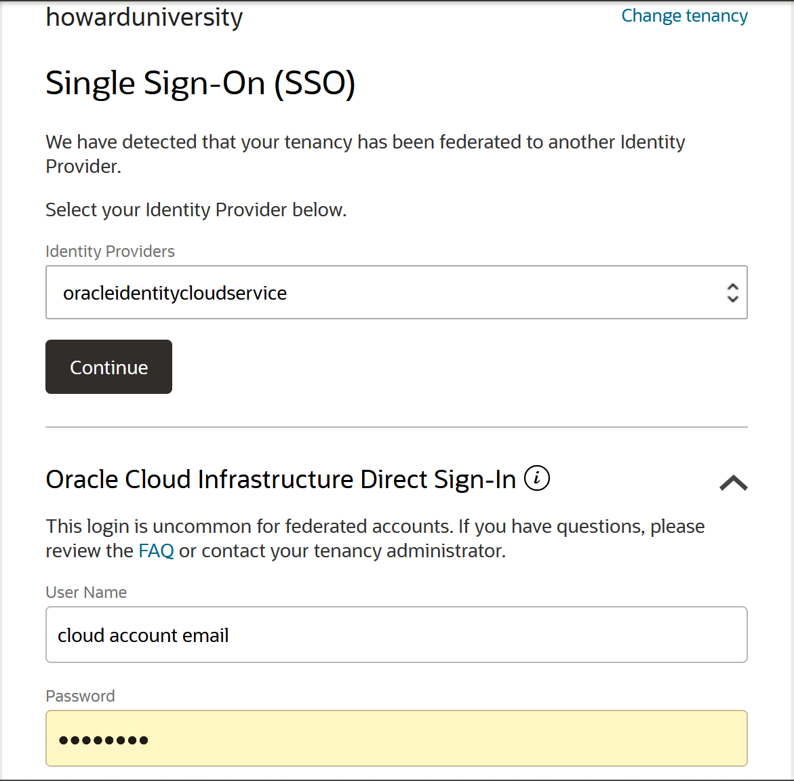

3. Once you are logged in, you are taken to the cloud services dashboard where you can see all the services available to you. Click the navigation menu in the upper left to show top level navigation choices.

    


4. Click **Autonomous Data Warehouse**.

    

5. From the Compartment drop down on the left side of the page, expand howarduniversity->spring2022->student1xx and select you student number.

    

6. Click on the database you created in lab 1
   
    
    
## Task 2: Setting Up APEX

After you are connected and clicked on your database, we need to set up APEX and create a database user for the database application we will use for it. Until now we have been using the ADMIN account to use the database, but in real world deployments you would never do that but instead create a different account.

1. Scroll down to where it says “APEX Instance” and click on the link right next to “Instance Name”, which should be your database name.

    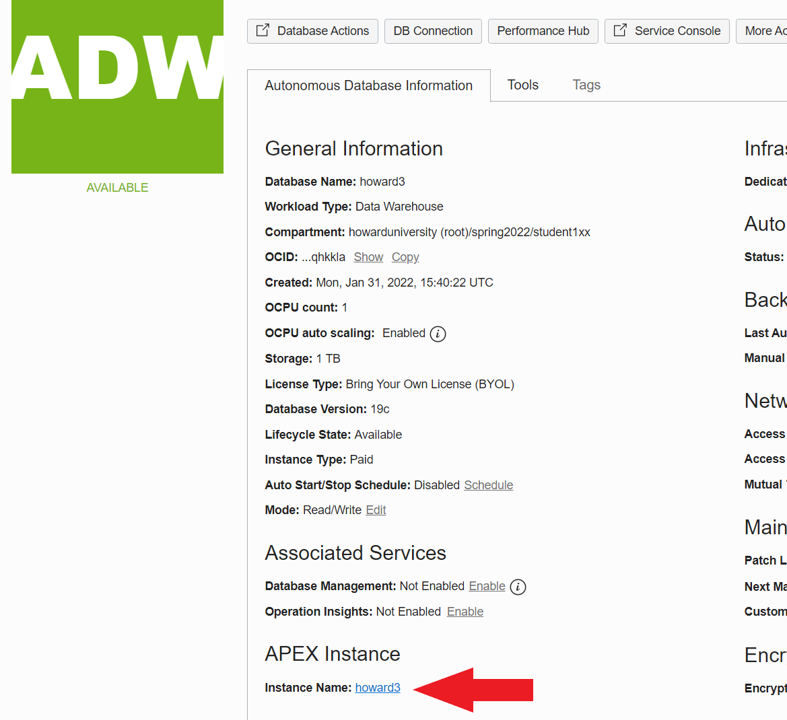

2. This will take you to the APEX page. Click on “Launch APEX”. This step, or some of the following steps may take a few minutes and your screen may remain blank. Don’t worry.

    

3. When done the APEX “Administration Services” window will appear. Here you need to type the Password that you used to create your database in Lab 1.

    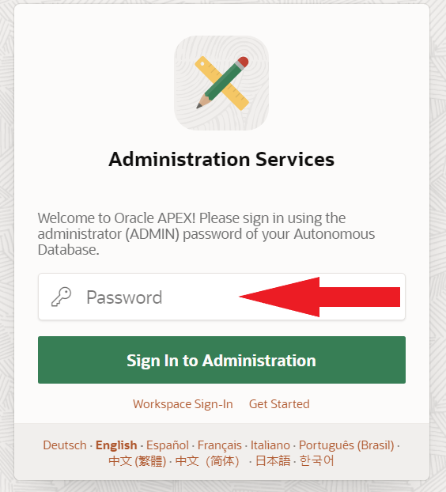

4. You will be re-directed to the APEX Welcome page. Click on “Create Workspace”.
   
    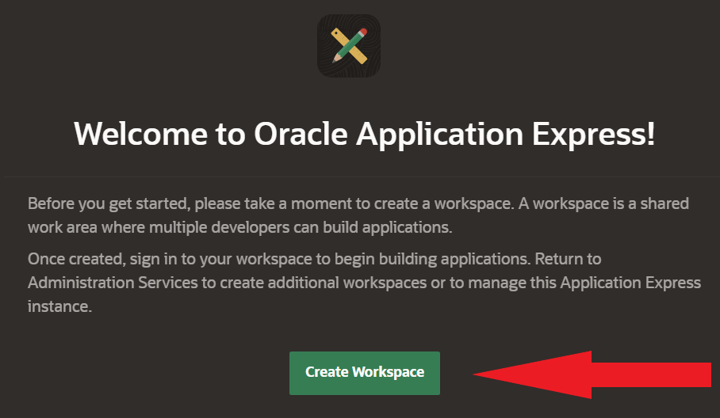

5. This is where you will create a new database user. 
    - <b>Database User:</b> make the database user your name so it will be easier for you to remember.
    - <b>Password:</b> For the password field pick a new password, I suggest you use the same password you just used in the previous step (your database ADMIN user password), to make it easier to remember all passwords.
    - <b>Workspace Name:</b> Use the same name as what you are using for the <b>Database User</b>.
  
  Click “Create Workspace”

    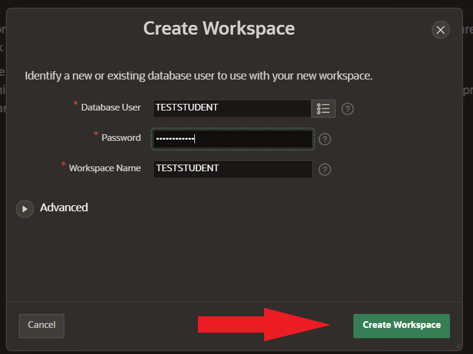

6. Once the workspace is created you will be placed in the APEX Administration Services page by way of this newly created ADMIN account.

    

7. At this point we need to log out of APEX Administration Services and log back into the APEX development workspace that was previously created. You probably will see a warning on to top of your page indicating you need to do this. To log-off click on top right icon that says “admin internal” and click on “Sign out”.

    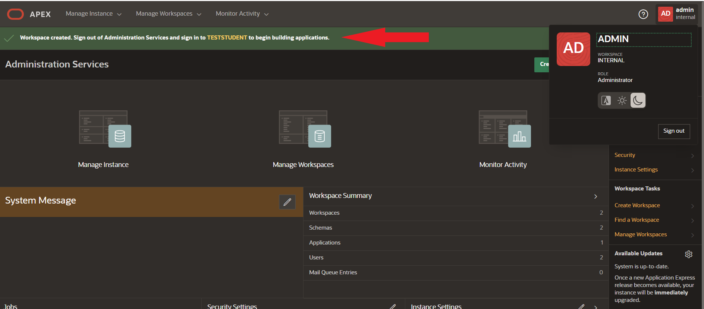

8. You will see the signed out successfully pop-up, click on “Return to Sign In Page”.

    

9. this will take you to the APEX development workspace sign-in page. Use the information you just used to create the new account above to log in.

    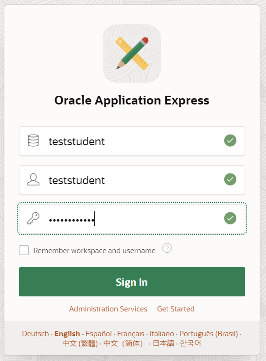

10. You are logged in to APEX and ready to develop your first application!

    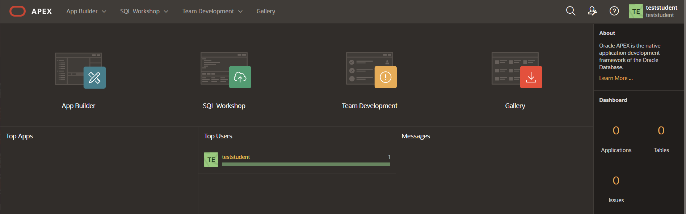


## Task 3: Creating the Application

You will get started by creating a skeleton application and you will add to it in each lab until you have built a full application that allows you to create and manage a personal list of movies you have watched or want to watch.

In this task, you will:  
- Create a new application.  
- Edit the appearance and theme of your application.  
- Run your application.  

Creating the App

1. If you have not already logged into your Oracle APEX workspace, sign in using the workspace name, email, and password you signed up with.

    

2. At the top left of your workspace, click **App Builder**.

    

3. On the App Builder page, click the **Create** button.

    

4. Click **New Application**.

    

Naming and Enhancing the Appearance of the App

1. In the Create Application wizard, set the Name to **Movies Watchlist**.

2. Click the expand button next to Appearance.

    

    * Select the **Vita-Dark theme**.

    * Click **Choose new icon**.

        - Select the red color swatch and the smiley face icon.

        - Click **Set Application Icon**.

    * Click **Save Changes**.
    
    

3. In the Pages section of the Create Application wizard, click the **Edit** button next to Home.

    

    * In the dialog, set Page Name: **My Watchlist**

    * Click the **Set Icon** button.

        - In the Select Icon dialog, search for **film**.

        - Click the film icon that has the play button in the middle.

    * Click **Save Changes**.

    

4. Click **Create Application** to create your app and go to the application home page.

    

Running the App

1. On your application home page, click **Run Application**.

    

2. On the sign in page that opens in a new tab in your browser, enter your username and password that you used to sign in to your workspace.

3. Click **Sign In**.

    

Updating the Theme of the App

1. In the tab that your app is running in, you will see a grey toolbar at the bottom of the page. This is your development toolbar that allows you to edit regions in your application user interface (UI) directly in the tab it's running in.  
*Note: If you do not see the grey developer toolbar, mouse over the bottom of your browser window to make it display. End users who log directly into the app will not see this toolbar.*

2. In the dev toolbar, click on **Customize** and then click **Theme Roller**.

    

3. Within the Theme Roller, you can modify many different aspects of the application UI. You will use it right now to update the color scheme.

4. Click on **Global Colors** to expand the dropdown.

    * Copy the HEX color code: **C74634**

    * Click on the color swatch next to **Header Accent** and paste the HEX code in the Hex text box.

    

    * Click on the color swatch next to **Body Accent** and paste the HEX code **312D2A** in the Hex text box.

    * The other color swatches automatically updated to variations of the Header Accent color.

    * Click **Save As**.

    * Style Name: **Movies - Dark**

    * Click **Save**.

    * Close the Theme Roller window.

    

5. You have now updated the color scheme of your app.

## Task 4: Creating REST Data Sources

This task will walk you through how to set up REST Data Sources. You will use these REST sources in later tasks to build out the movie search functionality.  

In this task, you will:  
- Create a REST data source for The Movie Database Popular Movies.  
- Create a REST data source for The Movie Database Search Movies.

Creating a Popular Movies REST Data Source

The first REST source you will create is the Popular Movies source because it is the simplest to implement and a good way to introduce the process of creating REST data sources. From there, you will implement a couple more REST sources, with each being a little more complicated than the last. You are creating the Popular Movies data source because you will need to display these when a user has not yet searched for a movie.

1. In the App Builder tab in your browser, click **Shared Components** in the middle of your Application home.

    

2. In the Data Sources section at the bottom of the page, click on **REST Data Sources**.

    

3. Click **Create** at the top right of the page.

4. Select **From Scratch** and click **Next**.

    

5. Name: **Popular Movies**

6. URL Endpoint: **https://api.themoviedb.org/3/movie/popular?api\_key=1c2f0993f616307716d7b80642e5b169&language=en-US&page=1**  
*Note: The TMDB API\_KEY = 1c2f0993f616307716d7b80642e5b169

7. Click **Next**.

    

8. Oracle APEX automatically divides the URL into the Base Path and Service URL Path. However, you want these to be slightly different than what APEX chose so that the Base Path is consistent across all the REST sources you make. Adjust the Base and Service URLs to the following:

    * Base URL: **https://api.themoviedb.org/3/**

    * Service URL Path: **movie/popular?api\_key=1c2f0993f616307716d7b80642e5b169&language=en-US&page=1**  
    *Note: Make sure you use the provided API\_KEY and that there are no spaces in your URL endpoint.*

9. Click **Next** again.

    

10. Click **Discover**.

    * APEX makes a call to the TMDB API and finds the popular movies data to parse into columns that you will be able to use as your data source when building your app.

    * You should now be able to view and scroll through a preview of the table of data that has been generated. 

    

11. Click **Create REST Data Source**.

Editing The REST Source Data Profile 

You have now created your new data source, but you are going to update it to improve the data you get from Popular Movies. One of the columns you get back from the TMDB Popular Movies API is POSTER\_PATH. It includes the unique poster identifier needed to grab the poster image for a movie. However, it does not contain the full URL, which means that if you want to use POSTER\_PATH, you have to manually add the first part of the URL when using it on the front end. Instead of having to add that each time you want to use the poster path, you can edit the Data Profile for Popular Movies and add a column derived from POSTER\_PATH that contains the entire URL so that later you can access it directly.

1. In the REST Source Name column of the REST Data Sources page, click on your **Popular Movies** source.

2. Click on the **Data Profile** tab within the REST Data Source page.

3. Within the Data Profile tab, you can see that there are 13 visible columns for Popular Movies. You can edit the data profile to add, remove, and edit columns, which will adjust the data that gets returned from the data source.

4. Click the **Edit Data Profile** button.

    

    * On the Data Profile dialog page, click the **Add Column** button.

        - Name: **POSTER_URL**

        - Visible: **on**

        - Column Type: **SQL Expression**

        - SQL Expression: **CONCAT('https://image.tmdb.org/t/p/w500', POSTER_PATH)**

            + This SQL Expression concatenates a string that contains the secure base URL and image size with the POSTER_PATH column that gets returned with the Popular Movies data. The base URL and image size come from [TMDB Configuration API](https://developers.themoviedb.org/3/configuration/get-api-configuration).

        - Click **Create**.

        

    * Click **Apply Changes** to save and close the Edit Data Profile dialog.

5. Click **Apply Changes** at the top of the REST Data Source page.

Creating a Search Movies REST Data Source

The process to create the Search Movies source is similar to the process for the Popular Movies source, but you will use a plug-in to assist with setting it up. Plug-ins are ready-to-use components created by other APEX developers that enable you to extend your APEX applications with custom functionality. A plug-in can be useful for creating REST data sources that return multiple pages of results. For example, when you make a request to TMDB search movies API, you must also include the page number within that request, and you can only get one page at a time with individual API calls. There is a REST data sources plug-in to work around this problem, which allows you to make one API request and get all results from all the pages.

1. [Click here](./files/web_source_type_fixedpagesize.sql) to download the plug-in.  

2. In your App Builder, return to your Movies Watchlist application home by clicking the Application XXXXX link under the APEX toolbar.

    

3. Click **Export/Import**.

    

    * Click **Import**.

    * Click on the Drag and Drop region to open the file selector.

        - In your Downloads folder, select the **web\_source\_type\_fixedpagesize.sql** file.

        - Click **Open**.

    * File Type: **Plug-in**

    * Click **Next**.

    

    * Click **Next**.

    * Click **Install Plug-in**.

    * You should finish on the Plug-ins page within the Shared Components of your Application and see your imported plug-in. You can now create your Search Movies REST source with this plugin.

4. Navigate to the Shared Components page by clicking the **Shared Components** link in the page path below the APEX toolbar.

    

5. Under Data Sources, click on **REST Data Sources**.

6. Click **Create**. 

    * Select **From Scratch** and click **Next**.

    * REST Data Source Type: **Fixed Page Size Plug-In for api.themoviedb.org [Plug-in]**

    * Name: **Search Movies**

    * URL Endpoint: **https://api.themoviedb.org/3/search/movie?api\_key=1c2f0993f616307716d7b80642e5b169&language=en-US&query=harry%20potter&page=1&include\_adult=false**  
    *Note: Make sure to use the URL endpoint with the API code from TMDB API and that there are no spaces in your URL endpoint.*

    * Click **Next**.

    

    * When you set up the Popular Movies REST data source, you created a remote server for TMDB API. APEX recognizes that remote server based on the Search Movies URL and automatically splits the URL into the correct Base URL and Service URL paths. Click **Next** again.

    * Authentication Required: **on**

    * Authentication Type: **URL Query String**

    * Name: **api_key**

    * Value: **1c2f0993f616307716d7b80642e5b169**

    * Click **Discover**.

    

    * You should be able to view a preview of the table of data that has been generated.

    * Click **Create REST Data Source**.  

    

7. Follow the same steps that you did for Popular Movies to edit the Search Movies data profile and create a POSTER_URL column. (Optional)

## Homework

Now that you have successfully created a REST Data Source. You are going to submit a screenshot of one of your REST Sources, Search Movies.  Submit the screenshot as a PDF and have the URL visible at the top.

1. Goto your Application - Movies Watchlist Home Page.  Click on **Shared Components**.

    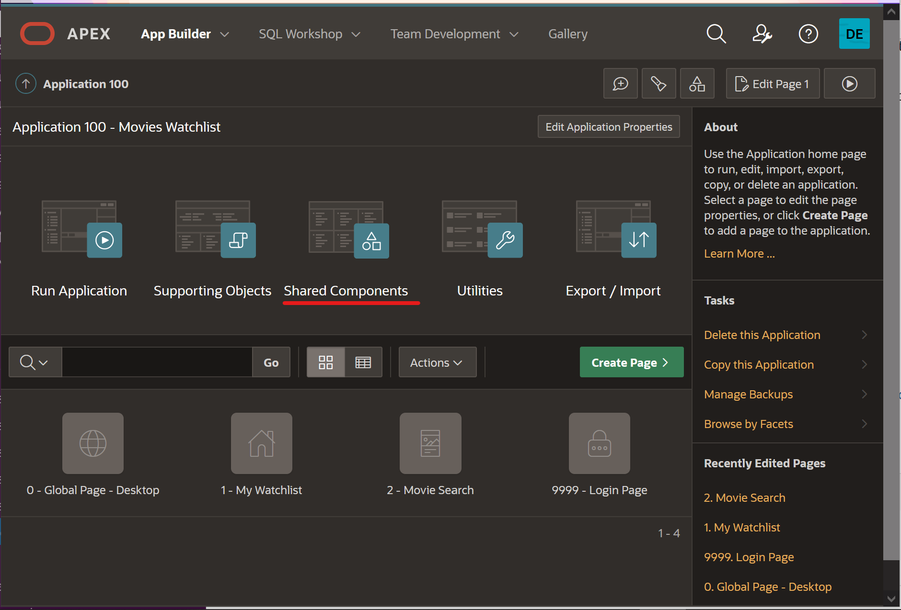

2. Under Data Sources, click on **REST Data Sources**.

    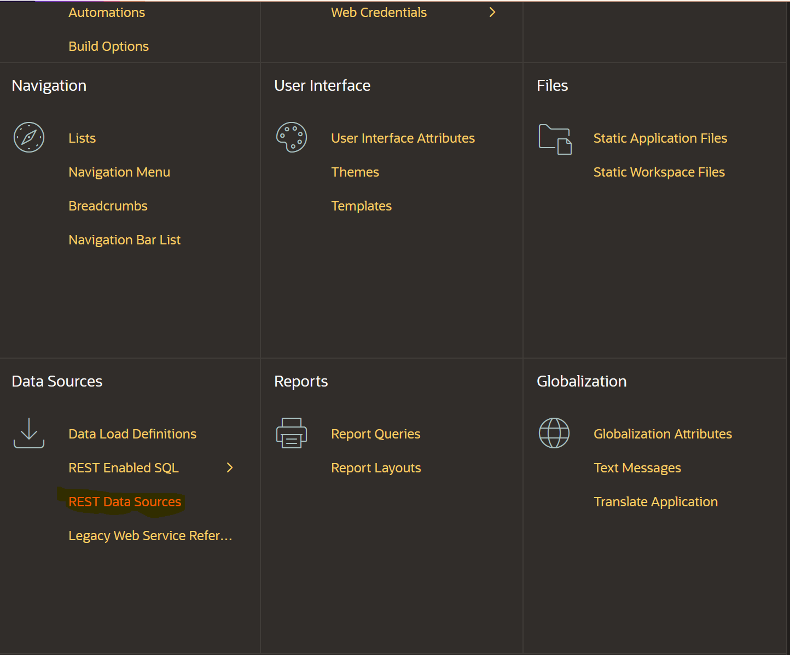

3. Click on **Search Movies**.
   
    

4. Click on **Operations**, then click the button under **Test Operation**.

    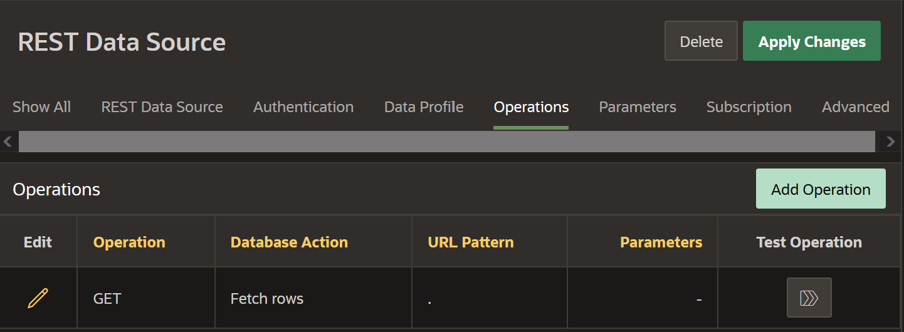

5. Your results should look similar to the screenshot below:
   
    

6. Upload the PDF to Blackboard.

## Task 5: Creating the Movie Search Page (Optional)

You will create and set up the Movie Search page in this task so that you can view popular movies and search for a movie of your choice. The search functionality must be built out first in order to be able to create a watchlist even though the My Watchlist page is the home page of the application. You will need to first create a button on the home page that links to the Movie Search page. On the Movie Search page you will create regions that display the data from the REST data sources you created in the previous task, and you will implement a search bar that lets you search for movies.

In this task, you will:  
- Add a button to link the Movie Search page to the Movie Watchlist page.  
- Create a new page.  
- Link the Popular Movies REST data source to the new page.  
- Link the Search Movies REST data source to the new page.  
- Set up search functionality to allow a user to search for a movie.

Creating the Add a Movie Button

You will need to create a button on the first page of the application before you can create the Movie Search page, so that you have a way to open up the page when you want to search for movies.

1. Return to the Movies Watchlist application home and click on page **1 - My Watchlist**.

    

2. The Page Designer in APEX is broken up into a few different panes: the rendering pane on the left, the layout pane in the middle, and the properties pane on the right. In the rendering pane on the left, click on the **Movies Watchlist** region in the Breadcrumbs Bar position.

    * In the properties panel on the right, set the Title: **My Watchlist** 

3. Right click on the My Watchlist region in the rendering pane and select **Create Button**.  

    

4. Set the following button Identification properties in the properties panel on the right:

    * Identification → Button Name: **ADD_MOVIE**
    
    * Identification → Label: **Add a Movie**

    * Layout → Button Position: **Next**

    * Appearance → Button Template: **Text with Icon**
    
    * Appearance → Hot: **on**

    * Appearance → Template Options:
    
        - Click on **Use Template Defaults, Right**

        - Check **Hide Label on Mobile**

        - Icon Position: **Left**

        - Click **Ok** to save and close the dialog.

    * Appearance → Icon: **fa-plus**

5. Click the **Save** button in the top right of the Page Designer to save everything.

    

Creating the Movie Search Page

Now that you have a way of opening the Movie Search page, you will actually create the page in this step and do a little page setup before adding data.

1. In the toolbar at the top of the Page Designer, click the **Create** button (3 buttons left of the Save button) and select the **Page** option. 

    

2. In the Create wizard, click **Blank Page**.

    

3. Set the following page attributes:

    * Page Number: **2**

    * Name: **Movie Search**

    * Page Mode: **Modal Dialog**

    * Click **Next**.

    

    * Click **Next** again.

    * Click **Finish** to save and go to your new page.

4. On your new page, make sure that **Page 2: Movie Search** is selected in the rendering pane.

5. In the Page pane, scroll down to **Appearance** and click on **Template Options**.

    * In the Template Options popup dialog, check the **Stretch to Fit Window** box under Common.

    * Click **Ok**.

    

6. In the Dialog section, paste the following line in **Attributes**:  
	**`close: function(event, ui) {apex.navigation.dialog.close(true,{dialogPageId:&APP_PAGE_ID.});}`**

    * The line above assists with refreshing the Watchlist page when the Movie Search dialog closes. This will be important when you start adding and removing movies to and from your watchlist, because you want your home page to load automatically to reflect any changes without you having to manually refresh the page each time.

7. Within Navigation:

    * Cursor Focus: **First item on page**

    * Warn on Unsaved Changes: **off**

    

8. In the CSS property group, you will also add some custom CSS to style some of the items on the page.

    * Copy the code below and paste it in the Inline property code box:

        ```
        <copy>
        /* Set posters to be the same size/ratio */
        .a-CardView-media--square:before {
            padding-top: 150%; /* 2:3 ratio */
        }
        
        /* set position of the Card badge */
        .a-CardView-badge {
            position: absolute;
            top: 12px;
            right: 12px;
            margin: 0;
        }
        
        /* style the movie rating under the movie title */
            .movie-rating {
            margin-top: 4px;
        }
        
        /* style both the movie rating and the star icon under the movie title */
        .movie-rating,
        .movie-rating .fa {
            font-size: 12px;
            line-height: inherit;
            vertical-align: bottom;
            opacity: 0.75;
        }
        ```

    * The above code styles the movie poster images to all be the same size. It also adds some styling for the Cards region badge attribute that will be used in a later lab, to place it in the top right of a card. Finally, it adds some styling for the movie rating that you will display on the Card along with the movie title and poster.

    

Setting up Popular and Searched Movies

In this step, you will start to add data to your app using the REST data sources you set up in Task 4. First, you will be using the Popular Movies source to get the list of current popular movies and display them when a user has not searched for any movies.

1. In the rendering pane of the Page Designer, right click on Content Body and select **Create Region**.

    

2. Set the following properties:  

    * Identification → Title: Movie Cards

    * Appearance → Template: Blank with Attributes

    

3. Within the Movie Cards region, you will create a Cards region that will display the list of popular movies.

4. Right click on the Movie Cards region and select Create Sub Region.

5. Set the following properties:

    * Identification → Title: **Popular Movies**

    * Identification → Type: **Cards**

    * Source → Location: **REST Source**

    * Source → REST Source: **Popular Movies**

        - When you click the dropdown for REST Source, you should see both the REST data sources you set up earlier - Popular Movies and Searched Movies. This will allow the Cards region to use the columns and data associated with the Popular Movies REST data source and populate the region.

    

4. Click the **Attributes** tab at the top of the properties pane on the right of the Page Designer. This is where you can select columns and set what data will display on each movie card. 

    * Appearance → Grid Columns: **5 Columns**

    * Card → Primary Key Column 1: **ID**

    * Title → Column: **TITLE**

    * Subtitle → Advanced Formatting: **on**

        - In your Cards region, you will show a star icon with the average rating of the movie next to it. Including multiple columns or custom text is not built-in to an attribute, but you can use Advanced Formatting to replace it with an HTML expression.

    * Subtitle → HTML Expression:
        
        ```
        <copy>
        &lt;div class="movie-rating">
        &lt;span aria-hidden="true" class="fa fa-star">&lt;/span> &VOTE_AVERAGE.&lt;/div>
        ```  
        *Note: In the HTML Expression, the &NAME. syntax is used to create a substitution string for the value of the VOTE_AVERAGE column for each movie.*

        

    * Media → Source: **URL Column**

    * Media → URL Column: **POSTER_URL**

    * Media → Position: **First**

    * Media → Appearance: **Square**

    * Media → Sizing: **Cover**

        

5. You also need to create a Cards region to display the data from the Search Movies REST source.  It will be almost exactly like the Popular Movies region, with a few minor changes.

6. Right click on the Popular Movies region in the rendering pane and select **Duplicate** to create a copy of the region.

7. Set the following properties:

    * Identification → Title: **Searched Movies**

    * Source → REST Source: **Search Movies**

8. You also need to set the pagination attributes for the Searched Movies region, because you are getting all the search results at one time. Within Searched Movies, set the following Pagination properties in Searched Movies region Attributes tab:

    * Type: **Page**

    * Cards per page: **25**

    

Adding the Search Bar

The final region that needs to be added to the Movie Search page is the search bar, which will allow a user to search for movies. Additionally, both the Popular and Searched movie regions are currently displaying at the same time on the Movie Search page. You want to only show one at a time based on the condition that the Searched Movies region displays only if the search bar page item has a value. If the search bar has no value, the page will only display the Popular Movies region.

1. Right click on Dialog Header in the rendering pane and select **Create Region**.

    * Identification → Title: **Search Bar**

    * Appearance → Template: **Blank with Attributes**

    * Appearance → CSS Classes: **padding-sm**  
    *Note: If you open the options dialog next to the CSS Classes property, the only option available is margin-sm, so you need to manually enter padding-sm in the property text box.*

    

2. Right click on the new Search Bar region and select **Create Page Item**.

    * Identification → Name: **P2_SEARCH**

    

    * Appearance → Template: **Hidden**

    * Appearance → open the Template Options dialog:

        - Select **Stretch Form Item**

        - Size: **X Large**

        - Click **Ok**.

    * Appearance → Icon: **fa-search**

    * Appearance → Value Placeholder: **Search for a movie...**

    * Advanced → Warn on Unsaved Changes: **Ignore**

    

3. Click on the **Popular Movies** region.

    * Scroll down to Server-Side Condition in the properties pane.

        - Type: **Item is NULL**

        - Item: **P2_SEARCH**

    * Now you are displaying the Popular Movies region based on a condition. If the P2_SEARCH item is NULL, then the region will display. You will create an opposite condition for the Searched Movies region.

    

4. Click on **Searched Movies**.

    * Scroll down to Server-Side Condition.

        - Type: **Item is NOT NULL**

        - Item: **P2_SEARCH**

    * Now, you are only displaying Searched Movies if the P2_SEARCH item is NOT NULL (has a value).

    

5. In order to actually search for a movie, you have to edit the query parameter that is submitted with a call to TMDB Search Movies API. A search query is required, otherwise you will not get any results back. When you look at the two Cards regions in the rendering pane, you can see that underneath Searched Movies there is a **Parameters** dropdown section.

6. Expand the section and you will see **query** listed as a parameter. This is what you will link to the P2_SEARCH page item in order to control the search.

7. Click on the **query** parameter.

    * You will see that its Type is Static Value, and the Static Value is harry potter, which is the query you used in the URL when setting up the REST source.

    * Change the Type from Static Value to **Item**.

    * In the Item field, enter **P2_SEARCH**.

8. Save your changes by clicking the **Save** button in the top right of the Page Designer.

    

Linking Add Movie to Movie Search

The last step in this task is linking your Add a Movie button on the Watchlist page to the Movie Search page. A modal dialog page like Movie Search cannot run on its own, which is why you need the Add a Movie button to access it.

1. Go to page 1 by clicking the down arrow in the page navigation on the toolbar.

    

2. Click on the ADD_MOVIE button and set the following:

    * Behavior → Action: **Redirect to Page in this Application**
    
    * Click on **No Link Defined** next to Target to open the Link Builder dialog.

    * Click on the List of Values button next to Page.

        

        * Within the List of Values dialog, select the Movie Search page.

            

    * Clear Cache: **2**  
    *Note: This is the ID of your Movie Search page. Clearing the Movie Search page cache will ensure the page items in are cleared each time the page is opened so users can perform new searches.*

    * Click **Ok** to close the dialog.

    

3. You also need to add a Dynamic Action to the button so that the My Watchlist page updates properly when the Movie Search page dialog closes.

4. Right click on the **ADD_MOVIE** button in the rendering pane and select **Create Dynamic Action**.

    

    * Name: **Refresh on Dialog Closed**

5. In the rendering pane, click the arrow next to the Refresh on Dialog Closed to expand the action.

6. Below the new Dynamic Action, click on the **Refresh** action under True.

    * Action: **Submit Page**

7. Click the green Save and Run button at the top right of the Page Designer.

    

8. Click the **Add a Movie** button to open the Movie Search page.

    

9. You should only see the search bar and the list of popular movies.

    

10. Type "harry potter" in the search bar and hit Enter (Return on Mac).

    * You should get results for movies with the search term "harry potter" in the title.

    

11. Delete "harry potter" from the search bar and press Enter (Return on Mac). The popular movies should reappear.

12. In the Development Bar at the bottom of the page, click **Application XXXXX** to return to the Application home.

	

## Task 6: Creating the Movie Details Page (Optional)

In this task, you will set up a new REST data source called Movie Details, that retrieves the details of a single movie. After the data source has been set up, you will create a new page that displays those movie details when a user clicks on a movie from the Movie Search page.

In this task, you will:  
- Set up the Movie Details REST Data Source.  
- Create a new page, Movie Details.  
- Use the Movie Details REST source to display data on the Movie Details page.  
- Connect the Movie Details page to the Movie Search page.

Creating the Movie Details REST Data Source

While the process for setting up the Movie Details REST source is similar to the Popular and Search Movies sources, it is a little more involved, because you have to define the response structure as well as specify variables to be able to query for any movie.

1. Just like you did for Popular Movies and Search Movies, click on **Shared Components**. 

    

2. Under Data Sources, click on **REST Data Sources**.

3. On the REST Data Sources page, click **Create**. 

    * In the wizard dialog, select **From Scratch**.

    * Click **Next**.

    * Name: **Movie Details**

    * URL Endpoint: **https://api.themoviedb.org/3/movie/:movie_id**

        - At the end of the URL Endpoint, you are creating a bind variable, :movie_id, using the : syntax. This is what will allow you to pass in any value for the movie ID so that you can get the details for any movie.

    * Click somewhere within the Create REST Data Source dialog to unfocus from the URL Endpoint. APEX will display a URL Parameter line, where you can set the :movie_id parameter value.

    * Value: **505**

    * Click **Next**.

    

    * Just like the Search Movies source, APEX automatically divides the URL Endpoint into the Remote Server and Service URL Path. Click **Next** again.

    * On the Authentication step, you will set up authentication with your API key.

        - Authentication Type: **URL Query String**

        - Name: **api_key**

        - Value: **1c2f0993f616307716d7b80642e5b169**

    * Click on the **Advanced** button at the bottom of the dialog.

    

    * Within the Advanced page, you can set up additional parameters and define what the response should look like. You should see your movie_id URL Pattern variable as a parameter, so the only thing you have to do is define the response.

    * Type a single period **.** in the **Row Selector (leave empty for auto-detection)** text field and hit Enter/Return.
    
        - This instructs APEX to use the root of the JSON object that gets returned from TMDB Movie Details API. 

    * For the Returns parameter, select **Single Row**.

        - Typically, APEX looks for a table with multiple rows of data. However, since you are getting data for a singular movie, there will be only a single row of data.

    * Click **Discover**.

    

    * In the next page, you should see a table with one row of data containing the details for the movie with ID 505.

    * Click **Create REST Data Source**.

    

4. On the REST Data Sources page, click on Movie Details.

5. In Task 4, you added a new column to the data profile for the full poster URL. You will now do the same thing for Movie Details, but you will add 2 visible columns:

    * **POSTER\_URL**: CONCAT('https://image.tmdb.org/t/p/w500', POSTER\_PATH)

    * **BACKDROP\_URL**:  CONCAT('https://image.tmdb.org/t/p/w500', BACKDROP\_PATH)

6. Follow the instructions in Task 4 to edit the Movie Details REST Data Profile and add the BACKDROP\_URL and POSTER\_URL columns.

Creating the Movie Details Page

Just like you did for the Movie Search page, you will create a new page and set a couple page properties before connecting the Movie Details REST source to the page.

1. Go to your Movies Watchlist Application home.

2. Click the **Create Page** button.

    * Click **Blank Page**.

    

    * Set Name: **Movie Details**

    * Select Page Mode: **Modal Dialog**

    * Click **Next**.

    

    * Click **Next**.

    * Click **Finish**.

    * You should now be on page 3, the **Movie Details** page.

    

3. Make sure **Page 3: Movie Details** is selected in the rendering tree.

4. Within the Appearance property group, open the **Template Options** dialog. 

5. Select **Stretch to Fit Window**.

6. Click **Ok**.

    

Connecting the Movie Details REST Source to Page

When you set up the Movie Details API, you created the movie_id parameter. You can link that parameter to a page item that contains the movie id, which will allow you to call the details for whatever movie you select from the Movie Search page.

1. In the Movie Details page, right click on the Content Body region and select **Create Region**.

    * Title: **Movie**

    * Type: **Form**

    * Under the **Source** section:

        - Location: **REST Source**

        - REST Source: **Movie Details**

    * Once you select the source, you can see in the rendering pane that an item has been created for each data column under the Movie form region.

    

2. Click on the **P3\_ID** column under the Movie region.

    * Scroll down to **Source** and switch Primary Key to **on**.

    

3. If you look at the Movie region, there is also a **Parameters** section in addition to the Items section. This is similar to the Searched Movies region on the Movie Search page. When you click the dropdown next to Parameters, you can see **movie_id**, which is the parameter you set up earlier in the Movie Details REST Data Source.

4. Click on the **movie_id** parameter.

    * Change the Value → Type to **Item**.

    * Set Item to **P3_ID**.

5. Click the **Save** button in the top right corner to save your changes.

    

Connecting the Movie Details Page to Movie Search Page

You want to be able to view the details of any movie you click on in your Movie Search page. You can link the Movie Details page to the Movie Search page like you did when setting up the Movie Search page and Add a Movie button. However, in order to get the details for the specific movie you clicked on, you have to pass the movie id from the search page to the details page.

1. Navigate to page **2: Movie Search** by entering 2 in the Page Finder in the Page Designer toolbar and clicking Go.

    

2. On the Movie Search page, you can see in the rendering pane that both Popular Movies and Searched Movies have an **Actions** section underneath them.

3. Right click on **Actions** underneath Popular Movies and select **Create Action**.

    

    * Identification → Type: **Full Card**

    * The Link section is where you can connect page 3 to page 2 by redirecting the user to a new page, similar to how a user gets to the Movie Search page from the Home page.

    * Click on **No Link Defined** next to Target to open the Link Builder dialog.

        - Page: **3**

        - You also need to set an ID item that will get passed to the Movie Details dialog so that the Movie Details page knows the ID of the movie that was clicked on.

        - Under Set Items, enter **P3_ID** as the Name.

        - Value: **&ID.**  
        	*Note: You can also use the buttons next to the name and value fields to browse items that you can pass values to. Notice that the options for Name all come from the Movie Details page (P3), because that is the item you want to set. The options for Value are the columns from the Movie Search data source because this is the what you are getting from page 2 and passing to page 3.*

        - Click **Ok**.

    

4. Right click on Actions under the Searched Movies region and select **Create Action**.

    * Type: **Full Card**

    * In the Link property group, click on **Target**.

        - Page: **3**

        - Name: **P3_ID**

        - Value: **&ID.**

        - Click **Ok**.

    

5. Click **Save**.

6. Refresh the page where your application is running.

7. Test the Movie Details page by clicking the **Add a Movie** button to open the Movie Search page.

8. Click on the movie of choice to see the details.

    

## Task 7: Creating Users and Watchlist Tables (Optional)

Up to this point, most of the work has revolved around implementing REST data sources and creating pages to use that data on. In this task, you will create and start to use local tables to store user and movie data. You will also add an application item and process, which will capture and store a user email and ID, as well as some of the movie details. This is what allows multiple users to have their own watchlist.

In this task, you will:  
- Set up the movie_users and watchlist tables using Quick SQL.  
- Create an application process and item for storing user information.

Creating the Movie Users Table

The first table you need to create is the movie\_users table. It is very simple, but it needs to be created before the watchlist table so that you can access the user ID. The watchlist table has a foreign key, user\_id, that will link it to the movie\_users table and allow different users to have their own unique lists.

1. In the Page Designer tab in your browser, click the dropdown next to SQL Workshop in the top navigation bar, hover over Utilities, and select **Quick SQL**. 

    

2. Copy the code below and paste into the first line of the code editor:

    ```
    <copy>
    movie_users
        id /pk
        username /unique
    ```

3. Click the **Generate SQL** button at the top of the pane. 

    

4. Click **Settings** on the top right of the Quick SQL toolbar. 

    * Scroll down to Additional Columns and check **Audit columns**.

    * This will automatically add the Created, Created\_By, Updated, and Updated\_By columns to the table.

    * Click **Save Changes**.

    

5. Click **Save SQL Script**. 

6. Script Name: **Create movie users**

7. Click **Save Script**.

    

8. Click the **Review and Run** button.

9. Click **Run**, then **Run Now**. 

    * You should see a success page with 2 statements successfully processed.

    

10. Now you will add an Application ID and Application Process, which will capture a user's email when they log in and assign them an ID so that you can keep track of their unique watchlist.

Creating the Application Item and Process

To store data within the movie\_users database, you will use an application process. The process grabs the user email when they log in and if they are a new user, it adds them to a local table, assigning them an ID. The ID of the current user is also stored in the application item, which will be needed when a user adds, removes, or updates items in their watchlist.

1. Click on **App Builder** in the top APEX toolbar.

    

2. Click on your Movies Watchlist app.

3. Click on **Shared Components**.

4. In the Application Logic section of the page, click **Application Items**.

    

5. Click **Create**.

    * Set Name: **USER_ID**

    * Click **Create Application Item**.

    

6. Go back to Shared Components and click on **Application Processes**.

    

7. Click **Create**.

    * Name: **Add User**

    * Point: **After Authentication**

    * Click **Next**.

    

    * Copy and paste the following code into the Code editor box in the Source section:

    ```
    <copy>
    -- create movie user ID
    -- query movie_users table to check for existing user
    -- if yes, return PK as user_id
    -- if no, add new user to movie_users
    declare
        l_user_id number;
    begin
        select id into l_user_id from movie_users where username = :APP_USER;
        
        :USER_ID := l_user_id;
        
        exception
            when no_data_found then
            insert into movie_users 
                    (username)
                values 
                    (:APP_USER)
                returning 
                    id into :USER_ID;
    end;
    ```

    * Click **Next**.

    

    * Click **Create Process**.

8. You have now set up an application item that keeps track of the current user's ID and added a process to store a user in the movie\_users table.

9. To initialize the user id for your movies app, you will need to sign out of your app in the tab in your browser where your app is running and sign back in.

10. On the My Watchlist page of your app, click the button at the top right of the screen where your username is displayed and click Sign Out.

    

11. Now, sign back in and your new application process will run and store your user ID in the movie\_users table and the USER\_ID application item.

    

12. Next, you'll set up a new table using Quick SQL to store all of a user's movies that they add to their list.

Creating the Watchlist Table

Finally, you will need a table to store some basic movie information in addition to the user information. This is what will display and be the source for the My Watchlist page.

1. In the toolbar at the top of your APEX workspace, click the dropdown next to SQL Workshop, hover over Utilities, and select **Quick SQL**.

2. Copy the code below and paste it into the Quick SQL pane to replace the previous Quick SQL code:

    ```
    <copy>
    watchlist
        id /pk
        movie_id
        user_id /fk movie_users
        watched_yn
        watched date
        title
        poster_url
        release_date
        runtime num
        vote_average num
        /unique movie_id, user_id
    ```

	* Note the /unique directive in the last line of the Quick SQL code. In the movie\_users table, you created a unique key by using the /unique directive for the username column. This prevents the same user from getting put into the table more than once by making sure the username is always unique. In the watchlist table, the unique key actually comes from two different columns: movie\_id and user\_id. A single user cannot add the same movie to the watchlist table more than once. Unique keys are extremely helpful when it comes to maintaining the integrity of the data in your local tables.

3. Click the **Generate SQL** button at the top of the pane.

    

4. Just like you did for the movie\_users table, click Settings and select **Audit columns**. 

5. Click **Save Changes**.

    

6. Click **Save SQL Script**.

    * Set Name: **Create watchlist** 

    * Click **Save Script**.

    

7. Click **Review and Run**.

8. Click **Run**.

9. Click **Run Now**. You should see 4 statements executed successfully.

    

10. The watchlist table has now been created. When a user clicks the Add to Watchlist button in the Movie Details dialog, the SQL action will capture the movie and user data and store it in this table so that you can access it later to build out our Watchlist on the front end.

11. Now you will set up your Back, Add, Remove, and Mark Watched buttons.

## Task 8: Implementing Movie Details Buttons and Movie Search Badges (Optional)

In the previous task, you did the backend work to set up tables and application items. In this task, you will be creating Add, Remove, Watched, and Back buttons that will control the flow between the Movie Search and Movie Details page, as well as the data stored in the watchlist table. You will also add a badge to the Cards on the Movie Search page to have a visual cue for movies that a user has already marked as added or watched.

In this task, you will:  
- Implement an Add button that inserts a movie into the watchlist table.  
- Implement a Remove button that deletes a movie from the watchlist table.  
- Implement a Watched button that marks a movie as watched in your watchlist table.  
- Implement a Back button that takes you back to the Movie Search page.  
- Use badges on the Movie Search page to display what movies have been marked as added or watched.

Creating the Movie Details Buttons

1. Click on **App Builder** in the top APEX toolbar.

    

2. Click on your **Movies Watchlist** app.

3. Click on the **Movie Details** page (page 3).

4. In the rendering pane, right click on Dialog Header and select **Create Region**.

5. Set the following properties:

    * Identification → Title: **Buttons Bar**

    * Appearance → Template: **Buttons Container**

    * Appearance → Template Options:

        - Style: **Remove UI Decoration**

    

6. Right click the Buttons Bar region and select **Create Button**.

    * Identification → Button Name: **BACK**

    * Layout → Button Position: **Previous**

    * Appearance → Button Template: **Text with Icon**

    * Appearance → Template Options:

        - Style: **Remove UI Decoration**

        - Icon Position: **Left**

        - Click **Ok** to close the dialog.

    * Appearance → Icon: **fa-chevron-left**

    

7. Right click the Buttons Bar region and select **Create Button**.

    * Identification → Button Name: **ADD\_TO\_WATCHLIST**

    * Layout → Button Position: **Next**

    * Appearance → Hot: **on**

    

8. Right click the Buttons Bar region and select **Create Button**.

    * Identification → Button Name: **REMOVE\_FROM\_WATCHLIST**

    * Layout → Button Position: **Next**

    

9. Right click the Buttons Bar region and select **Create Button**.

    * Identification → Button Name: **MARK\_WATCHED**

    * Identification → Label: **I've Watched This**

    * Layout → Button Position: **Next**

    * Appearance → Hot: **on**

    

Implementing Button Actions

Now that you have made the 4 buttons, it's time to connect actions to them. You first will connect each button to a database action so that APEX knows what SQL commands will be used for each. Then, you will need to implement those actions using a process for each button. You will also use a branch to redirect the user back to the previous page once the process is complete.

1. In the rendering pane, click on the **BACK** button and scroll down to the Behavior section.

    * Action: **Redirect to Page in this Application**

    * Click the button next to Target to open the Link Builder → Target dialog.

        - Page: **2**

        - Click **Ok**.

    

2. Click on **ADD\_TO\_WATCHLIST**.

    * Scroll down to Behavior and set Database Action to **SQL INSERT action**.

    

3. Click on **REMOVE\_FROM\_WATCHLIST**.

    * Set Database Action to **SQL DELETE action**.

4. Click on **MARK\_WATCHED**.

    * Set Database Action to **SQL UPDATE action**.

5. At the top of the rendering pane, click the **Processing** tab (the two looping arrows).

    

6. Right click on Processing and select **Create Process**.

    * Identification → Name: **Add to watchlist**

    * Copy the following code and paste it into the PL/SQL code box in the Source property group:

		```
	    <copy>
	    insert into watchlist
			(
				movie_id,
				user_id,
				watched_yn,
				title,
				poster_url,
				release_date,
				runtime,
				vote_average
			)
		values
			(
				:P3_ID,
				:USER_ID,
				'N',
				:P3_TITLE,
				:P3_POSTER_URL,
				:P3_RELEASE_DATE,
				:P3_RUNTIME,
				:P3_VOTE_AVERAGE
			);
	    ```

    * Server-side Condition → When Button Pressed: **ADD\_TO\_WATCHLIST**

    

7. Right click on Processing and select **Create Process**.

    * Identification → Name: **Remove from watchlist**

    * Copy the following code and paste it into the PL/SQL code box in the Source property group:

		```
	    <copy>
	    delete from watchlist 
		 where movie_id = :P3_ID 
		   and user_id = :USER_ID;
	    ```

    * Server-side Condition → When Button Pressed: **REMOVE\_FROM\_WATCHLIST**

8. Right click on Processing and select **Create Process**.

    * Identification → Name: **Update watchlist**

    * Copy the following code and paste it into the PL/SQL code box in the Source property group:

		```
	    <copy>
	    update watchlist
		   set watched_yn = 'Y',
			   watched = SYSDATE
		 where movie_id = :P3_ID
		   and user_id = :USER_ID;
	    ```

    * Server-side Condition → When Button Pressed: **MARK\_WATCHED**

9. Finally, you will add a branch that runs after processing to redirect the user to the previous page, regardless of which button they pressed.

10. In the processing pane on the left, right click on After Processing and select **Create Branch**.

    * Identification → Name: **Redirect to previous page**

    * Click on **Target** to open the Link Builder

        - Page: **&P3\_PREVIOUS\_PAGE\_ID.**

        - The item P3\_PREVIOUS\_PAGE\_ID contains the page number of the page you were on before the Movie Details page. This is to return to whichever page the user was on previously when any of the buttons on the Movie Details page get clicked. However, you still need to set up the Previous Page ID item, so you will do that now.

        - Click **Ok**.

11. Click the **Rendering** tab at the top of the left pane. 

    

12. Right click on the Movie region and select **Create Page Item**.

    * Name: **P3\_PREVIOUS\_PAGE\_ID**

13. Click **Save**.

14. Navigate to Page 2 in your application builder. 

    

15. Click on the **Full Card** action under the Popular Movies region.

    * In the Link properties group, click on **Target**. 

    * Under Set Items, add an item: 

        - Name: **P3\_PREVIOUS\_PAGE\_ID**

        - Value: **2**

        - Click **Ok**.

    

18. Follow Step 15 again for the Searched Movies Full Card action.

19. Click **Save**. 
    
Server-Side Conditions to Buttons

At this point, all of the buttons on the Movie Details page display at all times, regardless of whether or not you've already added a movie to your list or marked something as watched. You should really only show the Remove or Watched buttons if a movie exists in the watchlist table, meaning the user has added it. Similarly, you should only display the Added button if a user has not yet added a movie to the the watchlist table.

To accomplish this, you are going to use Server-Side Conditions, like you did for the Popular Movies and Searched Movies regions on page 2. You will also add a condition for the Back button, so that it only displays if the previous page is the Movie Search page.

1. In the application builder tab in your browser, navigate to page 3, Movie Details, and click on the **ADD\_TO\_WATCHLIST** button.

2. Type **server** into the search field at the top of the properties pane to find the **Server-side Condition** property group. Click the pin button to keep the filtered property group even when you move to other components, and then set the following properties:

    * Type: **No Rows returned**

    * SQL Query:

	    ```
	    <copy>
	    select null
	      from watchlist
	     where movie_id = :P3_ID
	       and user_id = :USER_ID
	    ```

        

3. Click on the **REMOVE\_FROM\_WATCHLIST** button.

4. Set the following Server-side Condition properties:

    * Type: **Rows returned**

    * SQL Query:

	    ```
	    <copy>
	    select null
	      from watchlist
	     where movie_id = :P3_ID
	       and user_id = :USER_ID
	    ```

        

5. Click on the **MARK\_WATCHED** button.

6. Set the following Server-side Condition properties:

    * Type: **Rows returned**

    * SQL Query:

	    ```
	    <copy>
	    select null
	      from watchlist
	     where movie_id =:P3_ID
	       and user_id = :USER_ID
	       and watched_yn = 'N'
	    ```

        

7. Click on the **BACK** button.

8. Set the following Server-side Condition properties.

    * Type: **Item = Value**

    * Item: **P3\_PREVIOUS\_PAGE\_ID**

    * Value: **2**

    
    
9. Click the pin button in the search field at the top of the properties pane to display all property groups when you navigate to a new page component.

9. Click **Save**.

10. Before you test the buttons, you will add badges to the Movie Search page so that you have a visual cue of what has been added and marked as  Badges to Movie Search Cards
Before you test the buttons you just implemented, you will add badges to the Movie Search page so that you have a visual cue of what has been added and marked as watched. You can extend the Popular and Search Movies data that gets returned from the REST data source by checking the WATCHLIST table to find movies with a matching ID to the displayed movies on the search page.

1. Navigate to page 2 in your Movies Watchlist application and click on the **Popular Movies** region.

    * Scroll down to the Local Post Processing property group and set Type: **SQL Query**

    * Replace the existing SQL Query with the query below:

        ```
        <copy>
        select ads.id,
               ads.adult,
               ads.title,
               ads.video,
               ads.overview,
               ads.popularity,
               ads.vote_count,
               ads.poster_path,
               ads.release_date,
               ads.vote_average,
               ads.backdrop_path,
               ads.original_title,
               ads.original_language,
               ads.poster_url,
               case when w.watched_yn = 'Y' then 'Watched'
                    when w.watched_yn = 'N' then 'Added'
                    end as badge_label,
               case when w.watched_yn = 'N' then 'u-success'
                    end as badge_color
          from #APEX$SOURCE_DATA# ads
        LEFT OUTER JOIN
            -- doing inline select to limit rows to current user
            (select * from watchlist where user_id = :USER_ID) w
            ON w.movie_id = ads.ID
        ```

        - The above code extends the Popular Movies data that gets returned from the REST data source by joining the REST data source with the watchlist table to add two columns: BADGE\_LABEL and BADGE\_COLOR. For the BADGE\_LABEL column, each movie in the Popular Movies list has the value 'Watched' (movies in the WATCHLIST table that are marked as Watched), 'Added' (movies in the WATCHLIST table that are not marked as Watched), or NULL (movies that are not in the WATCHLIST table). Similarly, the BADGE\_COLOR list contains values 'u-success' or NULL, based on whether or not a movie is in the WATCHLIST table and not marked as Watched.

        

    * Click on the **Attributes** tab.

    * Icon and Badge → Badge Column: **BADGE\_LABEL**

    * Icon and Badge → Badge CSS Classes: **&BADGE\_COLOR.**

    

2. Now that you have set up badges on the Popular Movies region, return to the beginning of step 1 and follow the same steps for Searched Movies.

3. Save your changes and refresh the tab where your app is running. Now you can play around with the Movie Search and Movie Details page and test out adding, removing, and marking items as watched.

    * From the Movie Search page, select a movie and you will see the Back and Add to Watchlist buttons.

    

    * Click the Add to Watchlist button and you will be redirected back to the Movie Search page where you will see the Added label on the movie you added.

    

    * Click on the movie you just added to your watchlist, and you will see the Back, Remove From Watchlist, and I've Watched This buttons.

    

    * Click the I've Watched This button and you will be redirected back to the Movie Search page where you will see the Watched label on the movie you just marked as watched.

    
    
4. In the Development Bar at the bottom of the page, click **Application XXXXX** to return to the application builder.

## Task 9: Implementing the Watchlist Page (Optional)

Now that you have implemented functionality to find movies and add them to a list, you can use page 1 to view that list, search it, and modify it. In this task, you will be setting up the My Watchlist page to display each movie in the watchlist table and filter the list, which is the final piece of base functionality you will need to complete this app.

In this task, you will:  
- Create cards to display watchlist movies.  
- Connect the Movie Details page to open details directly from the Watchlist.  
- Add search facets to filter through movies.  
- Add a search bar to directly search for movies.

Creating the Watchlist Cards

So far, you have only added a button in the Breadcrumb Bar region of page 1. You will start to flesh out the page by first adding a Cards region on the main page so that users can view their personal list of movies. It will be similar to the Cards regions on the Movie Search page, but these cards will be formatted a little differently and the source will not be a REST data source.

1. Navigate to page 1 of your Movies Watchlist application.

2. Right click on the Content Body region in the rendering tree and select **Create Region**.

3. Set the following properties for the new region:

    * Title: **Watchlist**

    * Type: **Cards**

    * Source → Type: **SQL Query**

    * Copy the code below and paste it into the SQL Query code box:

        ```
        <copy>
        select id,
               movie_id,
               user_id,
               watched_yn,
               watched,
               case when watched_yn = 'Y' then 'Watched' end as WATCHED_LABEL,
               case when watched_yn = 'Y'
                    then 'Marked as watched ' || apex_util.get_since(watched)
                    else 'Added to watchlist ' || apex_util.get_since(created)
                    end as movie_status,
               title,
               poster_url,
               release_date,
               to_char(release_date, 'YYYY') as release_year,
               floor( to_char(release_date, 'YYYY') / 10) * 10 as decade,
               runtime,
               vote_average,
               created,
               to_char(created, 'MM/YYYY') as created_on,
               created_by,
               updated,
               updated_by
          from watchlist
         where user_id = :USER_ID
        ```

    

4. Go to the Attributes tab of your new Watchlist region to customize your Watchlist cards.

    * Appearance → Layout: **Horizontal (Row)**

    * Card → Primary Key Column 1: **ID**

    * Title → Column: **TITLE**

    

    * Body → Advanced Formatting: **on**

    * Body → HTML Expression:

        ```
        <copy>
        Release Year: &RELEASE_YEAR.
        &lt;br>
        Rating: &VOTE_AVERAGE.
        ```

    * Secondary Body → Column: **MOVIE\_STATUS**

    * Icon and Badge → Badge Column: **WATCHED\_LABEL**

    * Media → Source: **URL Column**

    * Media → URL: **POSTER\_URL**

    

Connecting the Watchlist to the Movie Details Page

In this step, you are going to connect the My Watchlist page to the Movie Details page to allow a user to view details for any movie on the list, as well as remove a movie from their list or mark a movie as "Watched" without having to go through the Movie Search.

1. In the rendering pane, right click on the Actions section underneath the Watchlist region and select **Create Action**.

    

2. Set the following properties:

    * Identification → Type: **Full Card**

    * Click on the Link → Target field to open the link builder.

        - Page: **3**

        - Set Items:

            + Name: **P3\_ID**

            + Value: **&MOVIE\_ID.**

            + Name: **P3\_PREVIOUS\_PAGE\_ID**

            + Value: **1**

        - Click **Ok**.
    
    

3. Save and run the page.

4. On the tab where the app is running, click on a movie in your watchlist. The Movie Details dialog will pop up with information about that specific movie. Note that you are able to remove a movie or mark it as watched, but you cannot add the movie because it is already in your list. Additionally, there is no back button because you are going to the Movie Details page from the Watchlist page (page 1) instead of the Movie Search page (page 2).  
*Note: If you have not added any movies to your watch list, the page will say "No data found." Make sure to add movies to your watch list so that you can view them on the Watchlist page!*

    

Adding the Faceted Search

The next step is allowing a user to filter through movies in their watchlist to make it easier for users to explore their movie list and find movies they could watch based on specific criteria. You'll do this by using a Faceted Search to create facets for columns we can filter the movie list with.

1. In the Page Designer tab in your browser, right click on the Content Body region and select **Create Region**.

2. Set the following properties:

    * Identification → Title: **Filter**

    * Identification → Type: **Faceted Search**

    * Source → Filtered Region: **Watchlist**

    * Appearance → Template: **Blank with Attributes**

    

3. If you look at the layout pane in the Page Designer, the faceted search Filter region is underneath the Watchlist region. That is not a very convenient place and it would be better if the faceted search was sitting on the left side of the Watchlist region so users have easy access. You can change the page template to open up new positions on the page that the Filter region can go in, one of which is the Left Column.

4. At the top of the the Rendering Pane, click on **Page 1: My Watchlist**.

5. Scroll down to the **Appearance** property group.

    * Set Page Template to **Left Side Column**. 

    

6. Click on the Filter region and set:

    * Layout → Position: **Left Column**

    

7. Right click on the Facets section under the Filter region and select **Create Facet**. 

    

    * Name: **P1\_SEARCH**

    * Type: **Search**

    * Source → Database Column(s): **TITLE**

    

8. Right click on Facets again to create another new facet.

    * Identification → Name: **P1\_WATCHED\_YN**

    * Label: **Watched**

    * List of Values → Type: **Static Values**

    * Click on the box next to List of Values → Static Values to manually set up the display values that you will use for this facet. 

        - Under Values:

            + Display Value: **Yes**, Return Value: **Y**

            + Display Value: **No**, Return Value: **N**

        - Sort → Sort at Runtime: **off** 

        - Click **Ok**.

    

    * List Entries → Show Chart: **off**

    * Advanced → Collapsible: **off**

    * Oracle APEX auto-fills the Source based on the facet name.

9. You are going to add three more facets to allow a user to filter by release decade, runtime, and rating, using the DECADE, RUNTIME, and VOTE\_AVERAGE columns. The DECADE column was created within the Watchlist Source SQL select statement as a simpler date column to filter movies by instead of RELEASE\_DATE.

10. Create a new facet within the Filter region and set the following properties:

    * Identification → Name: **P1\_DECADE**

    * List of Values → Type: **Distinct Values**

    * List Entries → Sort By Top Counts: **off**

    * List Entries → Show Chart: **off**

    * Advanced → Collapsible: **off**

    * Source → Data Type: **Number**  
	   *Note: Again, Source auto-filled based on the Name of the facet. However, the data type did not change, so you have to manually change it to match the type of data you are getting in the DECADE column.*

    

11. Create another new facet within the Filter region and set the following properties:

    * Identification → Name: **P1\_RUNTIME**

    * Identification → Type: **Range**

    * Settings → Select Multiple: **on**

    * List of Values → Type: **Static Values**

    * Click on the box next to Static Values to manually set up the display values that you will use for this facet.

        - Under Values:

            + Display Value: **Over 3 hours**, Return Value: **180|**

            + Display Value: **2 to 3 hours**, Return Value: **120|180**

            + Display Value: **90 minutes to 2 hours**, Return Value: **90|120**

            + Display Value: **Less than 90 minutes**, Return Value: **|90**
            *Note: The | syntax is used to define a range of return values.*

        - Sort → Sort at Runtime: **off** 

        - Click **Ok**.

    

    * List Entries → Show Chart: **off**

    * Advanced → Collapsible: **off**

    * Source → Data Type: **Number**

12. Create the final facet within the Filter region and set the following properties:

    * Identification → Name: **P1\_VOTE\_AVERAGE**

    * Identification → Type: **Range**

    * Label: **Rating**

    * Settings → Select Multiple: **on**

    * List of Values → Type: **Static Values**

    * Click on the box next to Static Values to manually set up the display values that you will use for this facet.

        - Under Values:

            + Display Value: **Excellent**, Return Value: **8|**

            + Display Value: **Great**, Return Value: **6|8**

            + Display Value: **Fine**, Return Value: **4|6**

            + Display Value: **Bad**, Return Value: **|4**

        - Sort → Sort at Runtime: **off** 

        - Click **Ok**.

    

    * List Entries → Show Chart: **off**

    * Advanced → Collapsible: **off**

    * Source → Data Type: **Number**

Adding a Sort By Item

In addition to the Faceted Search, it would be helpful for there to be a "Sort By" feature that allows users to reorder their list of movies a few different ways.

1. Right click on the Watchlist region in the rendering pane and select **Create Page Item**.

    

2. Set the following properties:

    * Name: **P1\_SORT\_BY**

    * Type: **Select List**

    

    * List of Values → Type: **Static Values**

    * Within the List of Values → Static Values dialog:

        + Display Value: **Title**, Return Value: **TITLE**

        + Display Value: **Rating**, Return Value: **RATING**

        + Display Value: **Date Added**, Return Value: **RECENT**

        + Sort → Sort at Runtime: **off**

        + Click **Ok**.

    * List of Values → Display Null Value: **off**

    * Advanced → Warn on Unsaved Changes: **Ignore**

    

3. At this point, the sort item has been created but is not connected to anything else on the page.

4. To connect the P1\_SORT\_BY item, you will have to update the SQL query that is used for the Watchlist region source.

5. Click on the **Watchlist** region.

    * In SQL, you can sort data using the `order by` keywords. This means that when the results from the SQL query are received, they are rearranged to be in order based on the given column in the watchlist table.

    * You want the value of the Sort By page item to define what order by is, so you will update the SQL command to check for the value of P1\_SORT\_BY, and then use that to order by the associated watchlist column.

    * Copy the below code and paste it on the next blank line in the **SQL Query** code editor under Source:  

		```
		<copy>
		order by case when :P1_SORT_BY = 'TITLE'  then title else null end,
		         case when :P1_SORT_BY = 'RECENT' then created else null end desc,
		         case when :P1_SORT_BY = 'RATING' then vote_average else null end desc
		```
    * Source → Page Items to Submit: **P1\_SORT\_BY**

    

6. The final step for P1\_SORT\_BY is to add a Dynamic Action that refreshes the Watchlist region.

7. In the rendering pane, right click on P1\_SORT\_BY and select **Create Dynamic Action**.

    * Name: **Refresh Watchlist**

8. Click on the **Show** action highlighted in red, underneath your new Refresh Watchlist Dynamic Action.

    * Action: **Refresh**

    * Selection Type: **Region**

    * Region: **Watchlist**

    

9. Save and run the page to test out your app.

    

## Task 10: Improving the Movie Details Page (Optional)

At this point, you have built out the basic functionality of your Watchlist app. However, while the app is usable, it is not entirely user friendly. In this task, you will revamp the Movie Details page UI to make it easier to read and understand.

In this task, you will:  
- Create a header region for the Movie Details page.  
- Add the movie overview.  
- Style the regions with CSS.

Creating the Movie Details Header

On your current Movie Details page, all that displays are simple form fields with the data that comes from the Movie Details API. While that tells you information about a movie, you want to be able to view it in a nicer format. To start, you can utilize a few columns to create a nice header that includes the movie poster, the background image, and the movie title.

1. In the Page Designer tab in your browser, navigate to page 3 - Movie Details.

2. In the rendering pane, click on the **Movie** region.

    * Appearance → Template: **Blank with Attributes**

3. You also will need to hide all the Movie page items so that you can still access them but create your own content for the page. To do this, you can set the Type of a column to Hidden, which will not display an item on the frontend.

    * To select all items, click on the first item under the Movie region, P3\_ID, and then hold shift and click on the last item, P3\_PREVIOUS\_PAGE\_ID.

    * In the Page Items editing pane, set Type: **Hidden**

    

4. To start creating the header for the Movie Details page, right click on Content Body and select **Create Region**.

    * Set the following:

        - Title: **Movie Header**

        - Type: **Cards**

        - Source → Location: **REST Source**

        - Source → REST Source: **Movie Details**

        - Local Post Processing → Type: **SQL Query**

        - Local Post Processing → replace the existing SQL query with the following:

            ```
            <copy>
            select id,
                   title,
                   poster_path,
                   backdrop_path,
                   poster_url,
                   backdrop_url,
                   release_date,
                   runtime,
                   trunc(runtime/60) || 'hr ' ||
                        extract (minute from numtodsinterval((runtime/60), 'HOUR' )) || 'min'
                        as runtime_friendly,
                   vote_average,
                   tagline
              from #APEX$SOURCE_DATA#
            ```

        - The above query is a simplified version of the original query because you only need a few columns for the header. It also converts RUNTIME into the hours and minutes format and returns it as RUNTIME\_FRIENDLY.

        

        - Appearance → open Template Options:

            + Style: **Style B**

            + Click **Ok**.

5. Click on the **Attributes** tab for the Movie Header region.

    * Set the following:

        - Appearance → Layout: **Horizontal (Row)**

        - Card → CSS Classes: **movie-header-card**

        - Card → Primary Key Column 1: **ID**

        - Title → Column: **TITLE**

        - Subtitle → Column: **TAGLINE**

        - Body → Advanced Formatting: **on**

        - Body → HTML Expression:

            ```
            <copy>
            &lt;div class="movie-details">
                &lt;span title="Release Date">Released &RELEASE_DATE.&lt;/span> &amp;middot; 
                &lt;span title="Runtime">&RUNTIME_FRIENDLY.&lt;/span> &amp;middot;
                &lt;span title="&VOTE_AVERAGE. out of 10">&lt;span class="fa fa-star" aria-hidden="true">&lt;/span> &VOTE_AVERAGE.&lt;/span>
            &lt;/div>
            ```

        - Icon and Badge → Icon Source: **Image URL**

        - Icon and Badge → Image URL: **&POSTER\_URL.**

        - Icon and Badge → Icon CSS Classes: **w100 h150**

        - Media → Source: **URL Column**

        - Media → URL Column: **BACKDROP\_URL**

        - Media → Position: **As Background Image**

        - Media → Sizing: **Cover**

            

6. Under the Movie Header region in the rendering pane, expand the **Parameters** dropdown.

7. Click **movie\_id**.

    * Set the following properties:

        - Type: **Item**

        - Item: **P3\_ID**
    
    

8. Now you will have a nice header that includes the movie title, poster image, and background image, and some of the movie details.

Adding the Movie Overview

In addition to the header, you want to be able to see the overview of the movie, but formatted in a way that is better for viewing than in a form.

1. In the rendering pane on the left, right click on Content Body and select **Create Region**.

2. Set the following properties:

    * Title: **Overview**

    * Source → Text: **&P3\_OVERVIEW.**

    * Appearance → Template: **Content Block**

    * Appearance → Template Options:

        - Region Title: **Small**

        - Click **Ok**.

    

Adding Custom CSS

As the last step for the Movie Details page enhancements, you will add some custom CSS to style the page header you created and the cast cards that will be added in Lab 9. While the original layout and format of the Cards can get you pretty far, a little custom CSS goes a long way in really rounding out the entire look of a region and a page.

1. At the top of the rendering pane, click on **Page 3: Movie Details**.

2. Scroll down to the **CSS** property group.

3. Copy the code below and paste it into the Inline CSS code editor:

    ```
    <copy>
    /* Customize Movie Header Card */
    .movie-header-card.a-CardView {
        /* Increase the font sizes for movie name and tag line */
        --a-cv-title-font-size: 24px;
        --a-cv-subtitle-font-size: 16px;

        /* Add additional spacing around the header content */
        --ut-cv-subtitle-margin: 16px 0 0 0;
        display: flex;
        padding: 24px 0;

        /* Center align the all of the text */
        text-align: center;
    }
    .movie-header-card .a-CardView-body {
        /* Remove unnecessary padding */
        padding-top: 0;
    }

    /* Set card images to be a portrait ratio */
    .a-CardView-media--square:before {
        padding-top: 150%; /* 2:3 ratio */
    }
    ```

    

4. Click the **Save** button.

5. Refresh the Movies Watchlist tab in your browser where your app is running, and open the Movie Details page to see the updates you have made.

    

