# Machine Learning

## Introduction

In this lab, you will test drive Oracle Machine Learning on Oracle Autonomous Database. You will explore OML Notebooks by creating notebooks, setting interpreter bindings, and scheduling a notebook job. In the Introduction to OML4SQL lab, you will use the SQL API via notebooks to implement a short data science project that forecasts product sales using a time series model. In the Introduction to OML4Py lab, you will use the Python API to develop and evaluate a Decision Tree-based classifier and score data using it. In the Introduction to OML AutoML UI lab, you will use the no-code user interface OML AutoML UI to run an experiment, which builds and ranks models, and deploy a Naive-Bayes classifier. You will also explore a notebook generated from a model produced by the experiment. Finally, in the Introduction to Oracle Machine Learning Services lab, you will score singleton and mini-batch records with a Naive-Bayes classifier and use the Cognitive Text feature to analyze a text string.

### Objectives

In this lab, you will learn how to:
* Use OML Notebooks:
    * Create a notebook based on an example template
    * Check and update the interpreter binding settings for a notebook
    * Schedule a notebook to run at a specific time using the Jobs interface
* Develop and score using a time series model using OML4SQL:
    * Explore data using SQL queries
    * Build a time series-based model
    * Evaluate the time series model using standard diagnostic metrics provided by OML4SQL
    * Access the forecasts from the DM$VP model view
* Develop and score with a Decision Tree model using OML4Py:
    * Create a table and proxy to the table
    * Explore and prepare data using
    * Build and evaluate a Decision Tree classifier
    * Score with the classifier
* Use OML AutoML UI:
    * Create an experiment, adjust experiment settings and run the experiment
    * Deploy models to OML Services
    * View the OML Models user interface with deployed metadata and endpoint JSON
    * Create a notebook for the top model
    * View generated notebook and individual paragraphs
* Use OML Services:
    * Authenticate your user account to obtain a token to use OML Services through Autonomous Database
    * Get a model scoring endpoint
    * Perform singleton and mini-batch scoring using the scoring endpoint
    * Discover keywords and summaries for a text string using the Cognitive Text feature

## Task 1: Connecting to your Oracle Cloud Database

1. Log in to the Oracle Cloud at <a href="https://cloud.oracle.com">cloud.oracle.com</a>. Cloud Account Name is howarduniversity. Click "Next".
2. Click on "Direct Sign-In" and enter your Cloud Account email and password.

    

3. Once you are logged in, you are taken to the cloud services dashboard where you can see all the services available to you. Click the navigation menu in the upper left to show top level navigation choices.

    


4. Click **Autonomous Data Warehouse**.

    

5. From the Compartment drop down on the left side of the page, expand howarduniversity->spring2022->student1xx and select you student number.

    

6. Click on the database you created in lab 1
   
    

## Task 2: Getting Started with Machine Learning

**Create an Oracle Machine Learning user**

An administrator creates a new user account and user credentials for Oracle Machine Learning in the User Management interface.

> **Note:** You must have the administrator role to access the Oracle Machine Learning User Management interface.

1. On the Autonomous Database Details page, click **Service Console**.

	

2. On the Service Console, click **Administration**.

	

3. Click **Manage Oracle ML Users** to open the Oracle Machine Learning User Administration page.

	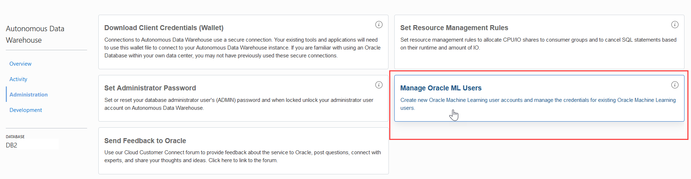

4. On the Oracle Machine Learning User Administration Sign in page, enter the username and password to sign in.

	> **Note:** The username is ADMIN. For the password, use the password you defined while provisioning the Autonomous Database instance.   

	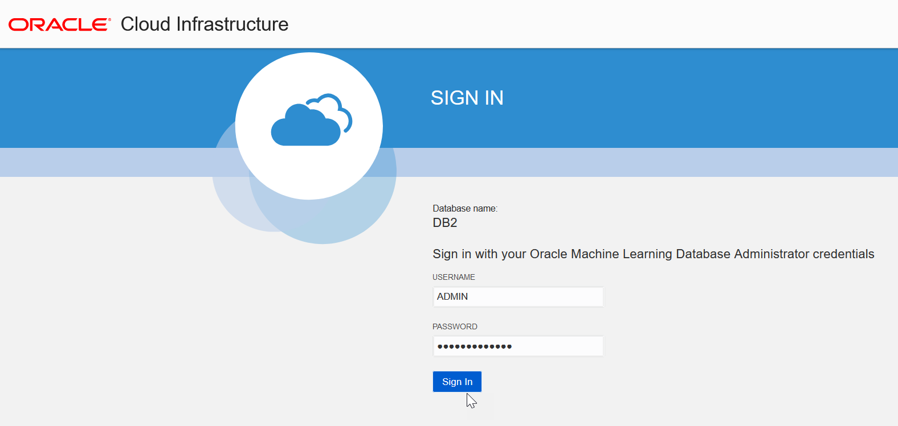

5. Click **Create** on the Oracle Machine Learning User Administration page.

	

6. On the Create User page, enter the following details to create the user:

	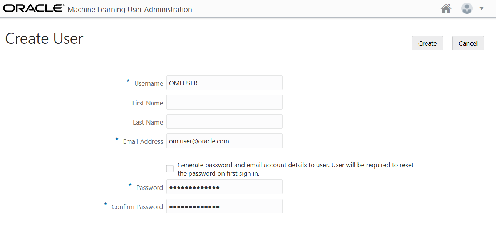

	* **Username:** Enter a username for the account. Using the username, the user will log in to an Oracle Machine Learning instance.
	* **First Name:** Enter the first name of the user.
	* **Last Name:**  Enter the first name of the user.
	* **Email Address:** Enter the email ID of the user.
	* Deselect the option **Generate password and email account details to user. User will be required to reset the password on first sign in**. This option auto generates a temporary password and sends an email with the account credentials to the user. If you select this option, you need not define the password in the **Password** and **Confirm Password** fields, as these two fields are disabled.
	* **Password:** Enter a password for the user.
		> **Note:** This option is disabled if you select the **Generate password...** option to auto generate a temporary password for the user.

	* **Confirm Password:** Enter the password to confirm the value that you entered in the **Password** field. By doing so, you create the password for the user. The user can change the password when first Signing in.

7. Click **Create**. After the user is created, it is listed on the Oracle Machine Learning User Administration page. This completes the task of creating an Oracle Machine Learning user.

	 

**Sign into Oracle Machine Learning**

A notebook is a web-based interface for data analysis, data discovery, data visualization, and collaboration. You create and run notebooks in Oracle Machine Learning user interface. You can access Oracle Machine Learning user interface from Autonomous Database.

1. From the tab on your browser with your ADW instance, click **Service Console**, then select **Development** on the left.

	

2. Click **Oracle Machine Learning Notebooks User Interface.**

	 

3. Enter your user credentials and click **Sign in**.

	> **Note:** The credential is what you have defined while creating the Oracle Machine Learning user.

	

  This opens the Oracle Machine Learning user interface home page.

	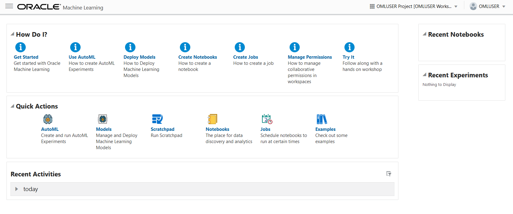

This completes the task of signing into Oracle Machine Learning user interface.

**Create the CUSTOMERS360 table**

In this step, you will create the table ``CUSTOMERS60`` by using the Scratchpad. The Scratchpad is available on the Oracle Machine Learning Notebooks home page. The Scratchpad is a one-click access to a notebook for running SQL statements, PL/SQL scripts, and Python scripts. After you run your scripts, the Scratchpad is automatically saved as a notebook by the default name _Scratchpad_ in the Notebooks page. You can access it later in the Notebooks page. You will learn more about notebooks in Task 3.

> **Note:** You will be using the table CUSTOMERS360 in the _Using Oracle Machine Learning AutoML UI_ task.

To create the table:

1. On the Oracle Machine Learning home page, click **Scratchpad**.

	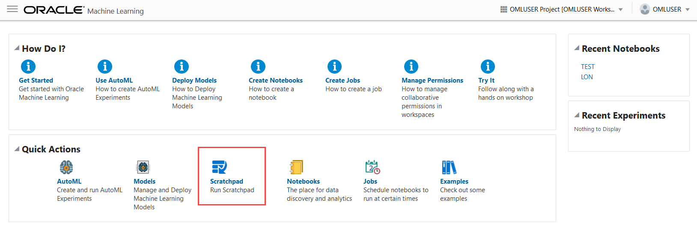

2. By default, the Scratchpad opens with three paragraphs: `%sql` (to run SQL statements), `%script` (to run PL/SQL scripts), and `%python` (to run Python scripts). Here, you will use the SQL paragraph to run a SQL statement to create the CUSTOMER360 table. On the SQL paragraph, click after the `%sql` tag, and press enter.

	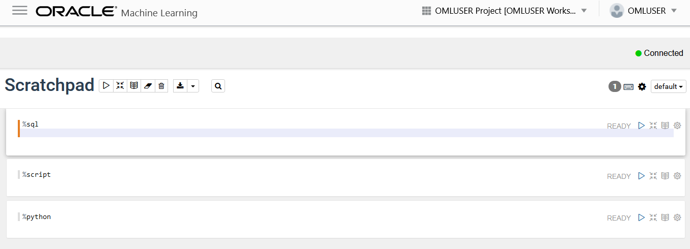

3. In the SQL paragraph copy the following statement and past it on the `%sql` paragraph. Make sure you paste in starting in a new line as shown (add a carriage return after the `%sql` to go to a new line) and click the Run icon :

    ```
    <copy>
		CREATE TABLE CUSTOMERS360 AS
              (SELECT a.CUST_ID, a.CUST_GENDER, a.CUST_MARITAL_STATUS,
                 a.CUST_YEAR_OF_BIRTH, a.CUST_INCOME_LEVEL, a.CUST_CREDIT_LIMIT,
                 b.EDUCATION, b.AFFINITY_CARD,
                 b.HOUSEHOLD_SIZE, b.OCCUPATION, b.YRS_RESIDENCE, b.Y_BOX_GAMES
           FROM SH.CUSTOMERS a, SH.SUPPLEMENTARY_DEMOGRAPHICS b
           WHERE a.CUST_ID = b.CUST_ID);
		</copy>
    ```

	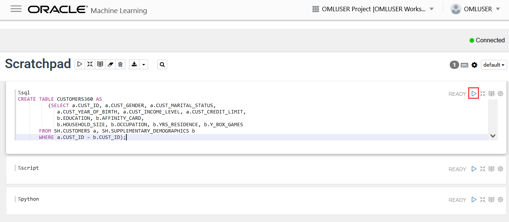

	After the script runs successfully, the paragraph status changes to `FINISHED`, as shown in the screenshot:

	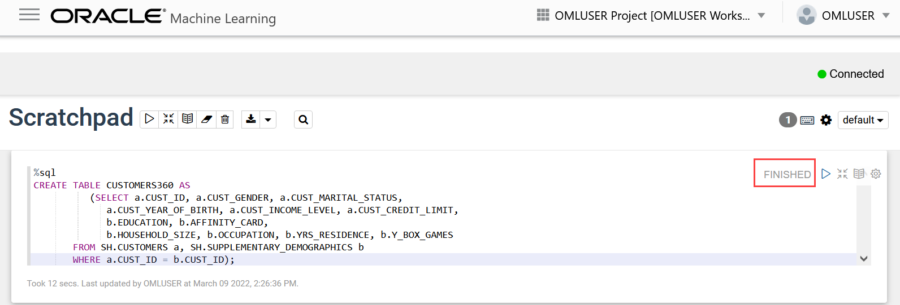

4. Add a new paragraph to run another SQL paragraph. To do that hold  your mouse at the bottom of the paragraph you just ran and a “+ Add Paragraph” option will appear. Click on it and a new empty paragraph will open right under it.

	

5. To view the data in the table you just created, copy and paste the following sql statement into the new paragraph (again in a new line after the `%sql`) and click the Run icon :

	```
		<copy>
		select * from CUSTOMERS360
			where rownum < 10;
		 </copy>
	 ```

	

This completes the task of creating the CUSTOMERS360 table.


## Task 3: Machine Learning Notebooks

**Sign into Oracle Machine Learning User Interface**

A notebook is a web-based interface for data analysis, data discovery, data visualization, and collaboration. You create and run notebooks using Oracle Machine Learning Notebooks, which is accessed through the Oracle Machine Learning user interface on Oracle Autonomous Database.

**Create a Notebook using a Template Example**

This task demonstrates how to create notebooks based on Example templates. You will learn how to:

* Create the OML4Py Classification notebook based on the OML4Py Classification DT example template. The template builds and applies the classification Decision Tree algorithm to build a classification model based on the relationships between the predictor values and the target values. The template uses the Sales History (`SH`) schema.
* Create the Time Series notebook based on the OML4SQL Time Series ESM example template. This template forecasts sales by using the Exponential Smoothing Algorithm for Time Series Data. It also used the `Sales` table in the SH schema.

### Create an OML4Py Notebook using the Classification DT Template Example
This step demonstrates how to create the OML4Py Classification notebook based on the OML4Py Classification DT (Decision Tree) Example template:

1. Go to the Examples page by clicking the hamburger icon  on the top left corner of the page to open the left navigation menu. On the left navigation menu, click **Examples**.

	
	

  Alternatively, on the Oracle Machine Learning home page, click **Examples** in the Quick Actions section to go Examples.

	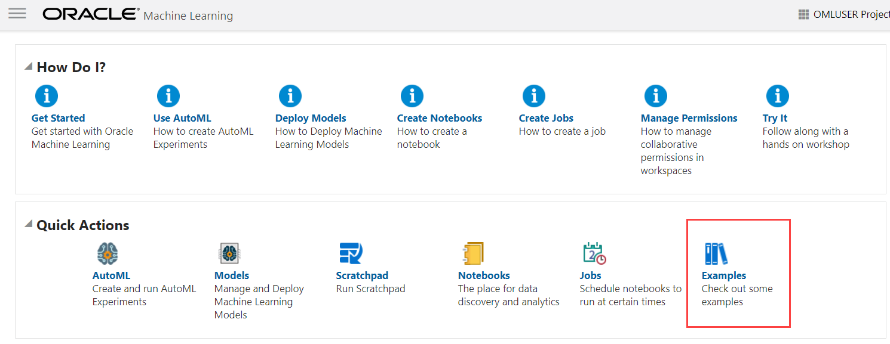


2. Navigate to the **OML4Py Classification DT** example template notebook. You can search for the notebook by typing in keywords in the search box on the upper right corner of the page. Click on the grey box around the notebook. This highlights the notebook and enables the **Create Notebook** button. Click **Create Notebook**.

	

3. The Create Notebook dialog opens. The Name field displays the same name as the template with the suffix `(1)`. You can edit this name. In this example, we will retain the auto-generated name `OML4PY Classification DT (1)`. Click **OK**.

	> **Note:** In the Project field, the current user, project and workspace is selected by default. You have the option to choose a different project or a workspace by clicking the edit icon here.  

	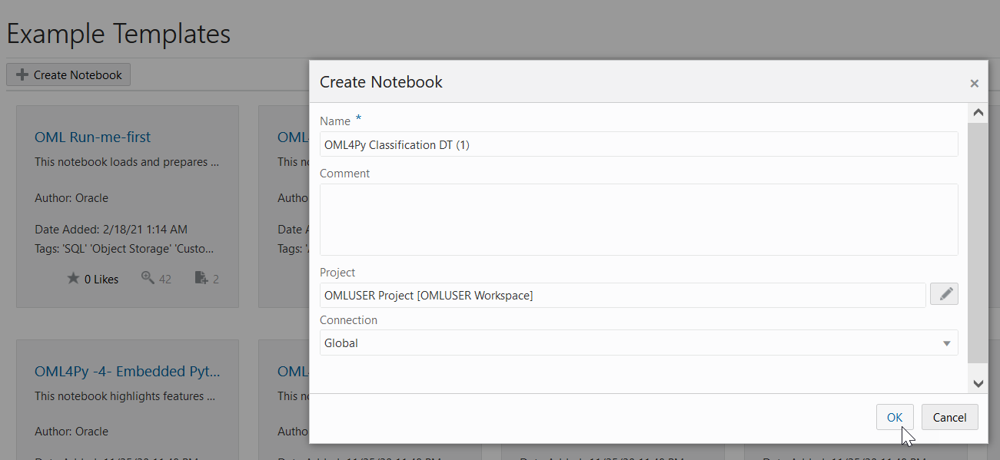


4. Once the notebook is created, the message _Notebook "OML4PY Classification DT (1)" created in project "OMLUSER Project"_ is displayed, as shown in the screenshot. The notebook is now available in the Notebooks page.

	


5. To view the notebook that you just created, click the hamburger icon  on the top left corner of the page to open the left navigation menu. Click **Notebooks** to go to the Notebooks page.

	

	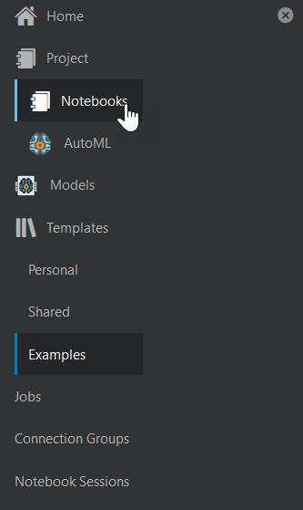


6. The OML4PY Classification DT (1) notebook is now listed on the Notebooks page, as shown in the screenshot. Click it to open the notebook in the Notebooks editor. Note that you will run this notebook in the subsequent steps.

	

This sample notebook contains all the python code we will be running in Task 4 to learn about machine learning and python. You can look through and run all the code in this notebook by clicking on the “Run all paragraphs” button. This is the fast way to do this lab. We suggest running through each step of the lab as detailed in Task 4 to better learn about machine learning and python.

## Task 4: Machine Learning for Python

With OML4Py, you can create Python proxy objects that can be used to access, analyze, and manipulate data that reside in the database. OML4Py uses these proxy objects and transparently translates many standard Python functions into SQL.

For this section of the lab we will be using the iris data set as the source data for creating our machine learning algorithms.  

1. To get started we will create a new notebook. From the hamburger menu on the top left of the OML page select **Notebooks**

	

	

2. When the Notebooks page appears, click on **+Create**

	

3. Name your notebook **OML4Py Classification DT** and click **OK**. The Notebook server will start, this may take a few moments. Once the Notebook starts you will have an empty Notebook and a single empty paragraph.

	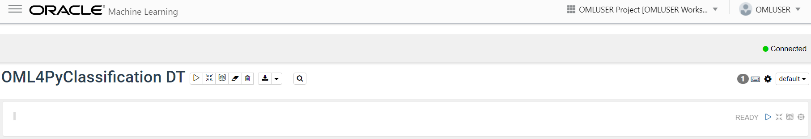

	**Note:** For the remainder of this lab section we will be executing Python code in new paragraphs in the notebook. As you execute each paragraph, a new empty paragraph should open up below it for your next code run. If it does not, to open up a new paragraph, hold your mouse at the bottom of the current paragraph and a **+ Add Paragraph** option will appear. Click on it and a new empty paragraph will open right under it. 

	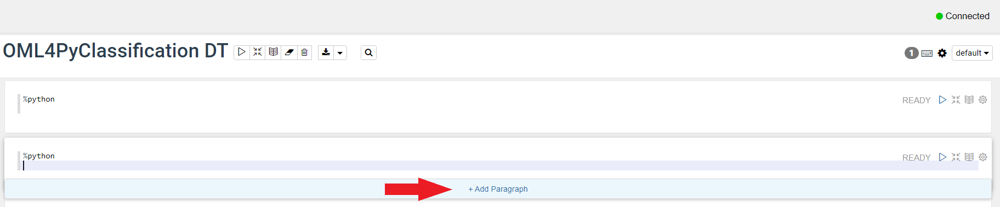

4. To use OML4Py, you must first import the `oml` module and the Pandas library. Use the `oml`.push function to create a temporary table.

	**Note:**  As you run code in the paragraphs, make sure the first line of the paragraph contains **%python**. When a new paragraph is created, the **%python** is automatically populated after the first time. As you copy and paste code, make sure it only appears one time and not twice or the code won’t run.

5. Run the following scripts to import the `oml` package, the Pandas library, and set the display options:
	```
	<copy>
	%python

	import pandas as pd
	import oml

	pd.set_option('display.max_rows', 500)
	pd.set_option('display.max_columns', 500)
	pd.set_option('display.width', 1000)
	</copy>
	```
6. Load the iris data into a single DataFrame. Use the `oml.push` function to load this Pandas DataFrame into the database, which creates a temporary table and returns a proxy object that you can use for IRIS_TMP.

	```
	<copy>
	%python
	from sklearn.datasets import load_iris
	import pandas as pd

	iris = load_iris()

	x = pd.DataFrame(iris.data, columns = ['SEPAL_LENGTH','SEPAL_WIDTH', 'PETAL_LENGTH','PETAL_WIDTH'])
	y = pd.DataFrame(list(map(lambda x: {0: 'setosa', 1: 'versicolor', 2:'virginica'}[x], iris.target)), columns = ['SPECIES'])

	iris_df = pd.concat([x, y], axis=1)
	IRIS_TMP = oml.push(iris_df)

	z.show(IRIS_TMP.head())
	</copy>
	```

  You use the zeppelin-context z.show method to display Python objects and proxy object content. Here, you display the first few rows of IRIS_TMP using z.show.
	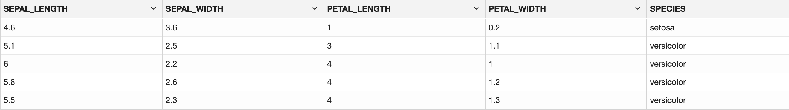

**Create a Persistent Database Table**

1. You can also create a persistent table using the create function and specifying a table name, IRIS as done below. The `oml.create` function creates a table in the database schema and returns an `oml.DataFrame` object. This table is now accessible both within OML4Py and directly from SQL. Use the z.show function to display the desired data in the notebook. To create the persistent table IRIS, run the following script.

	```
	<copy>
	%python
	try:
		oml.drop(table='IRIS')
	except:
		pass
	IRIS = oml.create(iris_df, table = 'IRIS')
	print(IRIS.columns)

	print("Shape:",IRIS.shape)
	z.show(IRIS.head(10))
	</copy>
	```

	The output is as follows:
	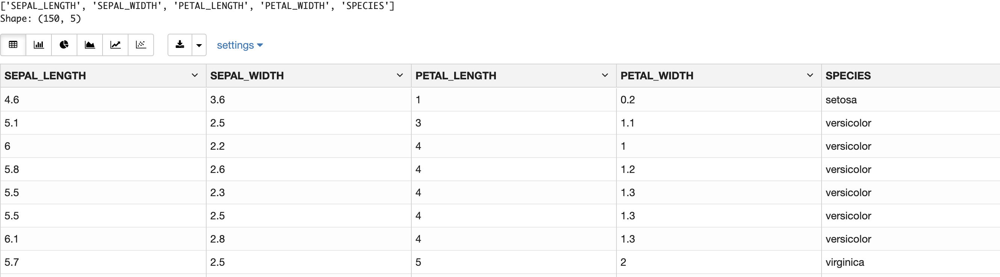

**Create a Proxy Object for a Database Object**

1. Use the `oml.sync` function to create a Python object as a proxy for a database table or view. The `oml.sync` function returns an `oml.DataFrame` object or a dictionary of `oml.DataFrame` objects. The `oml.DataFrame` object returned by `oml.sync` is a proxy for the database object.  
	```
	<copy>
	%python

	DEMO = oml.sync(table = "SUPPLEMENTARY_DEMOGRAPHICS", schema = "SH")
	z.show(DEMO.head())
	</copy>
	```
	In this step, you are viewing a few rows from the SUPPLEMENTARY_DEMOGRAPHICS table using the overloaded head function.
	

**Explore the Data**

In this example, use shape, describe and crosstab functions to explore and view the data.
1. Run the shape function to view the rows and columns of an `oml.DataFrame`.
	```
	<copy>
	%python

	DEMO.shape
	</copy>

	```
	```
	The output is (4500, 14).
	```
2. Use the transparency layer function `describe()` to calculate descriptive statistics that summarize the central tendency, dispersion, and shape of the DEMO table in each numeric column.Note that all computations are computed in the database and only the summary results are returned to the Python client, in this case, the notebook. Eliminating the need to move data greatly increases scalability.A few rows of the output are displayed using the `z.show` function.
	```
	<copy>
	%python
	summary_df = DEMO.describe()
	summary_df = summary_df.reset_index()
	summary_df = summary_df.rename(columns = {'index': 'statistics'})
	z.show(summary_df.head())
	</copy>

	```
	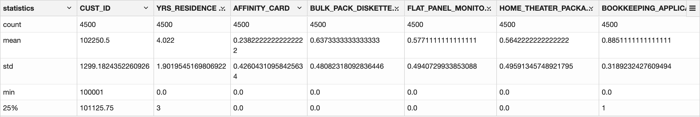
3. Use the crosstab function to perform cross-column analysis of an `oml.DataFrame` object. The crosstab method computes a cross-tabulation of two or more columns. By default, it computes a frequency table for the columns unless a column and an aggregation function have been passed to it.  In this example, the crosstab function displays the distribution of `AFFINITY_CARD` responders. To view the results in bar chart format click on the **Bar Chart** icon located on the icon row between your code and the result set.
	```
	<copy>
	%python

	z.show(DEMO.crosstab('AFFINITY_CARD'))
	</copy>
	```
	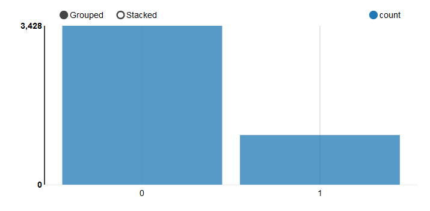
4. Run the following script to view the distribution of `HOUSEHOLD_SIZE` according to `AFFINITY_CARD` responders with the following setting. Click on the **Bar chart**, then click on **settings**. Drag the fields to titles as `HOUSEHOLD_SIZE` to **keys**, `AFFINITY_CARDS`  to **groups**, and count to **values**. Click on **Stacked** to get the required view.
	```
	<copy>
	%python

	z.show(DEMO.crosstab(['HOUSEHOLD_SIZE', 'AFFINITY_CARD']))
	</copy>
	```
	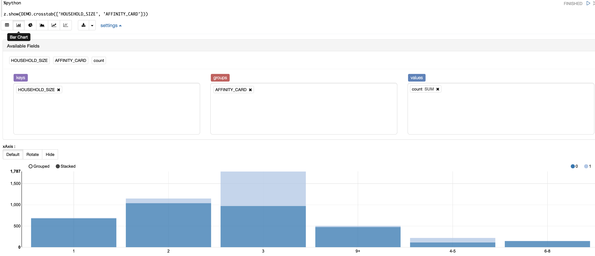

**Prepare the Data**

In this step, you will create a `DEMO_DF` DataFrame, select the necessary columns for further analysis, display a few rows of the `DEMO_DF` DataFrame, and split your data into TRAIN and TEST sets.
1. Use the DEMO proxy object to create a new proxy object `DEMO_DF` by selecting the necessary columns. Run the following script:
	```
	<copy>
	%python

	DEMO_DF = DEMO[["CUST_ID", 'AFFINITY_CARD', "BOOKKEEPING_APPLICATION", "BULK_PACK_DISKETTES", "EDUCATION",
	 "FLAT_PANEL_MONITOR", "HOME_THEATER_PACKAGE", "HOUSEHOLD_SIZE", "OCCUPATION", "OS_DOC_SET_KANJI",
	 "PRINTER_SUPPLIES", "YRS_RESIDENCE", "Y_BOX_GAMES"]]
	 </copy>
	```
2. To display the first few records of `DEMO_DF`, run the following script:
	```
	<copy>
	%python

	z.show(DEMO_DF.head())
	</copy>
	```
	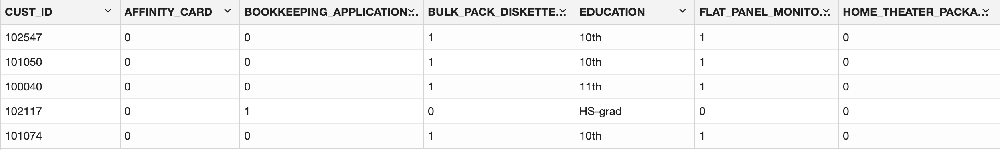
3. In this example, you are splitting the `DEMO_DF` data with 60 percent of the records for the TRAIN data set and 40 percent for the TEST data set. The split method splits the data referenced by DataFrame proxy object `DEMO_DF` into two new DataFrame proxy objects, TRAIN, and TEST.
	```
	<copy>
	%python

	TRAIN, TEST = DEMO_DF.split(ratio = (0.6,0.4))
	TRAIN_X = TRAIN.drop('AFFINITY_CARD')
	TRAIN_Y = TRAIN['AFFINITY_CARD']
	TEST_X = TEST
	TEST_Y = TEST['AFFINITY_CARD']
	</copy>
	```

Since we’ll be using automatic data preparation provided by the in-database algorithms, no further data preparation is required.

**Build Your Model**

Use the `oml.dt` class to build a Decision Tree model. You can build a model with default settings or specify custom model settings.
1. To build a Decision Tree model with the default settings, run the following script:
	```
	<copy>
	%python

	try:
	    oml.drop(model = 'DT_CLAS_MODEL')
	except:
	    print("No such model")

	setting = dict()
	dt_mod = oml.dt(**setting)
	dt_mod.fit(TRAIN_X, TRAIN_Y, case_id = 'CUST_ID', model_name = 'DT_CLAS_MODEL')
	</copy>

	```

	The `oml.dt` class uses the Decision Tree algorithm for classification and a model object `dt_mod` is created with the default parameter settings.  The **fit** function builds the Decision Tree model according to the training data and parameter settings.

	```
	<copy>
	Model Name: DT_CLAS_MODEL

	Model Owner: OMLUSER

	Algorithm Name: Decision Tree

	Mining Function: CLASSIFICATION

	Target: AFFINITY_CARD

	Settings:
	                    setting name            setting value
	0                      ALGO_NAME       ALGO_DECISION_TREE
	1              CLAS_MAX_SUP_BINS                       32
	2          CLAS_WEIGHTS_BALANCED                      OFF
	3                   ODMS_DETAILS              ODMS_ENABLE
	4   ODMS_MISSING_VALUE_TREATMENT  ODMS_MISSING_VALUE_AUTO
	5                  ODMS_SAMPLING    ODMS_SAMPLING_DISABLE
	6                      PREP_AUTO                       ON
	7           TREE_IMPURITY_METRIC       TREE_IMPURITY_GINI
	8            TREE_TERM_MAX_DEPTH                        7
	9          TREE_TERM_MINPCT_NODE                      .05
	10        TREE_TERM_MINPCT_SPLIT                       .1
	11         TREE_TERM_MINREC_NODE                       10
	12        TREE_TERM_MINREC_SPLIT                       20

	Global Statistics:
	  attribute name  attribute value
	0       NUM_ROWS             2725

	Attributes:
	EDUCATION
	HOME_THEATER_PACKAGE
	HOUSEHOLD_SIZE
	OCCUPATION
	YRS_RESIDENCE
	Y_BOX_GAMES

	Partition: NO

	Distributions:

	    NODE_ID  TARGET_VALUE  TARGET_COUNT
	0         0             0          2088
	1         0             1           637
	2         1             0           676
	3         1             1           549
	4         2             0           108
	5         2             1           252
	6         3             0           568
	7         3             1           297
	8         4             0          1412
	9         4             1            88
	10        5             0            50
	11        5             1            23
	12        6             0          1362
	13        6             1            65
	14        7             0            89
	15        7             1           244
	16        8             0            19
	17        8             1             8
	18        9             0           188
	19        9             1            38
	20       10             0           380
	21       10             1           259
	22       11             0            20
	23       12             0            30
	24       12             1            23
	25       13             0           826
	26       13             1             6
	27       14             0           536
	28       14             1            59

	Nodes:

	    parent  node.id  row.count  prediction                                              split                                          surrogate                                        full.splits
	0      0.0        1       1225           0                   (HOUSEHOLD_SIZE IN ("3" "4-5"))                          YRS_RESIDENCE >(3.5E+000))                    (HOUSEHOLD_SIZE IN ("3" "4-5"))
	1      0.0        4       1500           0          (HOUSEHOLD_SIZE IN ("1" "2" "6-8" "9+"))                         YRS_RESIDENCE <=(3.5E+000))           (HOUSEHOLD_SIZE IN ("1" "2" "6-8" "9+"))
	2      1.0        2        360           1       (OCCUPATION IN ("Armed-F" "Exec." "Prof."))   (EDUCATION IN( ("Bach." "Masters" "PhD" "Profs...  (HOUSEHOLD_SIZE IN ("3" "4-5")) AND (OCCUPATIO...
	3      1.0        3        865           0  (OCCUPATION IN ("?" "Cleric." "Crafts" "Farmin...  (EDUCATION IN( ("10th" "11th" "12th" "1st-4th"...  (HOUSEHOLD_SIZE IN ("3" "4-5")) AND (OCCUPATIO...
	4      2.0        7        333           1                         (Y_BOX_GAMES <=(5.0E-001))                         YRS_RESIDENCE >(2.5E+000))  (HOUSEHOLD_SIZE IN ("3" "4-5")) AND (OCCUPATIO...
	5      2.0        8         27           0                          (Y_BOX_GAMES >(5.0E-001))                        YRS_RESIDENCE <=(2.5E+000))  (HOUSEHOLD_SIZE IN ("3" "4-5")) AND (OCCUPATIO...
	6      3.0        9        226           0                       (YRS_RESIDENCE <=(3.5E+000))                 HOME_THEATER_PACKAGE <=(5.0E-001))  (HOUSEHOLD_SIZE IN ("3" "4-5")) AND (OCCUPATIO...
	7      3.0       10        639           0                        (YRS_RESIDENCE >(3.5E+000))                  HOME_THEATER_PACKAGE >(5.0E-001))  (HOUSEHOLD_SIZE IN ("3" "4-5")) AND (OCCUPATIO...
	8      4.0        5         73           0         (EDUCATION IN ("Masters" "PhD" "Profsc"))                                                None  (HOUSEHOLD_SIZE IN ("1" "2" "6-8" "9+")) AND (...
	9      4.0        6       1427           0  (EDUCATION IN ("10th" "11th" "12th" "1st-4th" ...                                               None  (HOUSEHOLD_SIZE IN ("1" "2" "6-8" "9+")) AND (...
	10     5.0       11         20           0                (HOME_THEATER_PACKAGE <=(5.0E-001))                           Y_BOX_GAMES >(5.0E-001))  (HOUSEHOLD_SIZE IN ("1" "2" "6-8" "9+")) AND (...
	11     5.0       12         53           0                 (HOME_THEATER_PACKAGE >(5.0E-001))                          Y_BOX_GAMES <=(5.0E-001))  (HOUSEHOLD_SIZE IN ("1" "2" "6-8" "9+")) AND (...
	12     6.0       13        832           0                       (YRS_RESIDENCE <=(3.5E+000))                 HOME_THEATER_PACKAGE <=(5.0E-001))  (HOUSEHOLD_SIZE IN ("1" "2" "6-8" "9+")) AND (...
	13     6.0       14        595           0                        (YRS_RESIDENCE >(3.5E+000))                  HOME_THEATER_PACKAGE >(5.0E-001))  (HOUSEHOLD_SIZE IN ("1" "2" "6-8" "9+")) AND (...
	14     NaN        0       2725           0                                               None                                               None    
	                                              (
	</copy>

	```
2. To specify model settings and build a Decision Tree model, run the following script :
	```
	<copy>
	%python

	try:
	    oml.drop(model = 'DT_CLAS_MODEL')
	except:
	    print("No such model")

	settings = {'TREE_IMPURITY_METRIC': 'TREE_IMPURITY_GINI',
	            'TREE_TERM_MAX_DEPTH': '7',
	            'TREE_TERM_MINPCT_NODE': '0.05',
	            'TREE_TERM_MINPCT_SPLIT': '0.1',
	            'TREE_TERM_MINREC_NODE': '10',
	            'TREE_TERM_MINREC_SPLIT': '20',
	            'CLAS_MAX_SUP_BINS': '32'}


	dt_mod = oml.dt(**settings)
	dt_mod.fit(TRAIN_X, TRAIN_Y, case_id = 'CUST_ID', model_name = 'DT_CLAS_MODEL')
	</copy>
	```
	The following is the list of model settings that are applied in the example:
* `TREE_IMPURITY_METRIC`: Specifies tree impurity metric for a Decision Tree model. Tree algorithms seek the best column/attribute and values for splitting data at each node. The best splitter and split value are those that result in the largest increase in target value homogeneity (purity) for the entities in the node. Purity in the decision trees algorithm can use either gini (`TREE_IMPURITY_GINI`) or entropy (`TREE_IMPURITY_ENTROPY`) as the purity metric. By default, the algorithm uses `TREE_IMPURITY_GINI`.
* `TREE_TERM_MAX_DEPTH`: Specifies the criteria for splits: maximum tree depth (the maximum number of nodes between the root and any leaf node, including the leaf node). The default is 7.
* `TREE_TERM_MINPCT_NODE`: Specifies the minimum number of training rows in a node expressed as a percentage of the rows in the training data. The default value is 0.05, indicating 0.05%.
* `TREE_TERM_MINPCT_SPLIT`: Specifies the minimum number of rows required to consider splitting a node expressed as a percentage of the training rows. The default value is 0.1, indicating 0.1%.
`TREE_TERM_MINREC_NODE`: Specifies the minimum number of rows in a node. The default value is 10.
* `TREE_TERM_MINREC_SPLIT`: Specifies the criteria for splits: minimum number of records in a parent node expressed as a value. No split is attempted if the number of records is below this value. The default value is 20.
* `CLAS_MAX_SUP_BINS`: Specifies the maximum number of bins for each attribute. The default value is 32.

**Evaluate Your Model**

To evaluate your model you need to score the test data using the model and then evaluate the model using various metrics.
1. In this step, you will make predictions on the test case and add the `CASE_ID` as a supplemental column so that you can uniquely associate scores with the original data. To do so run the below script:
	```
	<copy>
	%python

	# Set the case ID attribute
	case_id = 'CUST_ID'
	# Gather the Predictions
	RES_DF = dt_mod.predict(TEST_X, supplemental_cols = TEST_X)
	# Additionally collect the PROBABILITY_OF_0 and PROBABILITY_OF_1
	RES_PROB = dt_mod.predict_proba(TEST_X, supplemental_cols = TEST_X[case_id])
	# Join the entire result into RES_DF
	RES_DF = RES_DF.merge(RES_PROB, how = "inner", on = case_id, suffixes = ["", ""])
	</copy>
	```
2. To evaluate the model, pass a proxy `oml.Dataframe` containing predictions and the target columns in a user-defined function named evaluate_model. Evaluate your model using standard metrics. For a classification example, you can evaluate your model using Confusion Matrix, Lift Chart, Gains Chart, and ROC curve chart. The Confusion Matrix displays the number of correct and incorrect predictions made with respect to the actual classification in the test data. It is an **n**-by-**n** matrix where **n** is the number of classes. A lift chart applies only to binary classifications requiring the designation of the positive class. It measures the degree to which the predictions of a classification model are better than randomly generated predictions. The ROC curve also applies to binary classification and requires the designation of the positive class. These are metrics for comparing predicted and actual target values in a classification model.

	Here is a custom script to generate the metrics and charts as described above. Run the below script:
	```
	<copy>
	%python

	def evaluate_model(pred_data='',settings_name={''},name='',target=''):
	    import numpy as np
	    import matplotlib.pyplot as plt
	    from sklearn.metrics import auc
	    from sklearn.metrics import roc_curve

	    #Creating the confucion matrix using crosstab function.
	    conf_matrix = pred_data.crosstab(target,'PREDICTION',pivot=True)

	    # Extract Statistics from the Confusion Matrix
	    cf_local = conf_matrix.pull()
	    TN = int(cf_local[cf_local[target]==0]['count_(0)'])
	    FN = int(cf_local[cf_local[target]==0]['count_(1)'])
	    TP = int(cf_local[cf_local[target]==1]['count_(1)'])
	    FP = int(cf_local[cf_local[target]==1]['count_(0)'])
	    TPR = TP/(TP+FN)
	    FPR = FP/(FP+TN)
	    TNR = TN/(TN+FP)
	    FNR = FN/(FN+TP)
	    Precision = TP/(TP+FP)
	    Accuracy = (TP+TN)/(TP+TN+FP+FN)
	    NPV = TN/(FN+TN)
	    DetectionRate = TN/(FN+TN)
	    BalancedAccuracy = (TPR+TNR)/2

	    # Estimated AUC
	    pred_local = pred_data.pull()
	    fpr, tpr, _ = roc_curve(pred_local[[target]],pred_local[['PROBABILITY_OF_1']])
	    AUC = auc(fpr, tpr)
	    opt_index = np.argmax(tpr - fpr)
	    FPR_OPT = fpr[opt_index]
	    TPR_OPT = tpr[opt_index]
	    F1Score = 2*Precision*TPR/(Precision+TPR)
	    MathewsCorrCoef = ((TP*TN)-(FP*FN))/((TP+FP)*(TP+FN)*(TN+FP)*(TN+FN))**0.5

	    # Store all statistics to export
	    statistics = {'Algorithm' : name,
	                  'Algorithm_setting' : settings_name,
	                  'TN' : TN,
	                  'TP' : TP,
	                  'FP' : FP,
	                  'FN' : FN,
	                  'TPR' : TPR,
	                  'FPR' : FPR,
	                  'TNR' : TNR,
	                  'FNR' : FNR,
	                  'Precision' : Precision,
	                  'Accuracy' : Accuracy,
	                  'NPV' : NPV,
	                  'DetectionRate' : DetectionRate,
	                  'BalancedAccuracy' : BalancedAccuracy,
	                  'AUC' : AUC,
	                  'F1Score' : F1Score,
	                  'MathewsCorrCoef' : MathewsCorrCoef
	                  }
	    # Nice round stats for printing to screen
	    TOTAL = TP+TN+FP+FN
	    TN_P = round((TN/TOTAL*100),2)
	    FP_P = round((FP/TOTAL*100),2)
	    FN_P = round((FN/TOTAL*100),2)
	    TP_P = round((TP/TOTAL*100),2)
	    # Print the output nicely on Zeppelin native Table
	    print("%table CONFUSION MATRIX\tPREDICTED 0\tPREDICTED 1\nACTUAL 0\t"+
	          "True Negative: "+str(TN)+" ("+str(TN_P)+"%)\t"+
	          "False Positive: "+str(FP)+" ("+str(FP_P)+"%)\nACTUAL 1\t"+
	          "False Negative: "+str(FN)+" ("+str(FN_P)+"%)\t"+
	          "True Positive: "+str(TP)+" ("+str(TP_P)+"%)\n"+
	          "Accuracy: "+str(round(Accuracy*100,4))+"%\t"+
	          "AUC: "+str(round(AUC,4))+"\t"+
	          "F1Score: "+str(round(F1Score,4))
	          )

	    # Multiple Charts for Evaluation
	    fig, axes = plt.subplots(nrows=1, ncols=4,figsize=[22,5])
	    ax1, ax2, ax3, ax4 = axes.flatten()
	    fig.suptitle('Evaluation of the '+str(name)+' Model, with settings: '+str(settings_name), size=16)

	    # Statistics
	    ax1.axis('off')

	    # Function to return rounded numbers if the string is float, return
	    # integers otherwise and return characters if not a number
	    def round_if_float(content):
	        try:
	            val = float(content)
	        except ValueError:
	            return(content)
	        else:
	            if val.is_integer():
	                return(int(content))
	            else:
	                return(round(float(content),4))

	    for num, name in enumerate(statistics):
	        ax1.text(0.01,
	        (-num*0.06+0.94),
	        "{0}: {1}".format(name,round_if_float(statistics[name])),
	        ha='left',
	        va='bottom',
	        fontsize=12)

	    # Produce Lift Chart
	    ax2.set_title('Lift Chart')
	    data = pred_local.sort_values(by='PROBABILITY_OF_1', ascending=False)
	    data['row_id'] = range(0,0+len(data))
	    data['decile'] = ( data['row_id'] / (len(data)/10) ).astype(int)
	    lift = data.groupby('decile')[target].agg(['count','sum'])
	    lift.columns = ['count', target]
	    lift['decile'] = range(1,11)

	    data_ideal = pred_local.sort_values(by=target, ascending=False)
	    data_ideal['row_id'] = range(0,0+len(data))
	    data_ideal['decile'] = ( data_ideal['row_id'] / (len(data_ideal)/10) ).astype(int)
	    lift_ideal = data_ideal.groupby('decile')[target].agg(['count','sum'])
	    lift_ideal.columns = ['count', 'IDEAL']
	    lift['IDEAL']=lift_ideal['IDEAL']

	    ax2.bar(lift['decile'],lift['IDEAL']/lift['count'],
	    color='darkorange', label='Ideal')
	    ax2.bar(lift['decile'],lift[target]/lift['count'],
	    color='blue', alpha=0.6, label='Model')
	    ax2.axhline((lift[target]/lift['count']).mean(),
	    color='grey', linestyle='--', label='Avg TARGET')
	    ax2.set_ylim(0,1.15)
	    ax2.set_xlabel('Decile', size=13)
	    ax2.set_ylabel('Percent of Actual Targets', size=13)
	    # Print labels.
	    for dec in lift['decile']:
	        ax2.text(dec, lift[lift.decile==dec][target]/lift[lift.decile==dec]['count'] + 0.05,
	        ("%.0f" % int(round((lift[(lift.decile==dec)][target]/lift[lift.decile==dec]['count'])*100,0)))+"%",
	        ha='center', va='bottom')
	    ax2.legend(loc="upper right")

	    # Produce Gains Chart
	    ax3.set_title('Distributions of Predictions')
	    pred_local[pred_local[target]==1]['PROBABILITY_OF_1'].rename("Target = 1").plot(kind='density', bw_method=0.1, grid=True, ax=ax3)
	    pred_local[pred_local[target]==0]['PROBABILITY_OF_1'].rename("Target = 0").plot(kind='density', bw_method=0.1, grid=True, ax=ax3)
	    ax3.axvline(.5, color='grey', linestyle='--', label='Cutoff at 0.5')
	    ax3.set_xlim([0,1])
	    ax3.set_xlabel('Probability of 1', size=13)
	    ax3.set_ylabel('Density', size=13)
	    ax3.legend(loc="upper right")

	    # ROC curve Chart
	    ax4.set_title('ROC Curve')
	    ax4.plot(fpr, tpr, color='blue', lw=2, label='ROC curve')
	    ax4.plot(FPR_OPT, TPR_OPT, 'bo', color='orange', markersize=6)
	    ax4.plot([0, 1], [0, 1], lw=2, linestyle='--', color='grey', label='Random guess')
	    ax4.annotate('Optimal Cutoff:\nTPR: '+str(round(TPR_OPT,2))+' FPR: '+str(round(FPR_OPT,2)),
	                 fontsize=11, xy=(FPR_OPT, TPR_OPT), xycoords='data', xytext=(0.98, 0.54),
	                 textcoords='data',
	                 arrowprops=dict(facecolor='gray', shrink=0.1, width=2,
	                                 connectionstyle='arc3, rad=0.3'),
	                 horizontalalignment='right', verticalalignment='top')
	    ax4.annotate('AUC ='+str(round(AUC,4)), xy=(0.5, 0.35),
	                 xycoords='axes fraction', size=13)
	    ax4.annotate('Precision ='+str(round(Precision,4)), xy=(0.45, 0.3),
	                 xycoords='axes fraction', size=13)
	    ax4.annotate('Recall ='+str(round(TPR,4)), xy=(0.4, 0.25),
	                 xycoords='axes fraction', size=13)
	    ax4.annotate('Accuracy ='+str(round(Accuracy,4)), xy=(0.35, 0.2),
	                 xycoords='axes fraction', size=13)
	    ax4.annotate('F1 Score ='+str(round(F1Score,4)), xy=(0.3, 0.15),
	                 xycoords='axes fraction', size=13)
	    ax4.set_xlim([-0.02, 1.02])
	    ax4.set_ylim([0.0, 1.02])
	    ax4.set_xlabel('False Positive Rate', size=13)
	    ax4.set_ylabel('True Positive Rate', size=13)
	    ax4.legend(loc="lower right")

	    return(statistics, pred_local)
	_ = evaluate_model(pred_data=RES_DF, settings_name='Gini,Max Depth:7,Min%Node:0.05,Min%Split:0.1', name='Decision Tree', target='AFFINITY_CARD')
	</copy>
	```
	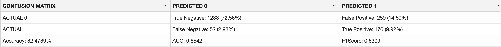
	

3. You can also call the score function to get the model accuracy computed on the TEST data provided.
	```
	<copy>
	%python
	dt_mod.score(TEST_X, TEST_Y)
	</copy>

	```

	```
	The output is 0.824789
	```
	You obtain an accuracy of 0.824789 or approximately 82.5% of the result are correctly predicted.

**Score Data for Deployment Using Your Model**

Having built and evaluated the model, you will now filter scores computed above. Such results can be computed in batch and materialized as a table for static lookup by applications and dashboards or results can be computed dynamically using in-database models using OML4Py functions or SQL queries.
1. You can also display results of customers responding to affinity card with a probability greater than 0.5. You can also select the columns from the `RES_DF` dataset to display. To do so, run the following script.
	```
	<copy>
	%python  
	z.show(RES_DF[RES_DF['PROBABILITY_OF_1'] > 0.5][['PREDICTION', 'PROBABILITY_OF_1', 'CUST_ID', 'AFFINITY_CARD','EDUCATION','OCCUPATION', 'HOUSEHOLD_SIZE', 'YRS_RESIDENCE', 'OS_DOC_SET_KANJI','BULK_PACK_DISKETTES']])
	</copy>
	```
	The output is as follows:
	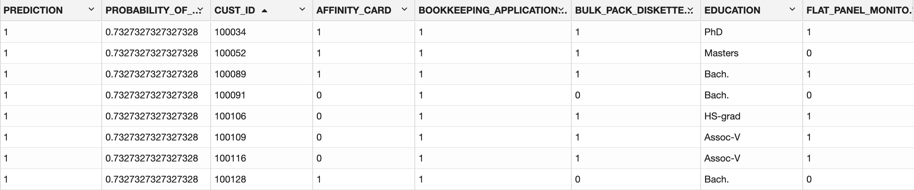

2. Now use the model to make predictions again on the test data by using the predict function, but also specify to retrieve prediction details using the `topN_attrs` parameter. To do so run the below script.
	```
	<copy>
	%python

	RES_DF = dt_mod.predict(TEST_X, supplemental_cols = TEST_X[['CUST_ID']], topN_attrs = True)
	z.show(RES_DF)
	</copy>
	```
	where `topN_attrs` returns the top **N** most influential attributes of the predicted value. For each attribute, three columns are provided: the attribute name, specific value, and corresponding weight of that attribute are provided. The output is similar to the following:
	

**Use the SQL Interface to Score Data and Display Prediction Details**

You can score data and make similar predictions using the SQL interface. The test data is materialized into DT\_TEST\_TABLE so that you can query it using SQL. The materialized method writes the contents of an Oracle Machine Learning proxy object (a view, a table, and so on) to an Oracle Database table.
1. Run the following command to materialize the test dataset:
	```
	<copy>
	%python

	try:
	    oml.drop(table = 'DT_TEST_TABLE')
	except:
	    pass
	_ = TEST_X.materialize(table = 'DT_TEST_TABLE')
	</copy>
	```
2. Run the following SQL command to score and display the prediction details. The prediction functions apply a decision tree classification model named `DT_CLAS_MODEL` to the data from the materialized table `DT_TEST_TABLE`. The query includes information about the predictors that have the greatest influence on the prediction.
	```
	<copy>
	%sql

	SELECT CUST_ID,
	    round(PREDICTION_YRS_RES,3) PRED_YRS_RES,
	    RTRIM(TRIM(SUBSTR(OUTPRED."Attribute1",17,100)),'rank="1"/>') FIRST_ATTRIBUTE,
	    RTRIM(TRIM(SUBSTR(OUTPRED."Attribute2",17,100)),'rank="2"/>') SECOND_ATTRIBUTE,
	    RTRIM(TRIM(SUBSTR(OUTPRED."Attribute3",17,100)),'rank="3"/>') THIRD_ATTRIBUTE
	FROM (SELECT CUST_ID,
	             PREDICTION(DT_CLAS_MODEL USING *) PREDICTION_YRS_RES,
	             PREDICTION_DETAILS(DT_CLAS_MODEL USING *) PD
	     FROM DT_TEST_TABLE
	     WHERE CUST_ID < 100015
	     ORDER BY CUST_ID) OUT,
	     XMLTABLE('/Details'
	              PASSING OUT.PD
	              COLUMNS
	              "Attribute1" XMLType PATH 'Attribute[1]',
	              "Attribute2" XMLType PATH 'Attribute[2]',
	              "Attribute3" XMLType PATH 'Attribute[3]')
	     OUTPRED
	</copy>
	```
	The output is similar to the following:
	

This concludes the Python portion of the lab. In the next section we will learn about the AutoML UI.

## Task 5: Machine Learning AutoML UI
 
 **Access Oracle Machine Learning AutoML UI**

Click the hamburger icon  on the top left corner of the home page to open the left navigation menu. Click **AutoML**. This opens the AutoML Experiments page.

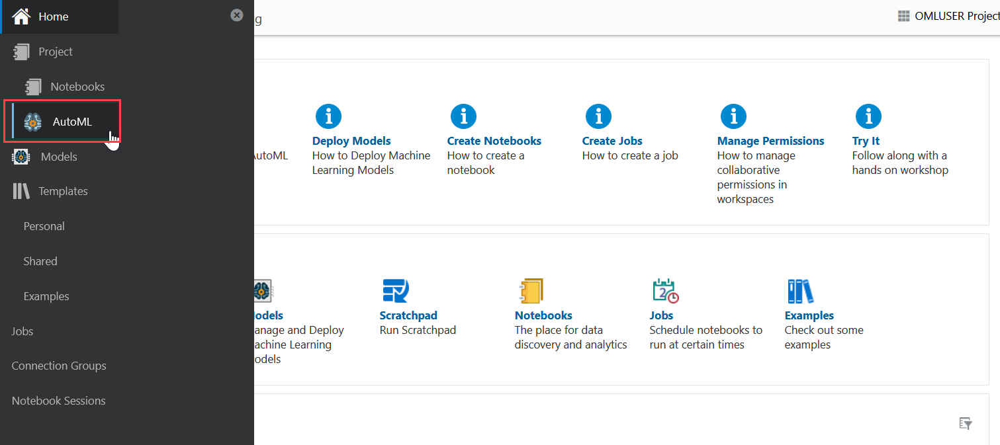

**Create an Experiment**

An Experiment can be described as a work unit that contains the definition of data source, prediction target, and prediction type along with optional settings. After an Experiment runs successfully, it presents you a list of machine learning models in the leader board. You can select any model for deployment, or use it to create a notebook based on the selected model.
When creating an Experiment, you must define the data source and the target of the experiment. To create an Experiment:

1. Click **AutoML** on your Oracle Machine Learning home page. Alternatively, you can go to the left navigation menu at the upper left corner of the page and click AutoML. The AutoML Experiments page opens.

	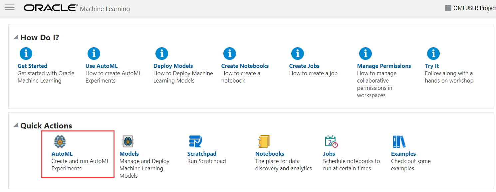

2. Click **Create**. The Create Experiments page opens.

	

3. In the **Name** field, enter **Customers 360**.


4. In the **Comments** field, enter comments, if any.

5. In the **Data Source** field, click the search icon to open the Select Table dialog. Under Schema, click **OMLUSER** and on the right pane, click **CUSTOMERS360** from the list of tables. Click **OK**.

	>**Note:** The Customers360 table is present in the OMLUSER schema.

	

6. In the **Predict** drop-down list, select the column **AFFINITY_CARD** from the ``CUSTOMERS360`` table. You can also type the column name and the column names are filtered for easier selection. This is the target for your prediction.

7. In the **Prediction Type** field, the prediction type is automatically selected based on target field data type and cardinality. In this lab, **Classification** is automatically selected.	The supported prediction types are:

	* Classification: For non-numeric data type, Classification is selected by default. Classification may be selected for small cardinality numeric data as well.
	* Regression: For numeric data type, Regression is selected by default.
8. In the **Case ID** field, select **CUST_ID**. For easier selection, you can also type the column name and the column names are filtered. The Case ID helps in data sampling and dataset split to make the results reproducible between experiments. It also aids in reducing randomness in the results. This is an optional field.  
	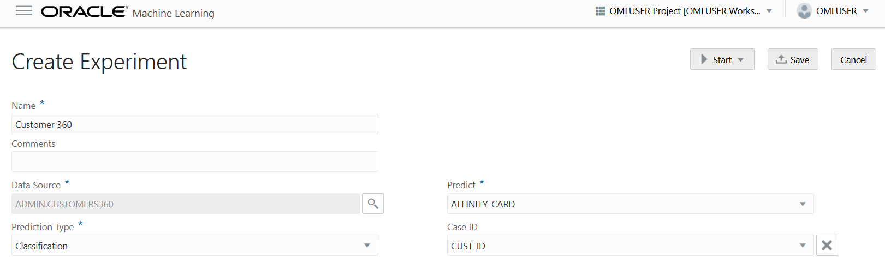

9. To adjust additional settings of this experiment, expand the **Additional Settings** section on the Experiments page, and make the following changes:

	

10. **Maximum Top Models:** Click the down arrow and set it to 3. This is the maximum number of top models to create. The default is 5 models. Fewer models built results is less time and the experiment will complete sooner.

11. **Maximum Run Duration:** This is the maximum time for which the experiment will be allowed to run. Retain the default entry 8. If you do not enter a time, then the experiment will be allowed to run up to the default, which is 8 hours am extreme upper bound.

12. **Database Service Level:** This is the database connection service level and query parallelism level. Default is **Low**. Change this to **Medium**.

	*  **High** level gives the greatest parallelism but significantly limits the number of concurrent jobs.
	*  **Medium** level enables some parallelism but allows greater concurrency for job processing.

>**Note:** Changing the database service level setting on the Always Free Tier will have no effect since there is a 1 OCPU limit. However, if you increase the OCPUs allocated to your autonomous database, then you can increase the Database Service Level to Medium or High.

13. Leave the other settings under **Additional Settings** as is, and click **Start** and then **Faster Results** to trigger the AutoML UI experiment to run.

	

	Note the following about the two options:

	* **Faster Results:** Select this option if you want to get candidate models sooner, possibly at the expense of accuracy. This option works with a smaller set of pipeline combinations and hence yields faster results.
	* **Better Accuracy:** Select this option if you want more pipeline combinations to be tried for possibly more accurate models. A pipeline is defined as an algorithm, selected data feature set, and set of algorithm hyperparameters.

> **Note:** This option works with the broader set of hyperparameter options recommended by the internal meta-learning model. Selecting Better Accuracy will take longer to run your experiment, but may provide models with more accuracy.

This completes the task of creating an experiment.
When an experiment starts running, the status is displayed in a progress bar. When an experiment runs, it starts to show the results in the Leader Board. Click **Details** next to the **Stop** button to view the experiment run details, as shown in the screen shot.

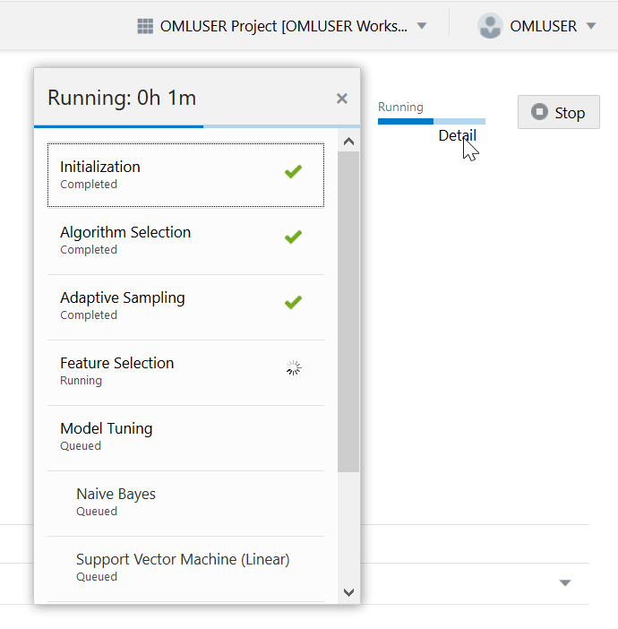

The Leader Board displays the top performing models relative to the model metric selected along with the algorithm and accuracy. Here,  you will view the additional metrics Precision, Recall, ROC AUC for the models:

14. Scroll down the Customer 360 experiments page to view the Leader Board section. The top three algorithms for this experiment are Naive Bayes, Random Forest and Support Vector Machine (Linear).

	>**Note:** Only when the experiment is completed, can you perform any of these actions listed here, including metrics 	selection.


	

15. Click on the Naive Bayes model row, and not on the model. This highlights the model row in blue. Click **Metrics**. The **Select Additional Metrics** dialog opens.

	>**Note:** The additional metrics can be selected once the experiment has completed.

	

16. In the Select Additional Metrics dialog, click **Precision, Recall, ROC AUC**, and then click the close icon to close the dialog.

	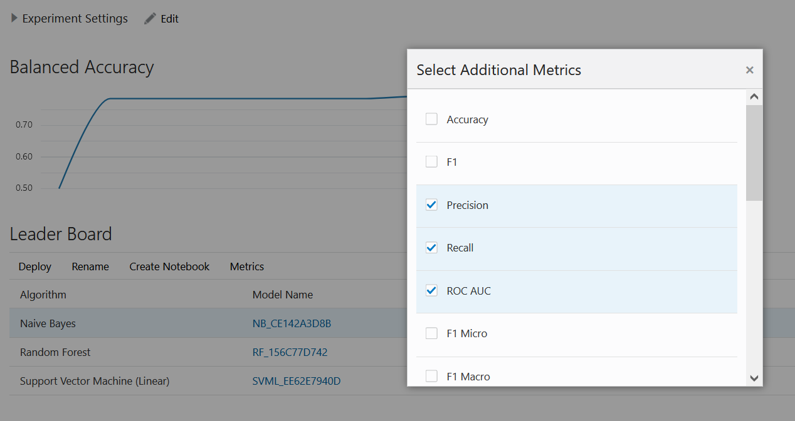

	The Leader Board now displays the selected metrics, as shown in the screenshot here. You can sort the rows by clicking the triangle to the right of each column name.

	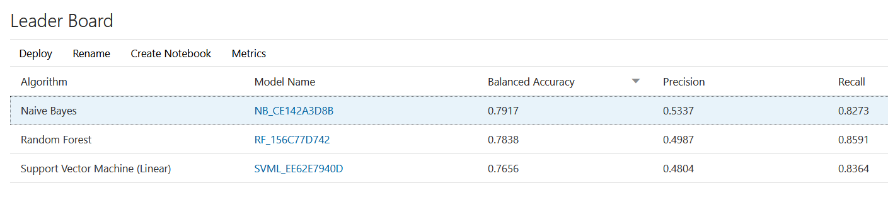

17. Click on any row in the Leader Board to enable the options - **Deploy, Rename**, and **Create Notebook**. Note that these options are greyed out if you do not click on the rows.

18. Click on the Naive Bayes model row (and not on the model), and then click **Rename**. In the Rename Model dialog, enter `NB_Customer360` to rename the auto generated model name for Naive Bayes. Click **OK**.  	

	

19. Click **OK**. A confirmation message is displayed once the renaming is complete.

	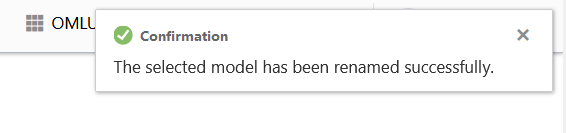

	The leader board refreshes to display the renamed model.

	

20. Click on any model name to view the model details in the Model Detail dialog. Click **Prediction Impacts** and **Confusion Matrix** tab in the dialog to view the respective details, as shown in the screenshots below:

* **Prediction Impact:** Displays the importance of the attributes in terms of the target prediction of the models. In this lab, the attribute HOUSEHOLD_SIZE has the highest impact on target prediction. Move your cursor over the prediction impact chart for each attribute to view the values.

	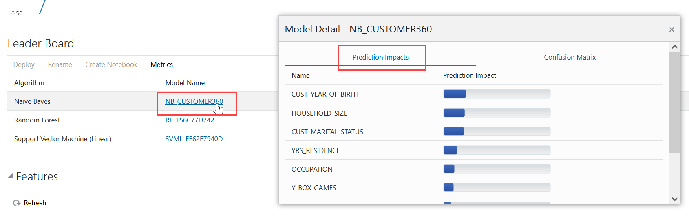


* **Confusion Matrix:** Characterizes the accuracy of a model, including the types of errors made. It is computed by OML AutoML UI on a random subset of the original data (based on the cross-validation process) to help assess the model quality. Because our target is binary, the results are classified into true positive (actual = predicted = 1), true negative (actual = predicted = 0), false positive (actual = 0, predicted = 1) and false negative (actual = 1, predicted = 0).

	>Note: The values shown here represent percentages of the test data that correspond to each of the confusion matrix entries.

	

## Task 6: Homework

- Complete the Machine Learning Lab
- Submit screenshots of the following (one is from the python section and one is from the AutoML section, you need to find them)
	- From Task 4 (Python): The prediction output of running the topN\_attrs on CUST\_ID
	- From Taks 5 (AutoML): The Confusion Matrix for the Naïve Bayes Algorithm found under the “Metrics” for your Leader Board


