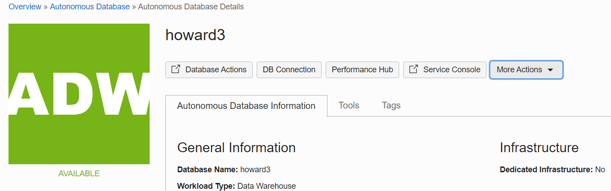
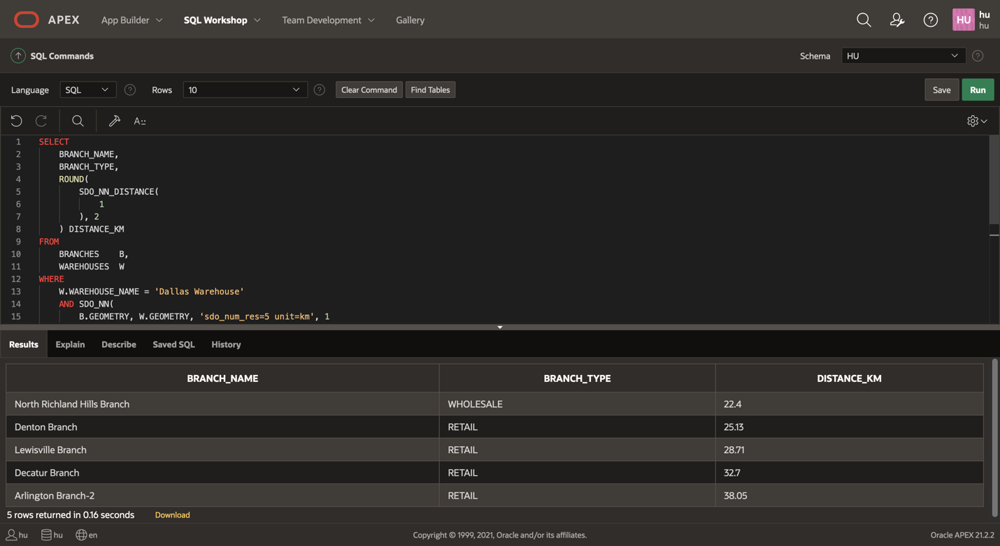
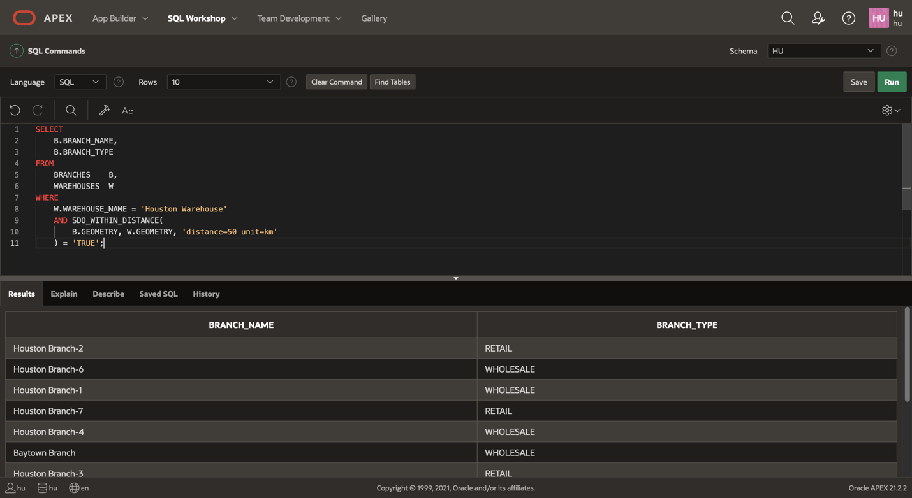
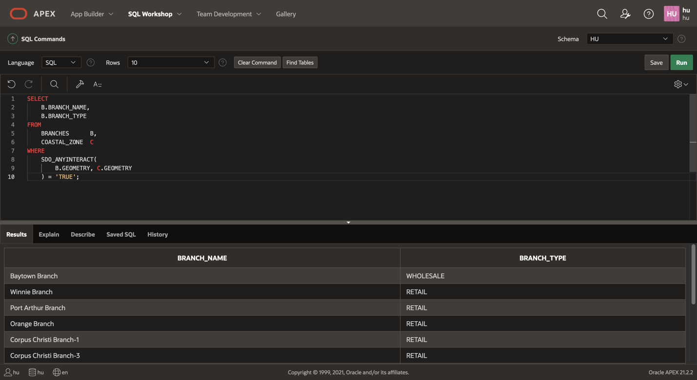

# Introduction

## About Oracle Spatial

Oracle’s mission is to help people see data in new ways, discover insights, and unlock endless possibilities. Spatial analysis is about understanding complex interactions based on geographic relationships – answering questions based on where people, assets, and resources are located. Spatial insights enable you to provide better customer service, optimize your workforce, locate retail and distribution centers, evaluate sales and marketing campaigns, and more. With Oracle’s spatial offerings, developers, database professionals, and analysts can use a comprehensive suite of spatial data management, analytics, and visualization tools to integrate spatial analysis and mapping into applications on enterprise grade data management infrastructure – Oracle Database and Oracle Exadata. Innovative technologies of Oracle Cloud Gen 2 and Oracle Autonomous Database, the industry’s only self-driving, self-securing, and self-repairing database, are available to spatial applications. 

As illustrated below, the spatial features of Oracle Database provide scalable and performant storage, processing and analysis of both basic and advanced spatial data types. A series of deployable Java EE components are also provided to support common mid-tier services. 

  

For more information please visit [https://oracle.com/goto/spatial] (https://oracle.com/goto/spatial)

### Task Overview

In this task you will create and configure spatial data and perform some basic spatial queries.  The scenario involves WAREHOUSES, BRANCHES, and a COASTAL\_ZONE. The WAREHOUSES and BRANCHES are points, and the COASTAL\_ZONE is a polygon. You will create and configure these spatial tables, and then perform spatial queries to identify items on proximity and containment.

## Task 1: Connecting to your Oracle Cloud Database

1. Log in to the Oracle Cloud at <a href="https://cloud.oracle.com">cloud.oracle.com</a>. Cloud Account Name is howarduniversity. Click "Next".
2. Click on "Direct Sign-In" and enter your Cloud Account email and password.

    

3. Once you are logged in, you are taken to the cloud services dashboard where you can see all the services available to you. Click the navigation menu in the upper left to show top level navigation choices.

    


4. Click **Autonomous Data Warehouse**.

    

5. From the Compartment drop down on the left side of the page, expand howarduniversity->spring2022->student1xx and select you student number.

    

6. Click on the database you created in lab 1
   
    

7. If your database icon is green and says running under it, proceed to Task 2 below. If your database is stopped, the ADW/ATP icon on the left is yellow says stopped under it then, under the More Actions drop down list, select “Start”, and confirm start.

    

8. Confirm start.

    

9.  Wait a few moments until the icon on the left turns from yellow to green.

    

## Task 2: Create Sample Data

### Introduction

This task walks you through the steps to create sample spatial data in Oracle Database. 

### About Spatial Data
Oracle Database stores spatial data (points, lines, polygons) in a native data type called  SDO_GEOMETRY.  Oracle Database also provides a native spatial index for high performance spatial operations. This spatial index relies on spatial metadata that is entered for each table and geometry column storing spatial data. Once spatial data is populated and indexed, robust APIs are available to perform spatial analysis, calculations, and processing.

The SDO_GEOMETRY type has the following general format: 
```
SDO_GEOMETRY( 
 [geometry type],           --ID for point/line/polygon
 [coordinate system],       --ID of coordinate system
 [point coordinate],        --for points only
 [line/polygon info],       --for lines/polygons only
 [line/polygon coordinates] --for lines/polygons only
  )
 ```

The most common geometry types are 2-dimensional:

  | ID |Type |
  | --- | --- | 
  | 2001 |Point |
  | 2002 |Line |
  | 2003 |Polygon |

The most common coordinate systems are:

  | ID |Coordinate System |
  | --- | --- | 
  | 4326 |Latitude/Longitude|
  | 3857 |World Mercator|

  When using latitude/longitude, note that latitude is the Y coordinate and longitude is the X coordinate. Since coordinates are listed as X,Y pair, the values are actually in the order longitude, latitude.

  The following is an example point geometry using latitude/longitude coordinates  :

```
SDO_GEOMETRY( 
 2001,               --2D point
 4326,               --latitude/longitude
 SDO_POINT_TYPE(     
    -100.123, 20.456 --coordinate
    ),         
 NULL,               --for lines/polygons only
 NULL                --for lines/polygons only
  )
```

  The following is an example polygon geometry using latitude/longitude coordinates  :

```
SDO_GEOMETRY( 
 2003,                  --2D polygon
 4326,                  --latitude/longitude
 NULL,                  --for points only       
 SDO_ELEM_INFO_ARRAY(
      1, 1003, 1        --indicates simple exterior polygon
        ), 
 SDO_ORDINATE_ARRAY(   
    -98.789065,39.90973, -- coordinates
    -101.2522,39.639537,
    -99.84374,37.160316,
    -96.67987,35.460699,
    -94.21875,39.639537,
    -98.789025,39.90973
      )
    )
);
```

### Objectives

In this task, you will:
* Create tables with a geometry column
* Populate geometries
* Create spatial metadata and indexes

### Prerequisites

As described in the workshop introduction, you need access to an Oracle Database and SQL Client. If you do not have these, then go back to the sections on Oracle Cloud Account, Autonomous Database, and SQL Developer Web.

**Create Tables with Coordinates**

We begin by creating tables with latitude, longitude coordinates. This is a common starting point for creating spatial data, for example coordinates from GPS, or from geocoding street address or IP address.

The instructions and screen shots refer to SQL Developer Web, however the same steps apply for other SQL clients.

1. Download the SQL script [here](files/create-sample-data.sql).


2. Copy/paste/run the script in SQL Developer Web


3. Refresh listing to see the tables BRANCHES and WAREHOUSES

    


**Create Geometries from Coordinates**

Geometries can be populated with SQL, for exathis case by specifying the coordinates of point geometries based on  latitude and longitude columns.

1. Add geometry columns:

    ```
    <copy> 
    ALTER TABLE WAREHOUSES ADD (
     GEOMETRY SDO_GEOMETRY
    );

    ALTER TABLE BRANCHES ADD (
       GEOMETRY SDO_GEOMETRY
    );
    </copy>
    ```

2. Populate geometry columns:

    ```
    <copy> 
    UPDATE WAREHOUSES
    SET
        GEOMETRY = SDO_GEOMETRY(
            2001, 4326, SDO_POINT_TYPE(
                LON, LAT, NULL
            ), NULL, NULL
        );
     UPDATE BRANCHES
     SET
        GEOMETRY = SDO_GEOMETRY(
            2001, 4326, SDO_POINT_TYPE(
                LON, LAT, NULL
            ), NULL, NULL
        );
    </copy>
    ```

**Create Table with Polygon**

Lines and polygons can be created in the same way. While a point geometry requires one coordinate, lines and polygons require all of the coordinates that define the geometry. In this case we create a table to store a polygon.

1. Create table and insert row
   
	```
    <copy>
    CREATE TABLE COASTAL_ZONE (
        ZONE_ID   NUMBER,
        GEOMETRY  SDO_GEOMETRY
    );       

    INSERT INTO COASTAL_ZONE VALUES (
        1,
        SDO_GEOMETRY(
            2003, 4326, NULL, SDO_ELEM_INFO_ARRAY(
                1, 1003, 1
            ), SDO_ORDINATE_ARRAY(
                -93.719934, 30.210638,
                -95.422592, 29.773714, 
                -95.059698, 29.322204, 
                -96.013892, 28.787021, 
                -96.660964, 28.925638, 
                -97.528688, 28.042050, 
                -97.858501, 27.447461, 
                -97.497364, 25.880056, 
                -96.977826, 25.969716, 
                -97.211445, 27.054605, 
                -96.870226, 27.816077, 
                -93.794290, 29.535729, 
                -93.719934, 30.210638
            )
        )
    );
    </copy>
    ```

2. Refresh the table listing to see the COASTAL_ZONE table.
    


**Add Spatial Metadata and Indexes**
Oracle Database provides a native spatial index for high performance spatial operations. Our sample data is so small that a spatial index is not really needed. However we perform the following steps since they are important for typical production data volumes. A spatial index requires a row of metadata for the geometry being indexed. We create this metadata and then the spatial indexes.


1. Add spatial metadata:

    ```
    <copy> 
    INSERT INTO USER_SDO_GEOM_METADATA VALUES (
       'WAREHOUSES',
       'GEOMETRY',
       SDO_DIM_ARRAY(
           SDO_DIM_ELEMENT(
               'x', -180, 180, 0.05
           ), SDO_DIM_ELEMENT(
               'y', -90, 90, 0.05
           )
       ),
       4326
   );

   INSERT INTO USER_SDO_GEOM_METADATA VALUES (
       'BRANCHES',
       'GEOMETRY',
       SDO_DIM_ARRAY(
           SDO_DIM_ELEMENT(
               'x', -180, 180, 0.05
           ), SDO_DIM_ELEMENT(
               'y', -90, 90, 0.05
           )
       ),
       4326
   );

   INSERT INTO USER_SDO_GEOM_METADATA VALUES (
       'COASTAL_ZONE',
       'GEOMETRY',
       SDO_DIM_ARRAY(
           SDO_DIM_ELEMENT(
               'x', -180, 180, 0.05
           ), SDO_DIM_ELEMENT(
               'y', -90, 90, 0.05
           )
       ),
       4326
   );
    </copy>
    ```

2. Create spatial indexes:

    ```
    <copy> 
   CREATE INDEX WAREHOUSES_SIDX ON
       WAREHOUSES (
           GEOMETRY
       )
           INDEXTYPE IS MDSYS.SPATIAL_INDEX;

   CREATE INDEX BRANCHES_SIDX ON
       BRANCHES (
           GEOMETRY
       )
           INDEXTYPE IS MDSYS.SPATIAL_INDEX;

   CREATE INDEX COASTAL_ZONE_SIDX ON
       COASTAL_ZONE (
           GEOMETRY
       )
           INDEXTYPE IS MDSYS.SPATIAL_INDEX;
    </copy>
    ```

    After the indexes are created, refresh the table listing. You will see 3 tables having names beginning with MDRT_. These are artifacts of the spatial indexes and are managed by Oracle Database automatically. You should never manually manipulate these tables.
    


    Our sample data is now prepared and ready for spatial queries. 

    If you need to revert this task and remove the items created, run the following:

        DROP TABLE BRANCHES;   
        DROP TABLE WAREHOUSES;
        DROP TABLE COASTAL_ZONE;
        DELETE FROM USER_SDO_GEOM_METADATA;
        COMMIT;

## Task 3: Spatial Queries

### Introduction

This task walks you through basic spatial queries in Oracle Database.  You will use the sample data created in the previous task to identify items based on proximity and containment.

### About Spatial Queries
Oracle Database includes a robust library of functions and operators for spatial analysis. This includes spatial relationships, measurements, aggregations, transformations, and much more. These operations are accessible through native SQL, PL/SQL, Java APIs, and any other language that communicates with Oracle Database.

### Objectives

In this task, you will:
* Identify BRANCHES having proximity relationships to a WAREHOUSE
* Identify BRANCHES having containment and proximity relationships to a COASTAL_ZONE

### Prerequisites

* Completion of previous task; Create Sample Spatial Data

<!--  *This is the "fold" - below items are collapsed by default*  -->

### Spatial Queries 

Spatial queries in Oracle Database are just like any other traditional queries you are accustomed to. The only difference is a set of spatial functions and operators that are probably new to you.

**Identify 5 closest branches to the the Dallas Warehouse:**
```
<copy> 
SELECT
    BRANCH_NAME,
    BRANCH_TYPE
FROM
    BRANCHES    B,
    WAREHOUSES  W
WHERE
    W.WAREHOUSE_NAME = 'Dallas Warehouse'
    AND SDO_NN(
        B.GEOMETRY, W.GEOMETRY, 'sdo_num_res=5'
    ) = 'TRUE';
</copy>
```

Notes:
    
* The ```SDO_NN``` operator returns the 'n nearest' branches to the Dallas Warehouse, where 'n' is the value specificed for ```SDO_NUM_RES```. The first argument to ```SDO_NN``` (```B.GEOMETRY``` in the example above) is the column to search. The second argument (```W.GEOMETRY``` in the example above) is the location you want to find the neighbors nearest to. No assumptions should be made about the order of the returned results. For example, the first row returned is not guaranteed to be the closest. If two or more branches are an equal distance from the warehouse, then either may be returned on subsequent calls to ```SDO_NN```.
* When using the ```SDO_NUM_RES``` parameter, no other criteria are used in the ```WHERE``` clause. ```SDO_NUM_RES``` takes only proximity into account. For example, if you added a criterion to the ```WHERE``` clause because you wanted the five closest branches having a specific zipcode, and four of the five closest branches have a different zipcode, the query above would return one row. This behavior is specific to the ```SDO_NUM_RES``` parameter. In an query below you will use an alternative parameter for the scenario of additional query criteria. 

**Identify 5 closest branches to the the Dallas Warehouse with distance:**
```
<copy>
SELECT
    BRANCH_NAME,
    BRANCH_TYPE,
    ROUND(
        SDO_NN_DISTANCE(
            1
        ), 2
    ) DISTANCE_KM
FROM
    BRANCHES    B,
    WAREHOUSES  W
WHERE
    W.WAREHOUSE_NAME = 'Dallas Warehouse'
    AND SDO_NN(
        B.GEOMETRY, W.GEOMETRY, 'sdo_num_res=5 unit=km', 1
    ) = 'TRUE'
ORDER BY
    DISTANCE_KM;
</copy>
```

Notes:

* The ```SDO_NN_DISTANCE``` operator is an ancillary operator to the ```SDO_NN``` operator; it can only be used within the ```SDO_NN``` operator. The argument for this operator is a number that matches the number specified as the last argument of ```SDO_NN```; in this example it is 1. There is no hidden meaning to this argument, it is simply a tag. If ```SDO_NN_DISTANCE()``` is specified, you can order the results by distance and guarantee that the first row returned is the closest. If the data you are querying is stored as longitude and latitude, the default unit for ```SDO_NN_DISTANCE``` is meters.
* The ```SDO_NN``` operator also has a ```UNIT``` parameter that determines the unit of measure returned by ```SDO_NN_DISTANCE```.
* The ```ORDER BY DISTANCE``` clause ensures that the distances are returned in order, with the shortest distance first.

**Identify 5 closest WHOLESALE branches to the the Dallas Warehouse with distance:**
```
<copy>
SELECT
    BRANCH_NAME,
    BRANCH_TYPE,
    ROUND(
        SDO_NN_DISTANCE(
            1
        ), 2
    ) DISTANCE_KM
FROM
    BRANCHES    B,
    WAREHOUSES  W
WHERE
    W.WAREHOUSE_NAME = 'Dallas Warehouse'
    AND B.BRANCH_TYPE = 'WHOLESALE'
    AND SDO_NN(
        B.GEOMETRY, W.GEOMETRY, 'sdo_batch_size=5 unit=km', 1
    ) = 'TRUE'
    AND ROWNUM <= 5
ORDER BY
    DISTANCE_KM;
</copy>
```


Notes:
* ```SDO_BATCH_SIZE``` is a tunable parameter that may affect your query's performance. ```SDO_NN``` internally calculates that number of distances at a time. The initial batch of rows returned may not satisfy the constraints in the WHERE clause, so the number of rows specified by ```SDO_BATCH_SIZE``` is continuously returned until all the constraints in the WHERE clause are satisfied. You should choose a ```SDO_BATCH_SIZE``` that initially returns the number of rows likely to satisfy the constraints in your WHERE clause.
* The ```UNIT``` parameter used within the ```SDO_NN``` operator specifies the unit of measure of the ```SDO_NN_DISTANCE``` parameter. The default unit is the unit of measure associated with the data. For longitude and latitude data, the default is meters.
* ```B.BRANCH_TYPE = 'WHOLESALE' AND ROWNUM <= 5``` are the additional constraints in the ```WHERE``` clause. The rownum  clause is necessary to limit the number of results returned to 5.
* The ```ORDER BY DISTANCE_KM``` clause ensures that the distances are returned in order, with the shortest distance first and the distances measured in miles.

**Identify branches within 50km of Houston Warehouse:**
```
<copy>
SELECT
    B.BRANCH_NAME,
    B.BRANCH_TYPE
FROM
    BRANCHES    B,
    WAREHOUSES  W
WHERE
    W.WAREHOUSE_NAME = 'Houston Warehouse'
    AND SDO_WITHIN_DISTANCE(
        B.GEOMETRY, W.GEOMETRY, 'distance=50 unit=km'
    ) = 'TRUE';
</copy>
```

Notes:
* The first argument to ```SDO_WITHIN_DISTANCE``` is the column to search. The second argument is the location you want to determine the distances from. No assumptions should be made about the order of the returned results. For example, the first row returned is not guaranteed to be the customer closest to warehouse 3.
* The DISTANCE parameter used within the ```SDO_WITHIN_DISTANCE``` operator specifies the distance value; in this example it is 100.
* The UNIT parameter used within the ```SDO_WITHIN_DISTANCE``` operator specifies the unit of measure of the DISTANCE parameter. The default unit is the unit of measure associated with the data. For longitude and latitude data, the default is meters; in this example, it is miles.

**Identify branches within 50km of Houston Warehouse with distance:**

```
<copy>
SELECT
    B.BRANCH_NAME,
    B.BRANCH_TYPE,
    ROUND(
        SDO_GEOM.SDO_DISTANCE(
            B.GEOMETRY, W.GEOMETRY, 0.05, 'unit=km'
        ), 2
    ) AS DISTANCE_KM
FROM
    BRANCHES    B,
    WAREHOUSES  W
WHERE
    W.WAREHOUSE_NAME = 'Houston Warehouse'
    AND SDO_WITHIN_DISTANCE(
        B.GEOMETRY, W.GEOMETRY, 'distance=50 unit=km'
    ) = 'TRUE'
ORDER BY
    DISTANCE_KM;
</copy>
```

Notes:
* The ```SDO_GEOM.SDO_DISTANCE``` function computes the distance between branch locations and the Houston Warehouse. 
* The first 2 arguments to ```SDO_GEOM.SDO_DISTANCE``` are BRANCH and WAREHOUSE locations for distance computation.
* The third argument to ```SDO_GEOM.SDO_DISTANCE ``` is the tolerance value. The tolerance is a round-off error value used by Oracle Spatial. The tolerance is in meters for longitude and latitude data. In this example, the tolerance is 50 mm.
* The UNIT parameter used within the ```SDO_GEOM.SDO_DISTANCE``` parameter specifies the unit of measure of the distance computed by the ```SDO_GEOM```.```SDO_DISTANCE``` function. The default unit is the unit of measure associated with the data. For longitude and latitude data, the default is meters. In this example it is miles.
* The ```ORDER BY DISTANCE_IN_MILES``` clause ensures that the distances are returned in order, with the shortest distance first and the distances measured in miles.

**Identify branches in the coastal zone:**

```
<copy>
SELECT
    B.BRANCH_NAME,
    B.BRANCH_TYPE
FROM
    BRANCHES      B,
    COASTAL_ZONE  C
WHERE
    SDO_ANYINTERACT(
        B.GEOMETRY, C.GEOMETRY
    ) = 'TRUE';
</copy>
```

Notes:
* The ```SDO_ANYINTERACT``` operator accepts 2 arguments, geometry1 and geometry2. The operator returns ```TRUE``` for rows where geometry1 is inside or on the boundary of geometry2.
* In this example geometry1 is ```B.GEOMETRY```, the branch geometries, and geometry2 is ```C.GEOMETRY```, the coastal zone geometry. The COASTAL_ZONE table has only 1 row so no additional criteria is needed.

**Identify branches outside and within 10km of coastal zone:**

```
<copy>

( SELECT
    B.BRANCH_NAME,
    B.BRANCH_TYPE
FROM
    BRANCHES      B,
    COASTAL_ZONE  C
WHERE
    SDO_WITHIN_DISTANCE(
        B.GEOMETRY, C.GEOMETRY, 'distance=10 unit=km'
    ) = 'TRUE'
)
MINUS
( SELECT
    B.BRANCH_NAME,
    B.BRANCH_TYPE
FROM
    BRANCHES      B,
    COASTAL_ZONE  C
WHERE
    SDO_ANYINTERACT(
        B.GEOMETRY, C.GEOMETRY
    ) = 'TRUE'
);
</copy>
```

Notes:
* In the first part of this query, the ```SDO_WITHIN_DISTANCE``` operator identifies BRANCHES within 10 km of the COASTAL_ZONE. This includes BRANCHES inside the COASTAL\_ZONE.
* The query uses ```MINUS``` to remove BRANCHES inside the COASTAL_ZONE, leaving only BRACNCHES within 10km and outside the COASTAL\_ZONE. 

## Task 4: Homework
