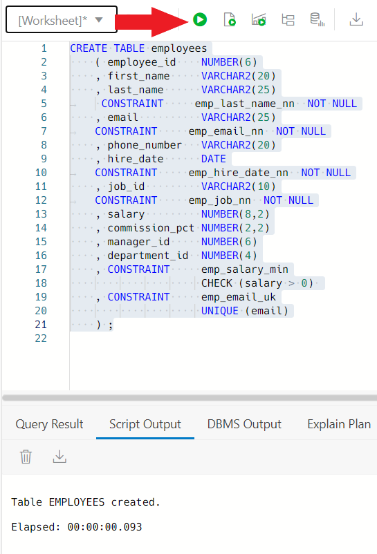

# Tables, Keys, SQL Basics

## Introduction

In this lab we will put into practice some of the concepts you learned in the second lecture, Database Basics part 2, which was about database tables, database keys (primary, secondary, unique, foreign, etc.), and SQL for data manipulation (DML) . 


[](youtube:a6Jm7lYaCWI)

Estimated lab time: 60 minutes

### Objectives

-	We will create tables
-	Associate tables with primary and foreign keys
-	Create additional constraints on tables
-	Create indexes
-	Explore the concept of a database view
-	Load data into the tables
-	Perform Data Manipulation Language operations on the tables

### Homework Submission Process

To complete the homework assignment, run through this lab in its completion. In the last section of the lab, you will have to insert your own information into the employees table and run some queries against the tables. You will need to take a screenshot of the statements you created, as well as the results. Save as a PDF file, and upload the PDF file to Blackboard. If you complete all sections of this lab, you will not have any problems completing this homework. If you do run into problems, please review the session 2 lecture material or refer to the **Need Help?** section in the Contents menu on the left.  


### Prerequisites

-   This lab requires completion of **Lab 1: Database Basics** section in the Contents menu on the left.  


## Task 1: Connecting to your Oracle Cloud Database

1. Log in to the Oracle Cloud at <a href="https://cloud.oracle.com">cloud.oracle.com</a>. Cloud Account Name is howarduniversity. Click "Next".
2. Click on "Direct Sign-In" and enter your Cloud Account email and password.

    

3. Once you are logged in, you are taken to the cloud services dashboard where you can see all the services available to you. Click the navigation menu in the upper left to show top level navigation choices.

    


4. Click **Autonomous Data Warehouse**.

    

5. From the Compartment drop down on the left side of the page, expand howarduniversity->spring2022->student1xx and select you student number.

    

6. Click on the database you created in lab 1
   
    
    
## Task 2: Connect with SQL Worksheet

Although you can connect to your autonomous database from local PC desktop tools like Oracle SQL Developer, you can conveniently access the browser-based SQL Worksheet directly from your Autonomous Data Warehouse or Autonomous Transaction Processing console.

1. In your database's details page, click the **Database Actions** button.

    

2. The Database Actions page opens. In the **Development** box, click **SQL**.

    

3. The first time you open SQL Worksheet, a series of pop-up informational boxes introduce you to the main features. Click **Next** to take a tour through the informational boxes or click X to skip the tour.

    


## Task 3: Creating Tables

We will be creating a basic company database application to store and manage different data the company uses for operations. We will create the following tables:

-	EMPLOYEES table to hold the employee personnel information for the company
-	DEPARTMENTS table to hold company department information
-	JOBS table to hold the different names of job roles within the company 
-	REGIONS table to hold region information for locations
-	COUNTRIES table to hold country information for customers and company locations 
-	LOCATIONS table to hold address information for company departments 
-	JOB_HISTORY table to hold the history of jobs that employees have held in the past.

1. Let’s start by creating the EMPLOYEES table which contains many common fields needed to track employee information such as first name, last name, employee id, etc. Notice that we are also including many constraints on the table:
    -	the last name cannot be NULL
    -	the email cannot be NULL
    -	the hire date cannot be NULL
    -	the job_id cannot be NULL
    -	the salary must be more than zero
    -	the email must be UNIQUE – no duplicate email addresses

2. Copy the statement below and paste it into SQL Worksheet. Make sure to erase anything else you have on the worksheet by clicking the trash can icon before pasting this code. To run the code click green arrow circle (Run Statement).
    ```
    <copy>CREATE TABLE employees
        ( employee_id    NUMBER(6)
        , first_name     VARCHAR2(20)
        , last_name      VARCHAR2(25)
          CONSTRAINT     emp_last_name_nn  NOT NULL
        , email          VARCHAR2(25)
          CONSTRAINT     emp_email_nn  NOT NULL
        , phone_number   VARCHAR2(20)
        , hire_date      DATE
          CONSTRAINT     emp_hire_date_nn  NOT NULL
        , job_id         VARCHAR2(10)
          CONSTRAINT     emp_job_nn  NOT NULL
        , salary         NUMBER(8,2)
        , commission_pct NUMBER(2,2)
        , manager_id     NUMBER(6)
        , department_id  NUMBER(4)
        , CONSTRAINT     emp_salary_min
                        CHECK (salary > 0) 
        , CONSTRAINT     emp_email_uk
                        UNIQUE (email)
        ) ;
    </copy> 	
    
    ``` 

    Your results should look similar to this:

         

3. In the create table statement we did not specify that employee\_id should be UNIQUE because we will do that by creating a UNIQUE index on the employee\_id. In this case we use an index because most of the time the access to this table will be through the employee_id so we want to make sure we have that column indexed as well as making it UNIQUE.

    Copy the statement below and paste it into SQL Worksheet. Make sure to erase anything else you have on the worksheet by clicking the trash can icon before pasting this code. To run the code click green arrow circle (Run Statement)
    
    ```
    <copy>CREATE UNIQUE INDEX emp_emp_id_pk
    ON employees (employee_id);
    </copy> 	
    
    ``` 
    Your results should look similar to this:

      

4. Next create the DEPARTMENTS table. Like with EMPLOYEES there is a constraint that the department\_name not be NULL, so when inserting data into this table, unless department\_name has a value, the insert will fail.

    Copy the statement below and paste it into SQL Worksheet. Make sure to erase anything else you have on the worksheet by clicking the trash can icon before pasting this code. To run the code click green arrow circle (Run Statement)
    ```
    <copy>CREATE TABLE departments
         ( department_id    NUMBER(4)
         , department_name  VARCHAR2(30)
           CONSTRAINT  dept_name_nn  NOT NULL
         , manager_id       NUMBER(6)
         , location_id      NUMBER(4)
         ) ;</copy>
    ```

    Your results should look similar to this:

    

5. As with EMPLOYEES make sure department\_id is unique so there are no duplicate department in the company, so we will create a UNIQUE index on department\_id. 
Copy the statement below and paste it into SQL Worksheet. Make sure to erase anything else you have on the worksheet by clicking the trash can icon before pasting this code. To run the code click green arrow circle (Run Statement)
    ```
   <copy>CREATE UNIQUE INDEX dept_id_pk
    ON departments (department_id);</copy>
    ```

    Your results should look similar to this:

    

For the next several table creations, please follow the same process as above for the table creation. Copy the statements below and paste them into SQL Worksheet. Make sure to erase anything else you have on the worksheet by clicking the trash can icon before pasting each piece of code. To run the code click green arrow circle (Run Statement). 

As you are creating the tables, examine the constraints that are being created with each and see if they make sense to have or if they are unnecessary? If you have any specific ideas you want to share, please share them on our next session.

6. Create the JOBS table
    ```
    <copy>CREATE TABLE jobs
        ( job_id         VARCHAR2(10)
        , job_title      VARCHAR2(35)
          CONSTRAINT     job_title_nn  NOT NULL
        , min_salary     NUMBER(6)
        , max_salary     NUMBER(6)
        ) ;</copy>

    ```
    Create a unique index on the jobs table to avoid duplicate job id’s.
    ```
    <copy>CREATE UNIQUE INDEX job_id_pk 
    ON jobs (job_id) ;</copy>
    ```
7. Create the REGIONS table
    ```
    <copy>CREATE TABLE regions
        ( region_id      NUMBER 
          CONSTRAINT  region_id_nn NOT NULL 
        , region_name    VARCHAR2(25) 
        );</copy>

    ```

    Create a unique index on the locations table to avoid duplicate region id’s.
    ```
    <copy>CREATE UNIQUE INDEX reg_id_pk
    ON regions (region_id);</copy>
    ```
8. Create the COUNTRIES table
    ```
    <copy>CREATE TABLE countries 
        ( country_id      CHAR(2) 
          CONSTRAINT  country_id_nn NOT NULL 
        , country_name    VARCHAR2(40) 
        , region_id       NUMBER 
        , CONSTRAINT     country_c_id_pk 
                     PRIMARY KEY (country_id) 
        );</copy>
    ```

9. Create the LOCATIONS table
    ```
    <copy>CREATE TABLE locations
        ( location_id    NUMBER(4)
        , street_address VARCHAR2(40)
        , postal_code    VARCHAR2(12)
        , city       VARCHAR2(30)
          CONSTRAINT     loc_city_nn  NOT NULL
        , state_province VARCHAR2(25)
        , country_id     CHAR(2)
        ) ;</copy>
    ```

10. Create a unique index on the regions table to avoid duplicate location id’s
    ```
    <copy>CREATE UNIQUE INDEX loc_id_pk
    ON locations (location_id);</copy>

    ```

Let’s create the JOB\_HISTORY table which has some different requirements than the other tables we have created so far. First, we don’t want any null values in any of the fields. We want to make sure the information is as complete and accurate as possible, so we have NOT NULL constraints on most columns. Notice department\_id has no such constraint because if a department disappears with a NOT NULL constraint you would be forced to put an invalid department number in that field.
    
More interesting is the constraint placed on the table on the last clause. There is a constraint placed on the table, not on a particular column using the CHECK operator that compares the end\_date with the start\_date to make sure the end\_date is later than the start_date. It would be pretty hard to end a job before you start it! This is an example of a table level constraint vs a column level constraint.

11.  Copy the statement below and paste it into SQL Worksheet. Make sure to erase anything else you have on the worksheet by clicking the trash can icon before pasting this code. To run the code click green arrow circle (Run Statement)
    ```
    <copy>CREATE TABLE job_history
        ( employee_id   NUMBER(6)
          CONSTRAINT    jhist_employee_nn  NOT NULL
        , start_date    DATE
          CONSTRAINT    jhist_start_date_nn  NOT NULL
        , end_date      DATE
          CONSTRAINT    jhist_end_date_nn  NOT NULL
        , job_id        VARCHAR2(10)
          CONSTRAINT    jhist_job_nn  NOT NULL
        , department_id NUMBER(4)
        , CONSTRAINT    jhist_date_interval
                        CHECK (end_date > start_date)
        ) ;</copy>
    ```

    Your results should look similar to this:

    

What about a unique index on this table? Should it be on employee\_id? What if you worked for the same company twice, at different times? If you have a unique index on employee\_id you will not be able to enter that employee into this table more than once. Instead create a composite column unique index. We will select two columns from the table that will guarantee that there are no duplicate entries in the table, but that allow a returning employee’s information to be put into this table.
    
12. In this case we will use the employees start\_date along with the employee\_id to create a unique index on the table. Run the statement below like you have been running the previous statements.
    ```
    <copy>CREATE UNIQUE INDEX jhist_emp_id_st_date_pk 
    ON job_history (employee_id, start_date);</copy>
    ```

    Your results should look similar to this:

    


## Task 4: Creating table relationships with key constraints

Now that we have created the tables for our company, we want to relate the tables to one another because the information in those tables is related and in some cases dependent on information in another table. Tables are explicitly related to one another through primary key and foreign key constraints that are placed on the tables.

Let’s walk through the constraints and create them. When creating constraints it’s important to understand the relationship between the tables beforehand because otherwise the constraint creation may fail, or an incorrect constraint may be created. The modeling process including Entity Relationship Diagrams (ERD’s) are used to define and formalize the relationships. 

For this lab we provide you with the relationships.

1. Starting with the jobs table, create a primary key on the job\_id column, because other tables will be checking that a particular job\_id exists and will do so by relating their job\_id columns to the jobs job\_id column. Once a table is created, for updating the definition of a table the ALTER TABLE command is used. So we will alter the table jobs and add the constraint.

    Copy the statement below and paste it into SQL Worksheet. Make sure to erase anything else you have on the worksheet by clicking the trash can icon before pasting this code. To run the code click green arrow circle (Run Statement)
    ```
    <copy>ALTER TABLE jobs
    ADD ( CONSTRAINT job_id_pk
                     PRIMARY KEY(job_id)
    );</copy>
    ```  
    Your results should look similar to this:

    

2. Create a primary key constraint on the regions table for the region\_id column.
    ```
    <copy>ALTER TABLE regions
    ADD ( CONSTRAINT reg_id_pk
                      PRIMARY KEY (region_id)
    );</copy>
    ```
    Your results should look similar to this:   

    

3. For the countries table we are now going to create a foreign key that references the primary key we just created in the regions table. What this accomplishes is that any time a value is inserted into the region\_id of the countries table, the database will check the region\_id column in the regions table to see if the value being inserted already exists. If the value does not exist in the regions table, the insert into the countries table will fail. 
   
    Run the following statement on SQL like you have been doing with the other statements. 
    ```
    <copy>ALTER TABLE countries
    ADD ( CONSTRAINT countr_reg_fk
                FOREIGN KEY (region_id)
                  REFERENCES regions(region_id) 
    );</copy>
    ``` 
    Your results should look similar to this:   
  
    

4. For the locations table we will be adding two constraints. The first is a primary key constraint on the location\_id so other tables can relate to the locations table. At the same time we will add a foreign key constraint to the table country\_id column that relates it to the country\_id column in the countries table. So no new locations can be added to the locations table without there being a valid country\_id associated with it as verified by the existence of that country\_id in the countries table (country\_id column). 
   
    Run the following statement:
    ```
    <copy>ALTER TABLE locations
    ADD ( CONSTRAINT loc_id_pk
                      PRIMARY KEY (location_id)
        , CONSTRAINT loc_c_id_fk
                      FOREIGN KEY (country_id)
                  REFERENCES countries(country_id) 
    );</copy>
    ```
    

5. Similarly the departments table will have a primary key on the department\_id column and a foreign key on the location\_id column relating the two tables through the location\_id columns respectively. 
   
    Run the following statement:
    ```    
    <copy>ALTER TABLE departments
    ADD ( CONSTRAINT dept_id_pk
                      PRIMARY KEY (department_id)
        , CONSTRAINT dept_loc_fk
                      FOREIGN KEY (location_id)
                  REFERENCES locations (location_id)
    );</copy>
    ```
    

6. The employees table has a primary key and several foreign key constraints. When inserting employee information into the table you want to make sure the information is as complete and accurate as possible. We want to ensure that employee\_id is unique, that the department\_id, job\_id, and manager\_id for the employee exist, so all these columns will have foreign key constraints relating them to the corresponding column on the appropriate tables. 
    
    Run the following statement:
    ```
    <copy>ALTER TABLE employees
    ADD ( CONSTRAINT     emp_emp_id_pk
                         PRIMARY KEY (employee_id)
        , CONSTRAINT     emp_dept_fk
                         FOREIGN KEY (department_id)
                          REFERENCES departments
        , CONSTRAINT     emp_job_fk
                         FOREIGN KEY (job_id)
                          REFERENCES jobs (job_id)
        , CONSTRAINT     emp_manager_fk
                         FOREIGN KEY (manager_id)
                          REFERENCES employees
    );</copy>
    ```

    

7. Our last table is job\_history. When we created this table we already specified some constraints such as start\_date must be before end\_date. Like with the employees table, when we populate this table we need to make sure the information is complete and accurate by verifying against existing information in related tables. We create a composite primary key, like we created a composite unique index on the table comprising of employee\_id and start\_date, again think of a returning employee that could cause duplicate entries in the table. Then we create relationships to job\_id, employee\_id, and department\_id on the corresponding tables.

    Run the following statement:
    ```
    <copy>ALTER TABLE job_history
    ADD ( CONSTRAINT jhist_emp_id_st_date_pk
          PRIMARY KEY (employee_id, start_date)
        , CONSTRAINT     jhist_job_fk
                         FOREIGN KEY (job_id)
                         REFERENCES jobs
        , CONSTRAINT     jhist_emp_fk
                         FOREIGN KEY (employee_id)
                         REFERENCES employees
        , CONSTRAINT     jhist_dept_fk
                         FOREIGN KEY (department_id)
                         REFERENCES departments
        ) ;</copy>
    ```

    


## Task 5: Loading Data Into the Tables

Now that we have created tables we need to load some data into them. There are many ways to load data into database tables but the simplest is to insert a row into a table. For each table we will insert data with the INSERT command. Notice that the syntax we are using does not include the column names we are inserting the data into, so there must be a one-to-one match between the values between parenthesis and the corresponding columns in the tables. If there was not a one-to-one match we would have to include the corresponding column name for which we are loading the data into.

For each of the tables run the corresponding statement. Select all the INSERT statements for each table and paste them into the SQL Worksheet (make sure you clear the worksheet before each paste by clicking on the trash can icon). After you paste the statements into the worksheet, highlight all of them by left-clicking the mouse and selecting all the rows, then click the green Run Statement button.

1. Load Regions Table 
    ```
    <copy>INSERT INTO regions VALUES 
            ( 1
            , 'Europe' 
            );
    INSERT INTO regions VALUES 
            ( 2
            , 'Americas' 
            );
    INSERT INTO regions VALUES 
            ( 3
            , 'Asia' 
            );
    INSERT INTO regions VALUES 
            ( 4
            , 'Middle East and Africa' 
            );</copy>
    ```

    Your results should look similar to this:

    

2. Load Countries Table

    Select all the INSERT statements and paste them into the SQL Worksheet (make sure you clear the worksheet before each paste by clicking on the trash can icon). After you paste the statements into the worksheet, highlight all of them by left-clicking the mouse and selecting all the rows, then click the green Run Statement button.
    ```
    <copy>INSERT INTO countries VALUES 
            ( 'US'
            , 'United States of America'
            , 2 
            );
    INSERT INTO countries VALUES 
            ( 'CA'
            , 'Canada'
            , 2 
            );
    INSERT INTO countries VALUES 
            ( 'UK'
            , 'United Kingdom'
            , 1 
            );</copy>
    ```
    Your results should look similar to this:

    

3. Load Locations Table

     Select all the INSERT statements and paste them into the SQL Worksheet (make sure you clear the worksheet before each paste by clicking on the trash can icon). After you paste the statements into the worksheet, highlight all of them by left-clicking the mouse and selecting all the rows, then click the green Run Statement button.
    ```
    <copy>INSERT INTO locations VALUES 
            ( 1400 
            , '2014 Jabberwocky Rd'
            , '26192'
            , 'Southlake'
            , 'Texas'
            , 'US'
            );
    INSERT INTO locations VALUES 
            ( 1500 
            , '2011 Interiors Blvd'
            , '99236'
            , 'South San Francisco'
            , 'California'
            , 'US'
            );
    INSERT INTO locations VALUES 
            ( 1700 
            , '2004 Charade Rd'
            , '98199'
            , 'Seattle'
            , 'Washington'
            , 'US'
            );
    INSERT INTO locations VALUES 
            ( 1800 
            , '147 Spadina Ave'
            , 'M5V 2L7'
            , 'Toronto'
            , 'Ontario'
            , 'CA'
            );

    INSERT INTO locations VALUES 
            ( 2500 
            , 'Magdalen Centre, The Oxford Science Park'
            , 'OX9 9ZB'
            , 'Oxford'
            , 'Oxford'
            , 'UK'
            );</copy>
    ```
    Your results should look similar to this:

    

4. Load Departments Table

    Select all the INSERT statements and paste them into the SQL Worksheet (make sure you clear the worksheet before each paste by clicking on the trash can icon). After you paste the statements into the worksheet, highlight all of them by left-clicking the mouse and selecting all the rows, then click the green Run Statement button.
    ```
    <copy>INSERT INTO departments VALUES 
            ( 10
            , 'Administration'
            , 200
            , 1700
            );
    INSERT INTO departments VALUES 
            ( 20
            , 'Marketing'
            , 201
            , 1800
            );
    INSERT INTO departments VALUES 
            ( 30
            , 'Purchasing'
            , 114
            , 1700
        );
    INSERT INTO departments VALUES 
            ( 50
            , 'Shipping'
            , 121
            , 1500
            );             
    INSERT INTO departments VALUES 
            ( 60 
            , 'IT'
            , 103
            , 1400
            );        
    INSERT INTO departments VALUES 
            ( 80 
            , 'Sales'
            , 145
            , 2500
            );                
    INSERT INTO departments VALUES 
            ( 90 
            , 'Executive'
            , 100
            , 1700
            );              
    INSERT INTO departments VALUES 
            ( 110 
            , 'Accounting'
            , 205
            , 1700
            );</copy>
    ```
    Your results should look similar to this:

    
 

    Did you get any errors (you probably did not)? If you a see constraint violation don’t worry, we tried to insert a row that violated one of our defined constraints. All the other rows got loaded correctly. One violation does not stop the load process.

5. Load Jobs Table

    Select all the INSERT statements and paste them into the SQL Worksheet (make sure you clear the worksheet before each paste by clicking on the trash can icon). After you paste the statements into the worksheet, highlight all of them by left-clicking the mouse and selecting all the rows, then click the green Run Statement button.
    ```
    <copy>INSERT INTO jobs VALUES 
            ( 'AD_PRES'
            , 'President'
            , 20080
            , 40000
            );
    INSERT INTO jobs VALUES 
            ( 'AD_VP'
            , 'Administration Vice President'
            , 15000
            , 30000
            );

    INSERT INTO jobs VALUES 
            ( 'AD_ASST'
            , 'Administration Assistant'
            , 3000
            , 6000
            );

    INSERT INTO jobs VALUES 
            ( 'FI_MGR'
            , 'Finance Manager'
            , 8200
            , 16000
            );

    INSERT INTO jobs VALUES 
            ( 'FI_ACCOUNT'
            , 'Accountant'
            , 4200
            , 9000
            );

    INSERT INTO jobs VALUES 
            ( 'AC_MGR'
            , 'Accounting Manager'
            , 8200
            , 16000
            );

    INSERT INTO jobs VALUES 
            ( 'AC_ACCOUNT'
            , 'Public Accountant'
            , 4200
            , 9000
            );
    INSERT INTO jobs VALUES 
            ( 'SA_MAN'
            , 'Sales Manager'
            , 10000
            , 20080
            );

    INSERT INTO jobs VALUES 
            ( 'SA_REP'
            , 'Sales Representative'
            , 6000
            , 12008
            );

    INSERT INTO jobs VALUES 
            ( 'PU_MAN'
            , 'Purchasing Manager'
            , 8000
            , 15000
            );

    INSERT INTO jobs VALUES 
            ( 'PU_CLERK'
            , 'Purchasing Clerk'
            , 2500
            , 5500
            );

    INSERT INTO jobs VALUES 
            ( 'ST_MAN'
            , 'Stock Manager'
            , 5500
            , 8500
            );
    INSERT INTO jobs VALUES 
            ( 'ST_CLERK'
            , 'Stock Clerk'
            , 2008
            , 5000
            );

    INSERT INTO jobs VALUES 
            ( 'SH_CLERK'
            , 'Shipping Clerk'
            , 2500
            , 5500
            );
    INSERT INTO jobs VALUES 
            ( 'IT_PROG'
            , 'Programmer'
            , 4000
            , 10000
            );
    INSERT INTO jobs VALUES 
            ( 'MK_MAN'
            , 'Marketing Manager'
            , 9000
            , 15000
            );
    INSERT INTO jobs VALUES 
            ( 'MK_REP'
            , 'Marketing Representative'
            , 4000
            , 9000
            );
    INSERT INTO jobs VALUES 
            ( 'HR_REP'
            , 'Human Resources Representative'
            , 4000
            , 9000
            );
    INSERT INTO jobs VALUES 
            ( 'PR_REP'
            , 'Public Relations Representative'
            , 4500
            , 10500
            );</copy>
    ```
    

6. Load Employees Table

    Select all the INSERT statements and paste them into the SQL Worksheet (make sure you clear the worksheet before each paste by clicking on the trash can icon). After you paste the statements into the worksheet, highlight all of them by left-clicking the mouse and selecting all the rows, then click the green Run Statement button.
    ```
    <copy>INSERT INTO employees VALUES 
            ( 100
            , 'Steven'
            , 'King'
            , 'SKING'
            , '515.123.4567'
            , TO_DATE('17-06-2003', 'dd-MM-yyyy')
            , 'AD_PRES'
            , 24000
            , NULL
            , NULL
            , 90
            );
    INSERT INTO employees VALUES 
            ( 101
            , 'Neena'
            , 'Kochhar'
            , 'NKOCHHAR'
            , '515.123.4568'
            , TO_DATE('21-09-2005', 'dd-MM-yyyy')
            , 'AD_VP'
            , 17000
            , NULL
            , 100
            , 90
            );
    INSERT INTO employees VALUES 
            ( 102
            , 'Lex'
            , 'De Haan'
            , 'LDEHAAN'
            , '515.123.4569'
            , TO_DATE('13-01-2001', 'dd-MM-yyyy')
            , 'AD_VP'
            , 17000
            , NULL
            , 100
            , 90
            );
    INSERT INTO employees VALUES 
            ( 114
            , 'Den'
            , 'Raphaely'
            , 'DRAPHEAL'
            , '515.127.4561'
            , TO_DATE('07-12-2002', 'dd-MM-yyyy')
            , 'PU_MAN'
            , 11000
            , NULL
            , 100
            , 30
            );
    INSERT INTO employees VALUES 
            ( 122
            , 'Payam'
            , 'Kaufling'
            , 'PKAUFLIN'
            , '650.123.3234'
            , TO_DATE('01-05-2003', 'dd-MM-yyyy')
            , 'ST_MAN'
            , 7900
            , NULL
            , 100
            , 50
            );
    INSERT INTO employees VALUES 
            ( 149
            , 'Eleni'
            , 'Zlotkey'
            , 'EZLOTKEY'
            , '011.44.1344.429018'
            , TO_DATE('29-01-2008', 'dd-MM-yyyy')
            , 'SA_MAN'
            , 10500
            , .2
            , 100
            , 80
            );
    INSERT INTO employees VALUES 
            ( 176
            , 'Jonathon'
            , 'Taylor'
            , 'JTAYLOR'
            , '011.44.1644.429265'
            , TO_DATE('24-03-2006', 'dd-MM-yyyy')
            , 'SA_REP'
            , 8600
            , .20
            , 149
            , 80
            );
    INSERT INTO employees VALUES 
            ( 200
            , 'Jennifer'
            , 'Whalen'
            , 'JWHALEN'
            , '515.123.4444'
            , TO_DATE('17-09-2003', 'dd-MM-yyyy')
            , 'AD_ASST'
            , 4400
            , NULL
            , 101
            , 10
            );
    INSERT INTO employees VALUES 
            ( 201
            , 'Michael'
            , 'Hartstein'
            , 'MHARTSTE'
            , '515.123.5555'
            , TO_DATE('17-02-2004', 'dd-MM-yyyy')
            , 'MK_MAN'
            , 13000
            , NULL
            , 100
            , 20
            );
    INSERT INTO employees VALUES 
            ( 202
            , 'Pat'
            , 'Fay'
            , 'PFAY'
            , '603.123.6666'
            , TO_DATE('17-08-2005', 'dd-MM-yyyy')
            , 'MK_REP'
            , 6000
            , NULL
            , 201
            , 20
            );</copy>
    ```

7. Load Job_History Table

    Select all the INSERT statements and paste them into the SQL Worksheet (make sure you clear the worksheet before each paste by clicking on the trash can icon). After you paste the statements into the worksheet, highlight all of them by left-clicking the mouse and selecting all the rows, then click the green Run Statement button.
    ```
    <copy>INSERT INTO job_history
    VALUES (102
        , TO_DATE('13-01-2001', 'dd-MM-yyyy')
        , TO_DATE('24-07-2006', 'dd-MM-yyyy')
        , 'IT_PROG'
        , 60);
    INSERT INTO job_history
    VALUES (101
        , TO_DATE('21-09-1997', 'dd-MM-yyyy')
        , TO_DATE('27-10-2001', 'dd-MM-yyyy')
        , 'AC_ACCOUNT'
        , 110);
    INSERT INTO job_history
    VALUES (101
        , TO_DATE('28-10-2001', 'dd-MM-yyyy')
        , TO_DATE('15-03-2005', 'dd-MM-yyyy')
        , 'AC_MGR'
        , 110);
    INSERT INTO job_history
    VALUES (201
        , TO_DATE('17-02-2004', 'dd-MM-yyyy')
        , TO_DATE('19-12-2007', 'dd-MM-yyyy')
        , 'MK_REP'
        , 20);
    INSERT INTO job_history
    VALUES  (114
            , TO_DATE('24-03-2006', 'dd-MM-yyyy')
            , TO_DATE('31-12-2007', 'dd-MM-yyyy')
            , 'ST_CLERK'
            , 50
            );
    INSERT INTO job_history
    VALUES  (122
            , TO_DATE('01-01-2007', 'dd-MM-yyyy')
            , TO_DATE('31-12-2007', 'dd-MM-yyyy')
            , 'ST_CLERK'
            , 50
            );
    INSERT INTO job_history
    VALUES  (200
            , TO_DATE('17-09-1995', 'dd-MM-yyyy')
            , TO_DATE('17-06-2001', 'dd-MM-yyyy')
            , 'AD_ASST'
            , 90
            );
    INSERT INTO job_history
    VALUES  (176
            , TO_DATE('24-03-2006', 'dd-MM-yyyy')
            , TO_DATE('31-12-2006', 'dd-MM-yyyy')
            , 'SA_REP'
            , 80
            );
    INSERT INTO job_history
    VALUES  (176
            , TO_DATE('01-01-2007', 'dd-MM-yyyy')
            , TO_DATE('31-12-2007', 'dd-MM-yyyy')
            , 'SA_MAN'
            , 80
            );
    INSERT INTO job_history
    VALUES  (200
            , TO_DATE('01-07-2002', 'dd-MM-yyyy')
            , TO_DATE('31-12-2006', 'dd-MM-yyyy')
            , 'AC_ACCOUNT'
            , 90
            );</copy>
    ```


## Task 6: Creating Indexes

To improve performance indexes can be created on tables. Now that we loaded data into our tables we create indexes to improve access to the data on the columns that will be queried most often. Run the statements below to create the indexes on the tables. Before copying and pasting the CREATE statements below, make sure you erase anything in your worksheet by clicking on the trash can icon like you have been doing. Once you copy and paste all the CREATE statements into the worksheet you need to select (highlight) all of them because we will run them all at once. If you do not highlight all of them, only the last CREATE statement will run and you will only create one index. Once you selected all the CREATE statements click on the green RUN STATEMENT Arrow. 
```
    <copy>CREATE INDEX emp_department_ix
           ON employees (department_id);
    CREATE INDEX emp_job_ix
           ON employees (job_id);
    CREATE INDEX emp_manager_ix
           ON employees (manager_id);
    CREATE INDEX emp_name_ix
           ON employees (last_name, first_name);
    CREATE INDEX dept_location_ix
           ON departments (location_id);
    CREATE INDEX jhist_job_ix
           ON job_history (job_id);
    CREATE INDEX jhist_employee_ix
           ON job_history (employee_id);
    CREATE INDEX jhist_department_ix
           ON job_history (department_id);
    CREATE INDEX loc_city_ix
           ON locations (city);
    CREATE INDEX loc_state_province_ix	
           ON locations (state_province);
    CREATE INDEX loc_country_ix
           ON locations (country_id);</copy>
```

## Task 7: Creating Views and Querying its Data

The Oracle Database allows the creation of objects called views, which consist of a virtual table comprising of columns from other tables. This allows users to view data that does not actually reside in a single table but on multiple tables without actually having to replicate or consolidate the data. This maintains simplicity of development, maintenance, and operations of databases.

 1. We will create an employee detailed view that joins the employees, jobs, departments, countries, and locations tables to provide us with a consolidated view of employees. 
    ```
    <copy>CREATE OR REPLACE VIEW emp_details_view
      (employee_id,
       job_id,
       manager_id,
       department_id,
       location_id,
       country_id,
       first_name,
       last_name,
       salary,
       commission_pct,
       department_name,
       job_title,
       city,
       state_province,
       country_name,
       region_name)
    AS SELECT
      e.employee_id, 
      e.job_id, 
      e.manager_id, 
      e.department_id,
      d.location_id,
      l.country_id,
      e.first_name,
      e.last_name,
      e.salary,
      e.commission_pct,
      d.department_name,
      j.job_title,
      l.city,
      l.state_province,
      c.country_name,
      r.region_name
    FROM
      employees e,
      departments d,
      jobs j,
      locations l,
      countries c,
      regions r
    WHERE e.department_id = d.department_id
      AND d.location_id = l.location_id
      AND l.country_id = c.country_id
      AND c.region_id = r.region_id
      AND j.job_id = e.job_id 
    WITH READ ONLY;</copy>
    ```

    Your results should look similar to this:

    

2. Explore the information the view contains. Select row in the view by running the following statement:
    ```
    <copy>select * from emp_details_view;</copy>
    ```

    Your results should look similar to this:

    

## Task 8: Homework deliverable


Now that we have created a database, objects, constraints, indexes and so on, its time for you to add your own information to your database. 

1. You will need to create an INSERT statement like we used above to add data into tables to insert your information into the EMPLOYEES table. You need to provide correct information for each field. Please use your first and last name for the FIRST\_NAME and LAST\_NAME fields so when grading the assignment we know its yours. The other fields do not need to reflect any personal information. 

    You need to review and understand all the previous parts of this lab and examine the information that was inserted into each table because the employees table has a lot of foreign key constraints and NOT NULL constraints that need to be satisfied in order for your INSERT operation to work. If you get an error message similar to this when running your INSERT:

    
    It means that you have not satisfied one of the constraints. For example you may be using a DEPARTMENT\_ID that does not exist in the DEPARTMENTS table. ***HINT***The MANAGER\_ID field has to contain a value of an employee already in the EMPLOYEES table.


2. When you successfully insert your information into the EMPLOYEES table take a snapshot of your work and add it to the pdf file you will submit. It should look something like this (this is an example of inserting into the job\_history table you will be inserting into the EMPLOYEES table):

    


3. The second part of the deliverable is to create a SELECT statement that retrieves only your information from the emp\_details\_view. Do not show the whole table, only your information you entered into the EMPLOYEES table. As a reminder the emp\_details\_view will contain any updated information from the EMPLOYEES table. You CANNOT use the following fields to search for yourself: employee\_id, last\_name, or first\_name. Your SELECT statement will have to consist of a combination of attributes that uniquely identifies you but are not your employee id, first or last name. Your results should be similar to this. Take a snapshot of this output and add it to the pdf file you will submit. 

    

4. When successfully completed these two steps upload your results to Blackboard.

## Task 9: LAB Cleanup

****NOTE: Running the statements below will wipe out your work, only do it if you want to start over or need to clean up your database for any reason*****

When you are finished with this lab you can drop all your tables and associated objects to clean up your database. This will allow you to do the lab again and start with a clean database. Please notice that if you created any other tables or objects that were not specifically included in this lab you will have to clean up those objects also.

Copy the following statements and execute them in SQL. Notice the "CASCADE CONSTRAINTS" clause included in the DROP TABLE statement. This will make sure that any indexes, keys, and any other constraints that exist in the table get dropped as well. Without the CASCADE CONSTRAINTS clause the drop table will fail because you cannot drop a table that has a constraint association with another table, such as a primary/foreign key constraint.
    ```

    <copy>DROP TABLE employees CASCADE CONSTRAINTS;
    DROP TABLE departments CASCADE CONSTRAINTS;
    DROP TABLE jobs CASCADE CONSTRAINTS;
    DROP TABLE job_history CASCADE CONSTRAINTS;
    DROP TABLE locations CASCADE CONSTRAINTS;
    DROP TABLE regions CASCADE CONSTRAINTS;
    DROP TABLE countries CASCADE CONSTRAINTS;</copy>
    ```


## Troubleshoot Tips

If you are having problems with any of the labs, please visit the **Need Help?** tab.

