<!-- Updated July 30, 2025 by Madhusudhan Rao -->
<!-- Updated April 12, 2021 -->
<!-- Updated May 21, 2024 by Madhusudhan Rao -->
# Provision Autonomous AI Database and Connect Using SQL Worksheet

## Introduction

This lab walks you through the steps to quickly provision an Oracle Autonomous AI Database on Oracle Cloud. You will use this database in subsequent labs of this workshop. In this lab, you will then connect to the database using SQL Worksheet, a browser-based tool that is easily accessible from the Autonomous Data Warehouse.

<!--  -->

Estimated lab time: 15 minutes

### Objectives

-   Provision a new Autonomous AI Database Lakehouse
-   Learn how to connect to your new autonomous database using SQL Worksheet

### Prerequisites

-   This lab requires completion of the **Get Started** section in the Contents menu on the left.  

## Task 1: Choose ADW or Lakehouse from the Services Menu

1. Log in to the Oracle Cloud.
2. Once you are logged in, you are taken to the cloud services dashboard where you can see all the services available to you. Click the navigation menu in the upper left to show top level navigation choices. 

3. Click on **Oracle AI Database** > **Autonomous Data Warehouse or Lakehouse**.

    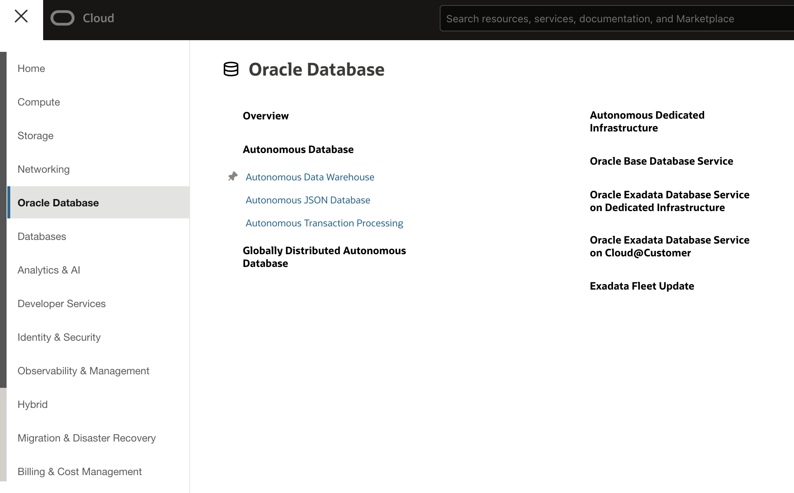

    Select the compartment where you have access to create or use an Oracle Autonomous AI Database Instance. 

    Click on **Create Autonomous AI Database** button

    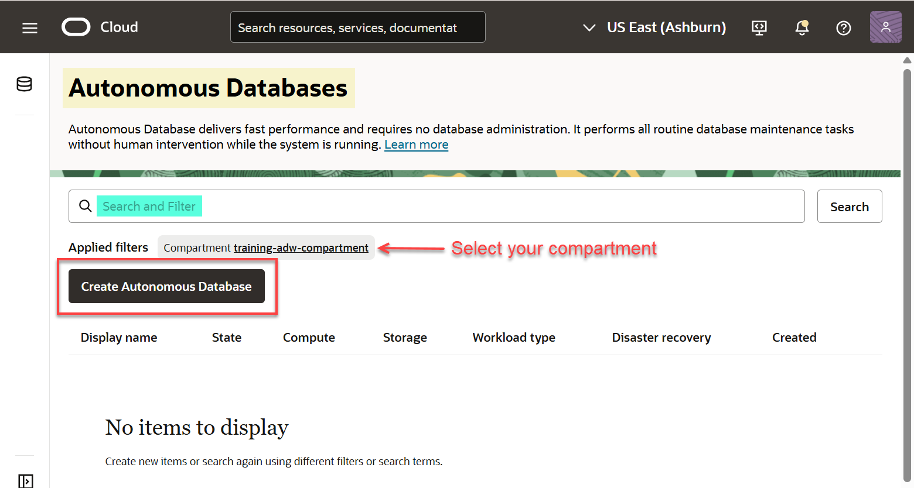

    > Note: Avoid the use of the **ManagedCompartmentforPaaS** compartment as this is an Oracle default used for Oracle Platform Services.
 
    
## Task 2: Create the Autonomous AI Database Instance
 
1.  This brings up the __Create Autonomous AI Database__ screen where you will specify the configuration of the instance.
2. Provide basic information for the autonomous database:
  
    - __Display Name__ - Enter a memorable name for the database for display purposes. For this lab, use __FirstName LastName__ example (John Smith).
    - __Database Name__ - Use letters and numbers only, starting with a letter. Maximum length is 14 characters. (Underscores not initially supported.) For this lab, use __YOURNAME__ example (JOHNSMITH). 
    - __Choose a compartment__ - Select a compartment for the database from the drop-down list.

    

3. Choose a workload type. Select the workload type for your database from the choices:

    - __Data Warehouse or Lakehouse__ - For this lab, choose __Data Warehouse__ as the workload type.
    - __Transaction Processing__ - Alternately, you could have chosen Transaction Processing as the workload type. 
    - __JSON__ - Alternately, you could have chosen JSON as the workload type. 
    - __APEX__ - Alternately, you could have chosen APEX as the workload type. 
    - __Deployment Type__ - For this lab, choose __Serverless__ as the deployment type.
    - __Dedicated Infrastructure__ - Alternately, you could have chosen Dedicated Infrastructure as the workload type.

    

    <b>Choose the Data Warehouse or Lakehouse as workload type for this course.  Do not choose one of the others. Each student is only allowed 2 ECPU instance for ADW or Lakehouse (depending upon the resources available for this lab).</b>
 
  
    <if type="freetier">
    Choose database version: Select **26ai** for the database version from this drop-down list.

    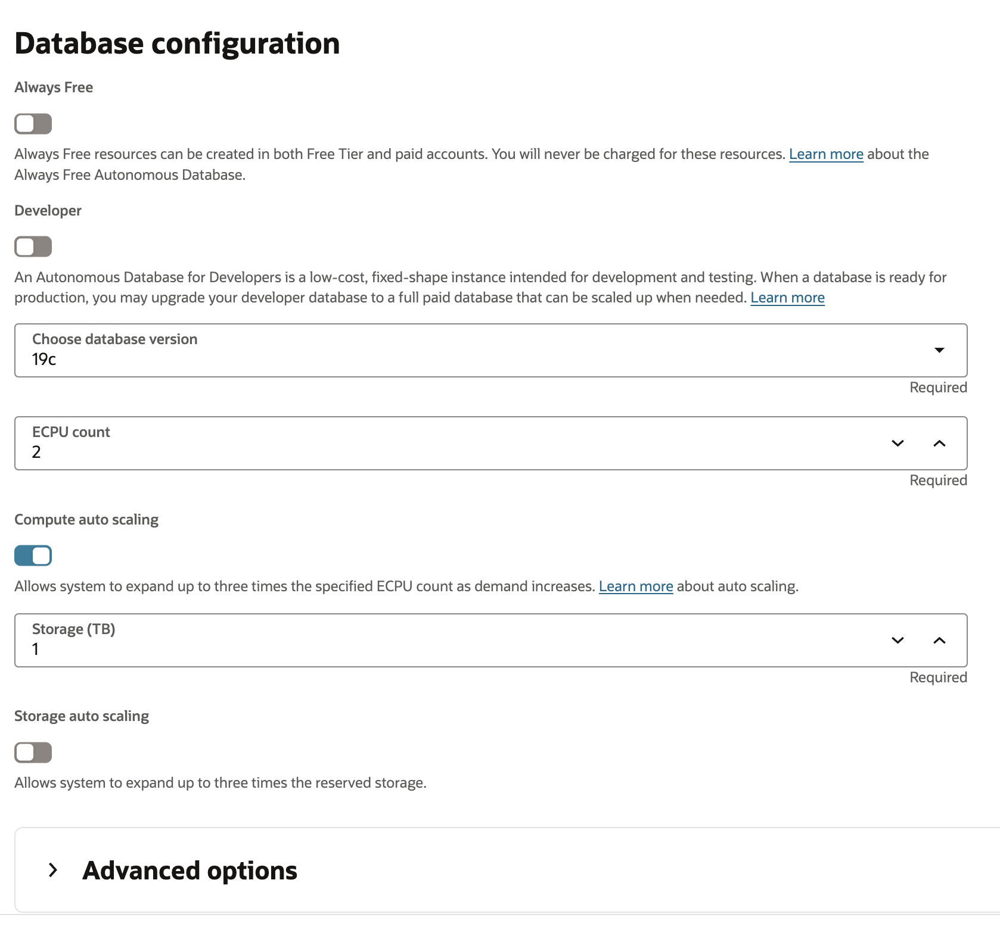
    </if>
    <if type="freetieraidb">   
    Choose database version: Select **23ai or 26ai** for the database version from this drop-down list.

    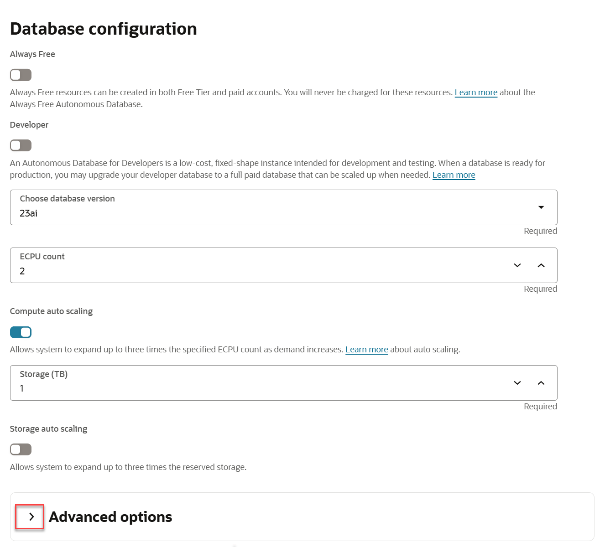
    </if>
  
- __ECPU count (2)__ - Leave default.
- __Storage (TB)__ - Leave default.
- __Storage auto scaling__ (off) - Leave default. 

## Task 3: Advanced Options

1. Under the **Advanced Options** select **Edit License selection** 

    

    Under Advanced Options choose a license type. For this lab, choose **Bring Your Own License** (BYOL) enabled.
  
2. Create administrator credentials: 
 
    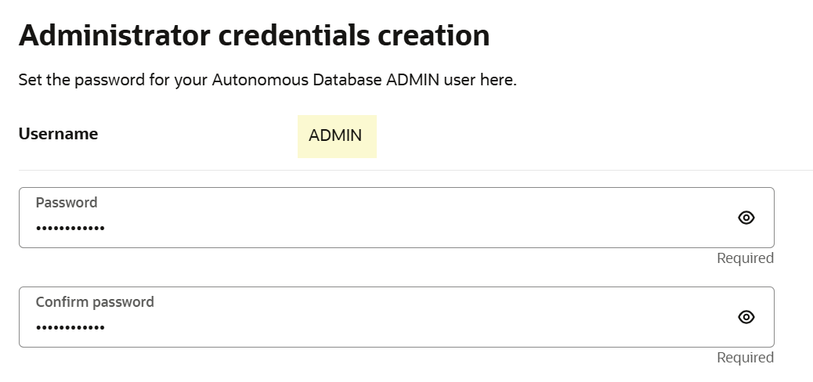 

    > Note: __Password and Confirm Password__ - Specify the password for ADMIN user of the service instance.
    - The password must meet the following requirements:
    - The password must be between 12 and 30 characters long and must include at least one uppercase letter, one lowercase letter, and one numeric character.
    - The password cannot contain the username.
    - The password cannot contain the double quote (") character.
    - The password must be different from the last 4 passwords used.
    - The password must not be the same password that is set less than 24 hours ago.
    - Re-enter the password to confirm it. Make a note of this password.

3. Backup

    - __Backup retention__ - Leave default. 
  
    

    
4. Choose network access:
    - For this lab, accept the default, **Secure access from everywhere**.
   
    

5. In the Contacts for operational notifications and announcements section, provide a contact email address. The Contact email field allows you to list contacts to receive operational notices and announcements as well as unplanned maintenance notifications.

    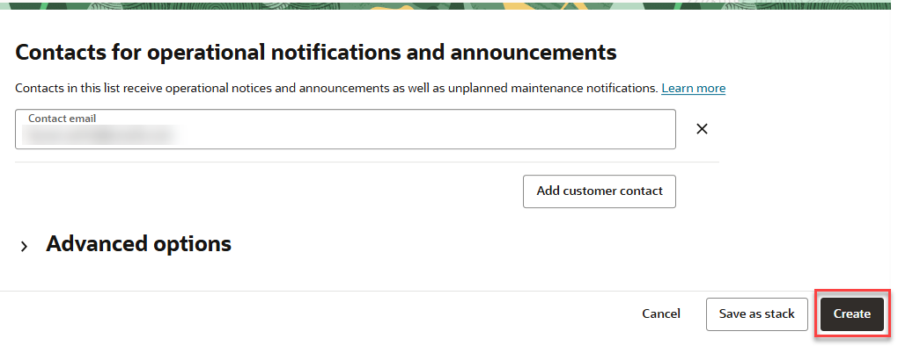

6.  Click **Create**.
 
7.    Your instance will begin provisioning. In a few minutes the state will turn from Provisioning to Available. At this point, your Autonomous Data Warehouse database is ready to use! Have a look at your instance's details here including its name, database version, CPU count and storage size.
   
    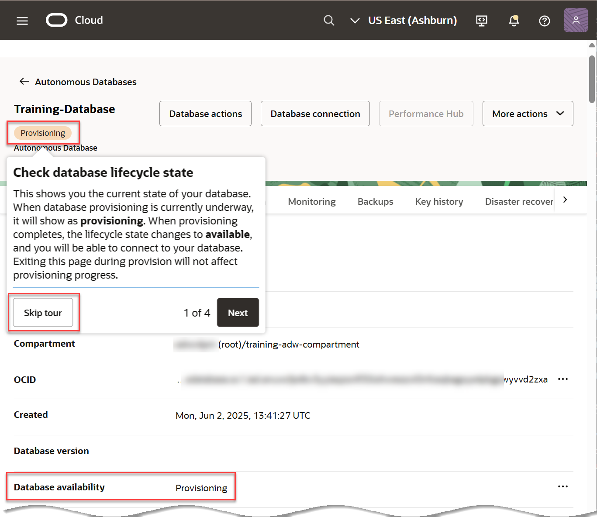

8. A Check database lifecycle state informational box is displayed. You can navigate through this tour or choose to skip it. Click Skip tour. A Skip guided tour dialog box is displayed. Click Skip.

    In a few minutes, the instance status changes to Available. At this point, your Autonomous Data Warehouse database instance is ready to use! Review your instance's details including its name, database version, ECPU count, and storage size.

    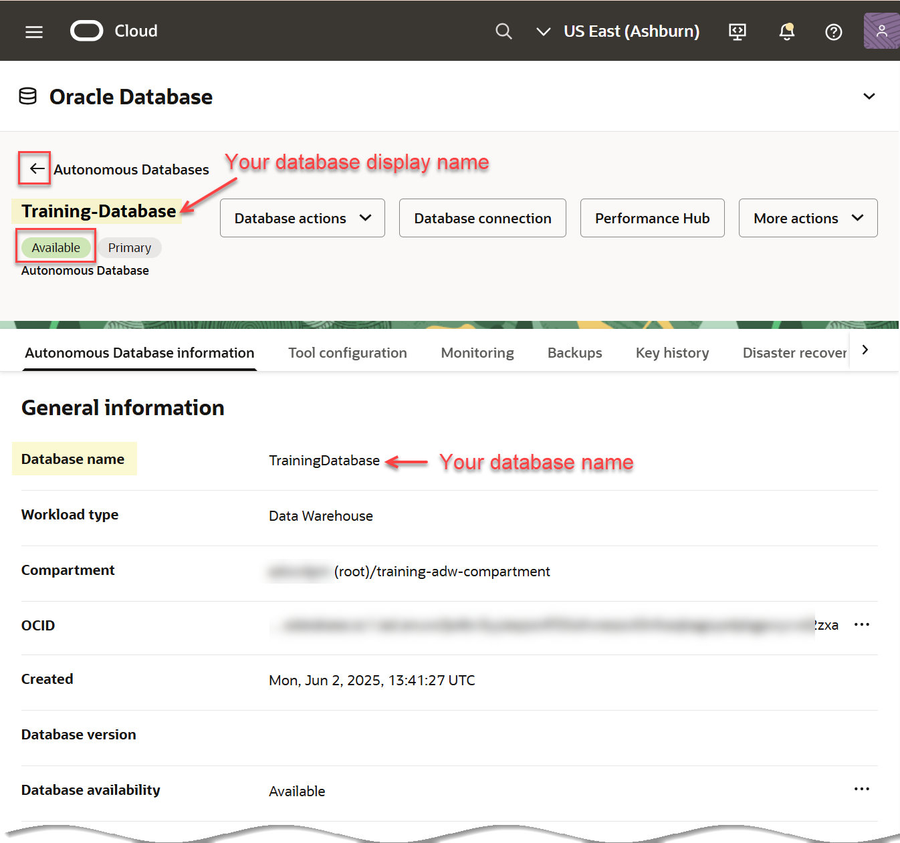

> Note: In the following screen sample, the database display name is Training-Database and the database name is TrainingDatabase. In your example, your database display name and database name might be different.

## Task 4: Navigate to Database Actions

1. Navigate to the **Autonomous Database details** page of the Autonomous Database instance that you provisioned earlier. Click the **Database actions** drop-down list, and then select **View all database actions** or **SQL**.

    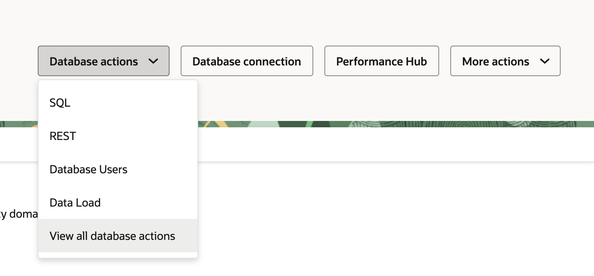

## Task 5: Connect with SQL Worksheet

Although you can connect to your autonomous database from local PC desktop tools like Oracle SQL Developer, you can conveniently access the browser-based SQL Worksheet directly from your Autonomous Data Warehouse or Autonomous Transaction Processing console.

1. From the **Database Actions** tool, navigate to the SQL Worksheet. Click the **Selector** menu. In the **Development** section, click **SQL**.

    

    The SQL Worksheet is displayed. The first time you access the SQL Worksheet, informational boxes are displayed. Click the X icons to close those boxes. You can also click the **Collapse** icon to increase the worksheet area.

    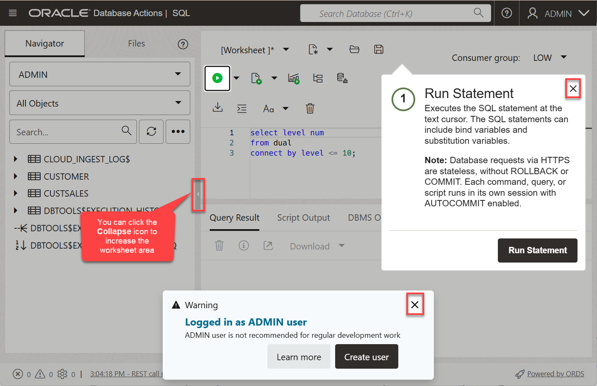
 
2. Learn more about the SQL Worksheet features using the tooltips when you hover over an icon. You will run queries by entering your commands in the worksheet. Click the **Run Statement** icon to run the command and view the output in the Query Result tab in tabular format. Click the Run Script icon to run a script and display the output in the Script Output tab in text format. You can clear your worksheet by clicking the trash icon.

    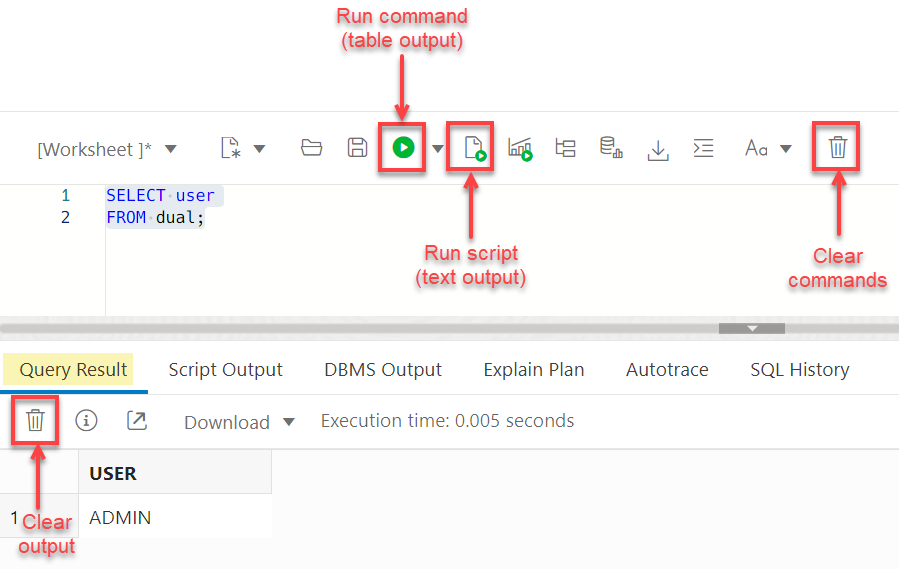

3. The first time you open SQL Worksheet, a series of pop-up informational boxes introduce you to the main features. Click **Next** to take a tour through the informational boxes.
 

## Task 6: Run scripts in SQL Worksheet

Run a query on a sample Oracle Autonomous Database data set.

1. Copy and paste the code snippet below to your SQL Worksheet. One of the two ADW or Lakehouse sample data sets that you can access from any ADW or Lakehouse instance. Take a moment to examine the script. Make sure you click the Run Statement button to run it in SQL Worksheet so that all the rows display on the screen.
  
        <copy>
        select sysdate from dual; 
        </copy>

    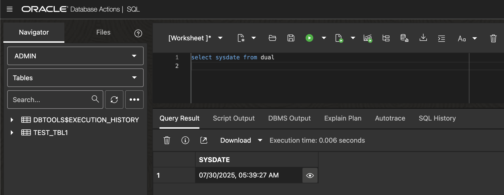

        <copy>
        select /* low */ c_city,c_region,count(*)
        from ssb.customer c_low
        group by c_region, c_city
        order by count(*);
        </copy>

    

2. Take a look at the output response from your Autonomous Data Warehouse.

3. When possible, ADW or Lakehouse also caches the results of a query for you.  If you run identical queries more than once, you will notice a much shorter response time when your results have been cached.

4. You can find more sample queries to run in the <a href="https://www.oracle.com/autonomous-database/autonomous-data-warehouse/">ADW documentation.</a>
  
## Troubleshoot Tips

If you are having problems with any of the labs, please visit the [Need Help?](https://livelabs.oracle.com/cdn/university/applied-database-systems-ai-db/workshops/freetier/index.html?customTrackingParam=:ow:lp:cpo::::RC_WWMK211125P00013:llid=4216&lab=need-help-freetier#) tab.

## Acknowledgements

* **Author** - Madhusudhan Rao, Principal Product Manager Oracle Database, Priscila Iruela, Senior Principal Technical Program Manager
* **Contributors** -  Ankita Beri, Apoorva Srinivas, Beda Hammerschmidt, Jayant Mahto, Russ Lowenthal, Markus Michalewicz, Mark Hornick, Denise Myrick, Ramu Murakami, David Lapp, Mike Blackmore, Sean Stacey, William Endress, Eli Schilling, Doug Hood, Jayant Sharma, Kishore Katta, Julian Dontcheff, Paul Parkinson, Chaitanya Koratamaddi, Vishal Singh, Melliyal Annamalai, Maria Colgan
* **Last Updated By/Date** - Priscila Iruela, October 2025