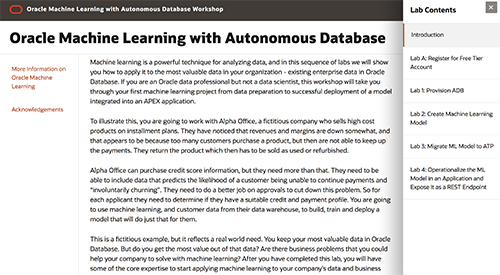

# Oracle Machine Learning with Oracle Autonomous Database

Welcome to the Oracle Machine Learning (OML) with Autonomous Database Workshop. This lab will walk you through the following tasks:

-  Learn how to provision an ADW instance
-  Learn how to provision an ATP instance
-  Learn how to connect to ADW
-  Import a Apache Zepplin notebook.
-  Become familiar with Oracle Machine Learning Algorithms.
-  Create a machine learning model to determine factors that predict good credit.

## Access the Workshop Using Our Web Interface

**Click the image to use our easy to navigate HTML format:**

