# Deploy the Machine Learning Model into ATP

## Introduction

In lab 2, you created a machine learning model that can predict customer credit. Congratulations! But you’re not finished. It’s a good model, but models have to be deployed into production systems, they have to positively impact the business, and too many machine learning projects fail at this point. We are going to spend the next two labs making sure you deploy this model so that Alpha Office employees can use it in their day to day work.

### Before You Begin

The first step is to move the model from where it was developed into a production transaction processing database where it will be accessible to the Client Service application. This lab will take you through that process.

Watch the brief demo on Introduction to Deploy the Machine Learning Model into ATP.

[](youtube:YUikH5-5n_o)

Estimated time: 20 - 30 minutes

### Objectives

In this lab, you will:

- In ADW:
    - Log into the SQL Developer Web and enable user ml_user access to the SQL Developer Web.
    - Grant storage privileges to ml_user
    - Log in with ml_user and export the model to a temporary table.

- In ATP:
    - Create a database link that will be used to copy (pull) export of the ml model from ADW to ATP.
    - Create a new ml_user and grant that user access to the SQL Developer Web, and to storage.
    - Copy the model from ADW to ATP.
    - Log in with ml_user and import the ml model.
    - Create a virtual column on the table that applies the model to rows in the table.

### Prerequisites

This lab assumes you have completed the following labs:
- Login to Oracle Cloud/Sign Up for Free Tier Account
- Connect and Provision ADB
- Create a Machine Learning Model

## Task 1: Grant Privileges to ML\_USER

1.  Log into Oracle Cloud Console, if you have not already done so.

    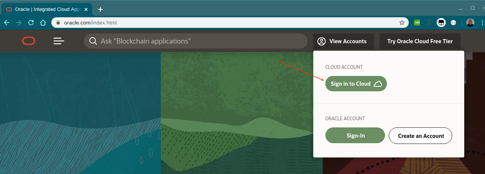

2.  Navigate to Autonomous Data Warehouse from the menu and then select your ADW instance.

    

    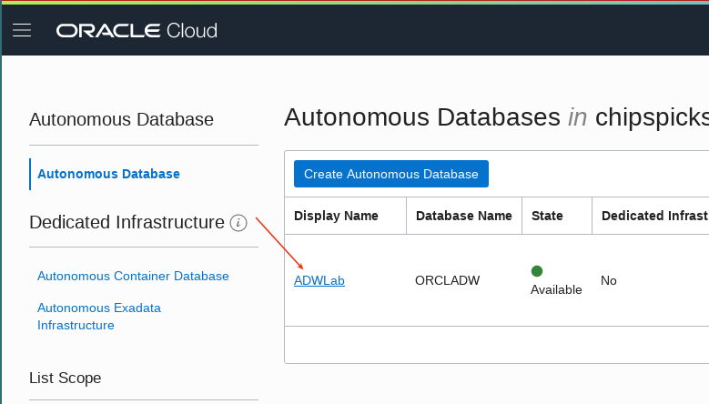

3.  Select the **Service Console**.

    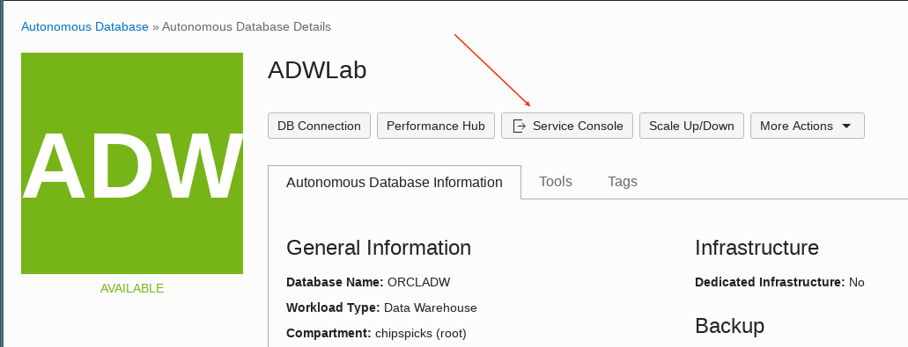

4.  Select **Development**, and then select **SQL Developer Web**.

    

5.  Log in with your adw userid, **Username - ADMIN** and the <if type="freetier">**Password** you created for the ADW Instance.</if><if type="livelabs">password **WELcome__1234**.</if>

    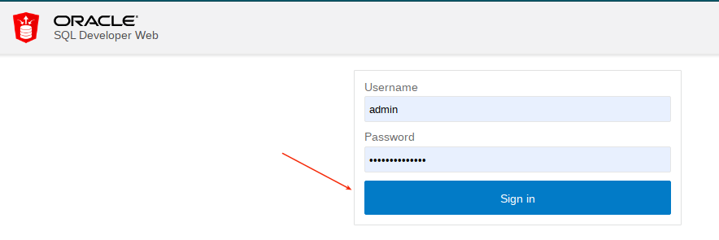

6.  Close the popup help notes.

    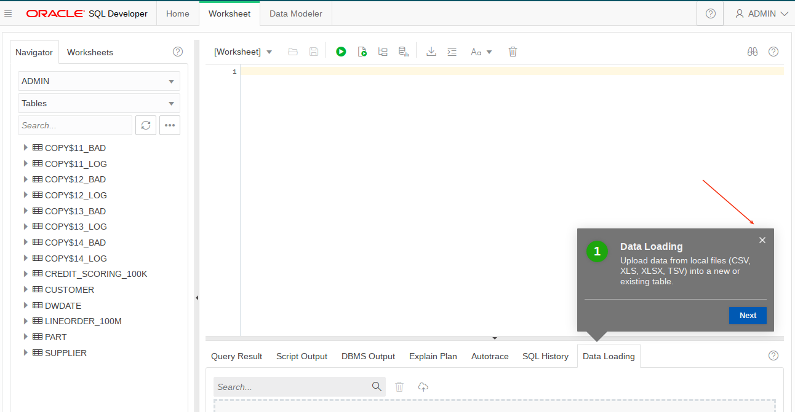

7.  By default, only the admin userid can use the SQL Developer Web. To enable ml\_user to use it, you need to enter the following and execute the procedure to grant sqldeveloper web access to ml\_user.

    ````
    <copy>
    BEGIN
      ORDS_ADMIN.ENABLE_SCHEMA(
        p_enabled => TRUE,
        p_schema => 'ML_USER',
        p_url_mapping_type => 'BASE_PATH',
        p_url_mapping_pattern => 'ml_user',
        p_auto_rest_auth => TRUE
      );
      COMMIT;
    END;
    /
    </copy>
    ````

    

    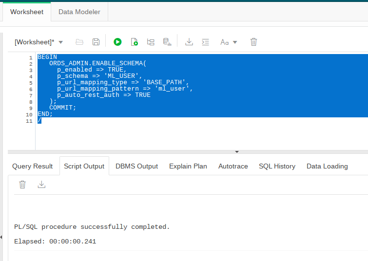

8.  Grant storage privileges to ml\_user.

    ````
    <copy>
    alter user ml_user quota 100m on data;
    </copy>
    ````

    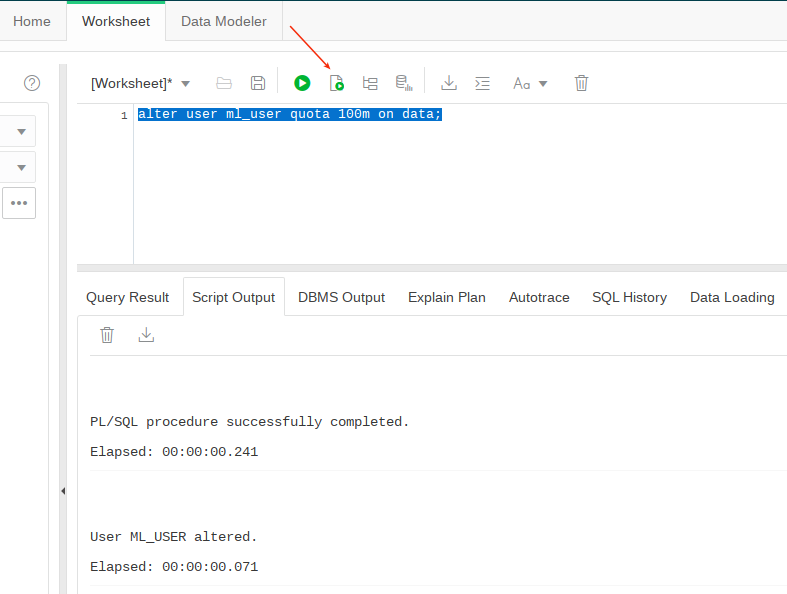

## Task 2: Export the machine learning model

1.  Copy the SQL Developer URL from the browser and paste it in another tab. Change the user in the SQL Developer URL from admin to **ml\_user** and hit enter to log in as ml\_user. Copy the URL to a notepad - you will need it later.


    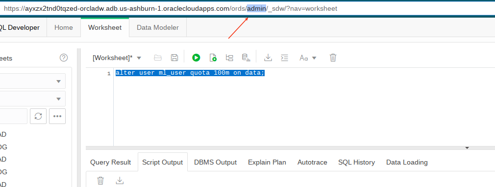

2.  Log in as ml\_user, enter **Username - ml\_user** and **Password** you created for the ADW instance.

    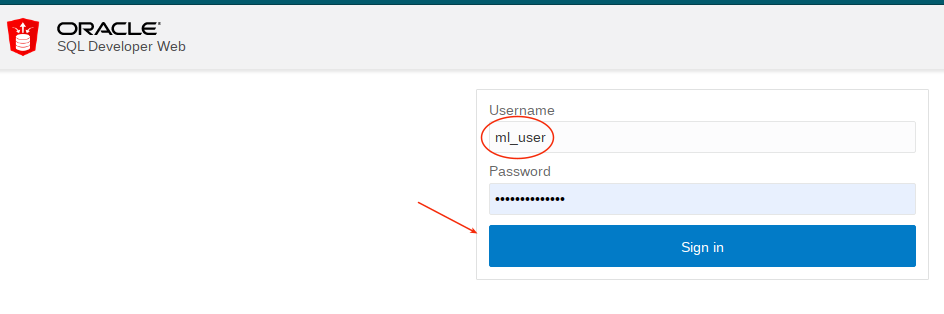

    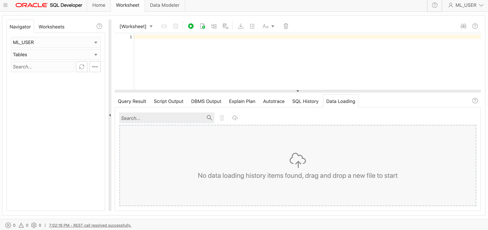

3.  Create a temporary table to hold the data mining model.

    ````
    <copy>
    create table temp(my_model blob);
    </copy>
    ````

    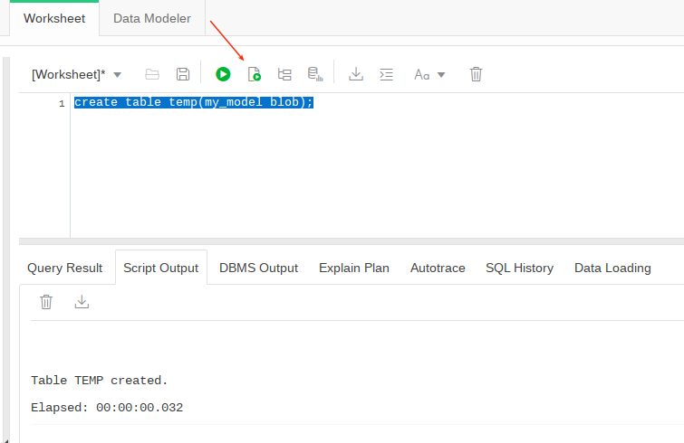

4.  Confirm the machine learning model that was built. This has been done in lab 1 and lab 2 by executing the steps in the Credit Scoring notebook and Targeting Customers That Complete All Payments Notebook respectively.

    ````
    <copy>
    select * from user_mining_models;
    </copy>
    ````

    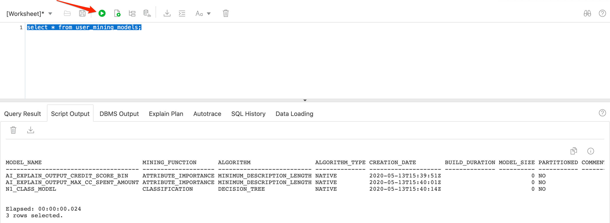

5.  Export the ml model to this temporary table. The model will be stored in a binary large object.

    ````
    <copy>
    DECLARE
    v_blob blob;
    BEGIN
    dbms_lob.createtemporary(v_blob, FALSE);
    dbms_data_mining.export_sermodel(v_blob, 'N1_CLASS_MODEL');
    insert into temp values(v_blob);
    commit;
    dbms_lob.freetemporary(v_blob);
    END;
    /
    </copy>
    ````

    

6.  Confirm the model was exported by looking at the length of the blob (you can't see the binary data). Note your length may differ slightly.

    ````
    <copy>
    select length(my_model) from temp;
    </copy>
    ````

    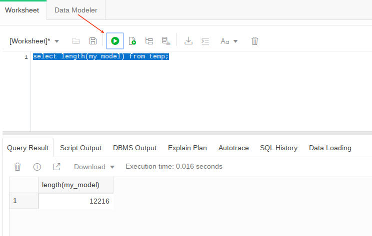

## Task 3: Grant Create Table Privileges

1.  In Oracle Cloud Console, navigate to Autonomous Transaction Processing menu item and select your ATP instance.

    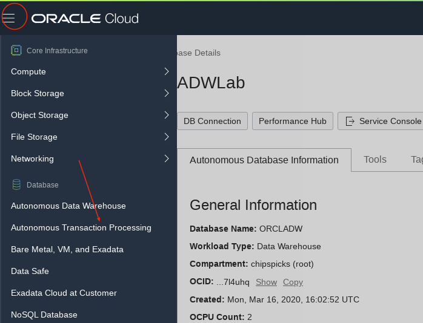

    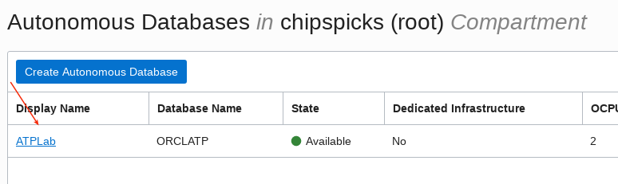

2.  Select the **Service Console**.

    

3.  Select **Administration**, and then **Manage Oracle ML Users**.

    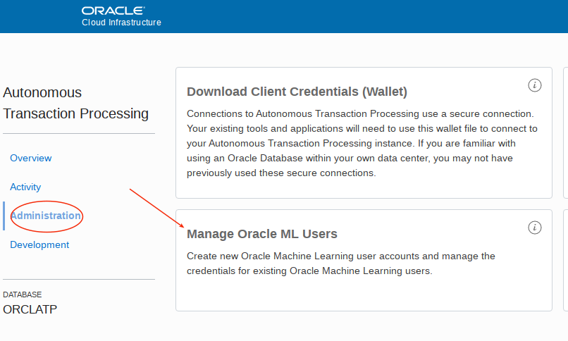

4.  Click **Create** to create a new ML User.

    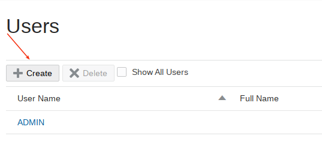

5.  Enter **Username - ml\_user**, provide your account **Email Address**, create a **Password** and click **Create**.

    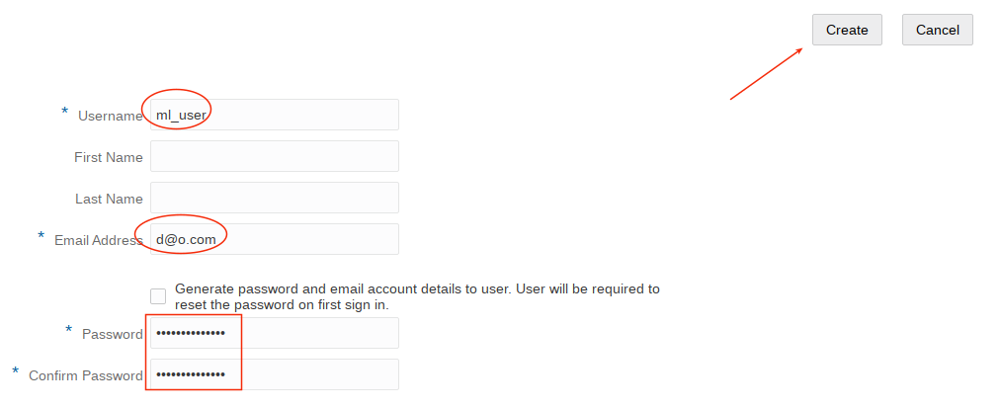

6.  Go to the Autonomous Transaction Processing Console (previous tab in your browser), select **Development**, and then **SQL Developer Web**.

    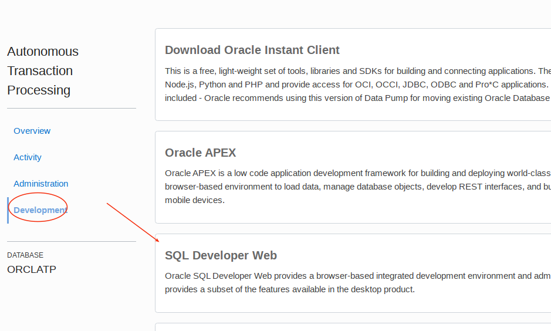

7.  Log in with your ATP admin userid. Enter **Username - admin** and **Password** that you assigned when you created the ATP instance.

    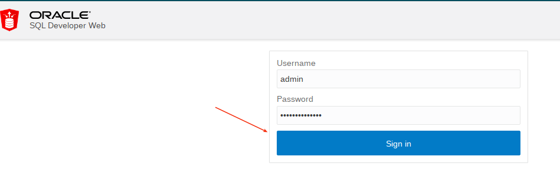

8.  Grant SQL Developer Web rights to ml\_user.

    ````
    <copy>
    BEGIN
      ORDS_ADMIN.ENABLE_SCHEMA(
        p_enabled => TRUE,
        p_schema => 'ML_USER',
        p_url_mapping_type => 'BASE_PATH',
        p_url_mapping_pattern => 'ml_user',
        p_auto_rest_auth => TRUE
      );
      COMMIT;
    END;
    /
    </copy>
    ````

    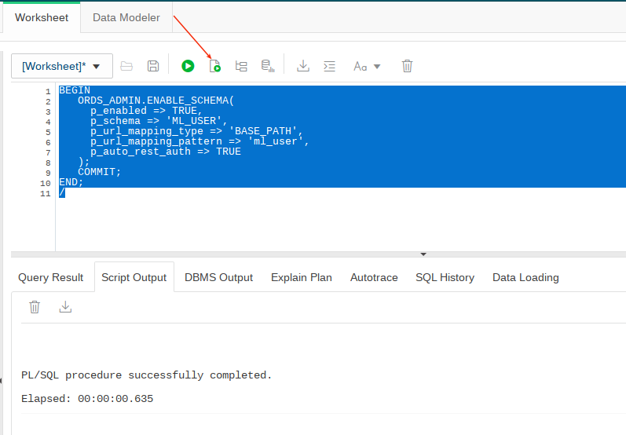

9.  Grant storage privileges to ml\_user.

    ````
    <copy>
    alter user ml_user quota 100m on data;
    </copy>
    ````

    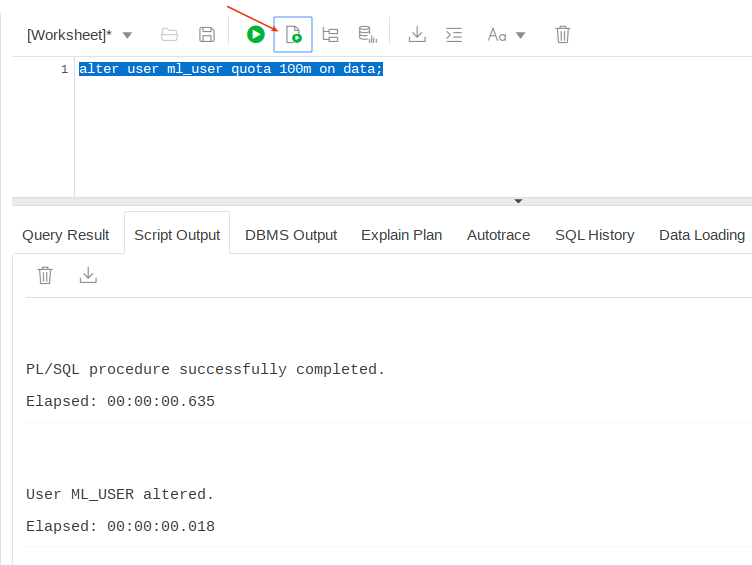

## Task 4: Copy Machine Learning Models between ADW and ATP

1.  With the admin userid in ATP SQL Developer Web, create a credential to copy your ADW wallet from Object Storage to the DATA\_PUMP\_DIR which will be used later in this step. Specify the credentials:

    - Username: The username will be the OCI Username you noted in lab 1 step 5 (which is not the same as your database username).
    - Password: The password will be the OCI Object Store Auth Token you generated in lab 1 step 5.

    ````
    <copy>
    BEGIN
      DBMS_CLOUD.CREATE_CREDENTIAL(
        credential_name => 'adwc_token',
        username => '&lt your cloud username &gt',
        password => '&lt generated auth token &gt'
      );
    END;
    /
    </copy>
    ````

    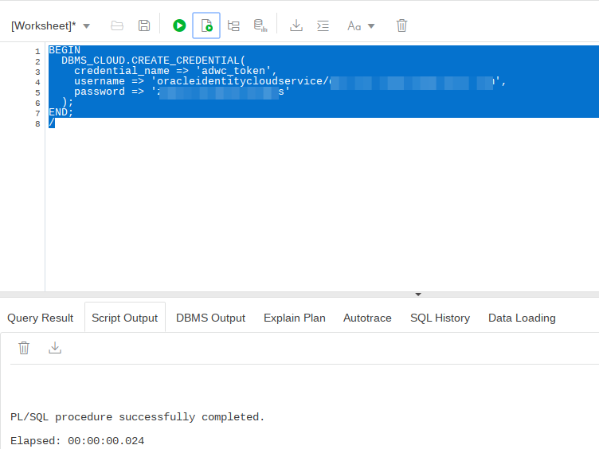

2.  Create another credential for the ADW database. For the **Username - ADMIN**, create a **Password**. This is your database admin userid and password. This will be used in the following steps.

    ````
    <copy>
    BEGIN
      DBMS_CLOUD.CREATE_CREDENTIAL(
        credential_name => 'adw_db',
        username => 'ADMIN',
        password => '&lt;password&gt;'
      );
    END;
    /
    </copy>
    ````

    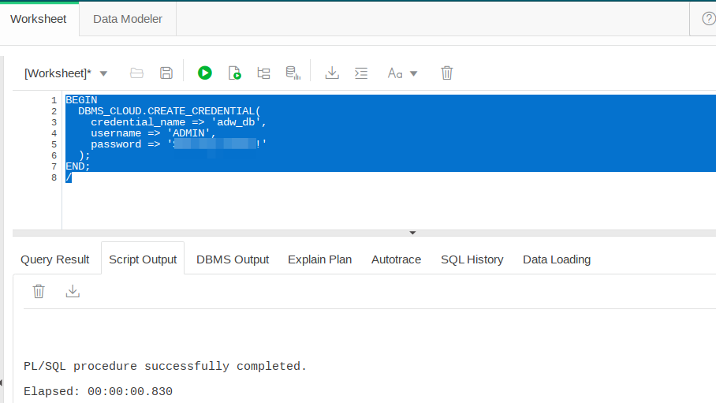

3.  Go back to Oracle Cloud Console tab in the browser and navigate to Object Storage in the menu and select your **adwc** bucket in Object Storage.

    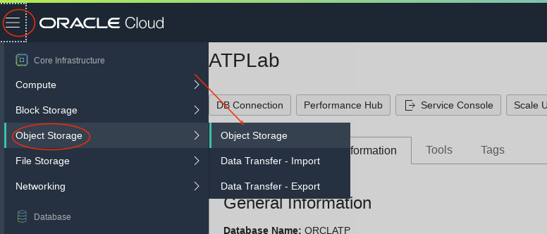

    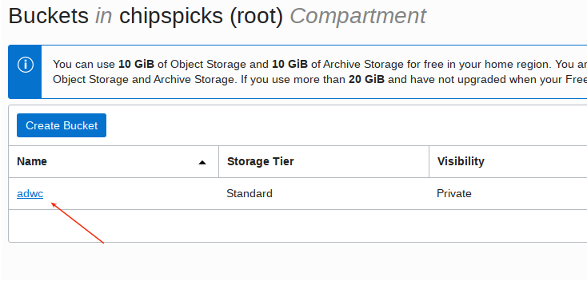

4.  The database link needs access to your ADW wallet file - cwallet.sso (we uploaded this file to Object Storage in lab 1). Scroll down till Objects to view the objects.

    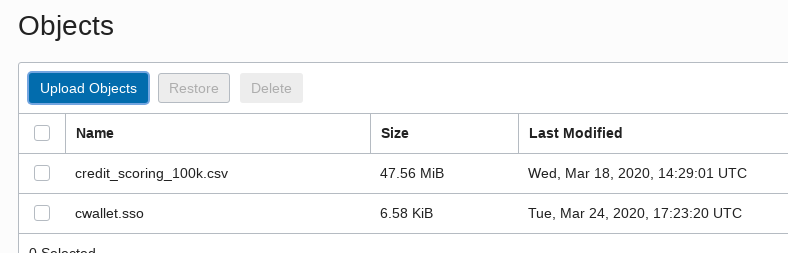

5.  Under Objects, click on the far right menu of the **cwallet.sso** file and click on **View Object Details**.

    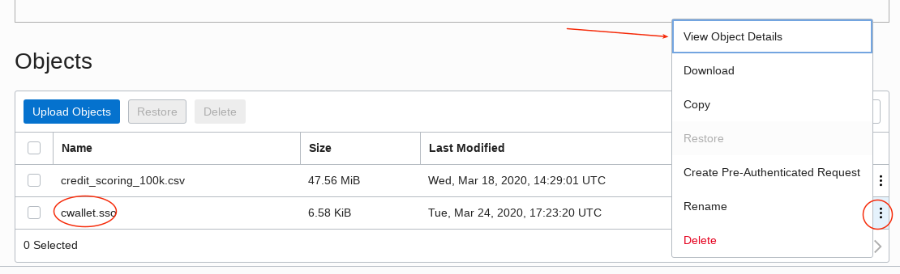

6.  Copy the URL to a notepad. We'll need it in this step.

    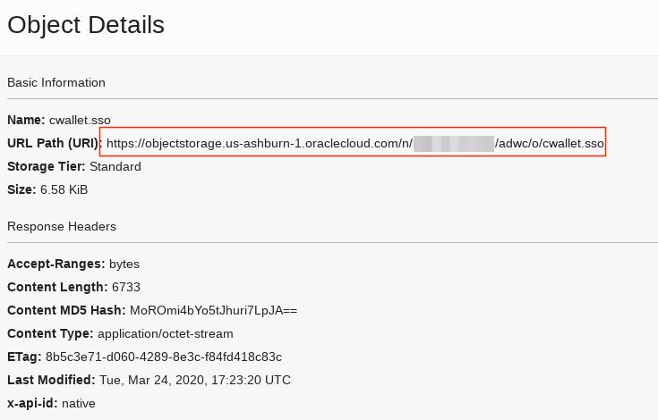

7.  Switch browser tabs to the SQL Developer Web tab and replace the **object\_uri** with the **URL Path** you copied earlier in this step. This copies the wallet path to the ATP's DATA\_PUMP\_DIR. When we create the database link in the next steps this wallet will be required.

    ````
    <copy>
    BEGIN
        DBMS_CLOUD.GET_OBJECT(
            credential_name => 'adwc_token',
            object_uri => '&lt;your object file URI&gt;',
            directory_name => 'DATA_PUMP_DIR');
    END;
    /
    </copy>
    ````

    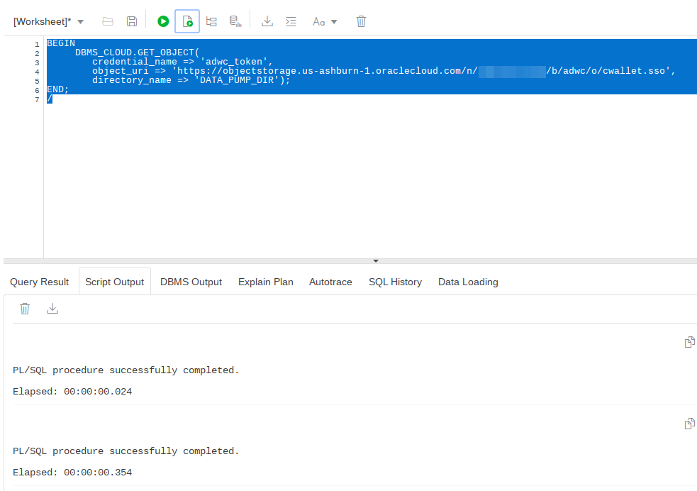

8.  From the downloaded ADW zip wallet file, make note of the following values from the tnsnames.ora file to a notepad which will be needed in this step. (It is recommended to use notepad if there is no application supported to open the file.)
    - hostname
    - service\_name
    - ssl\_server\_cert\_dn

    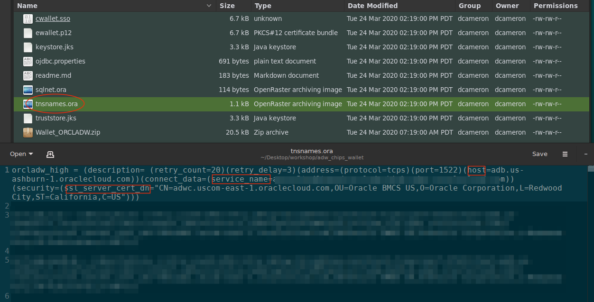

9.  Specify the **hostname**, **service_name** and **ssl\_server\_cert\_dn** values you noted earlier, to create a database link. This allows you to copy data from ADW to ATP (in fact, bi-directional).

    ````
    <copy>
    BEGIN
        DBMS_CLOUD_ADMIN.CREATE_DATABASE_LINK(
              db_link_name => 'adwlink',
              hostname => '&lt;your ADW host&gt;',
              port => '1522',
              service_name => '&lt;your service name&gt;',
              ssl_server_cert_dn => '&lt;your cert&gt;',
              credential_name => 'adw_db',
              directory_name => 'DATA_PUMP_DIR');
    END;
    /
    </copy>
    ````

    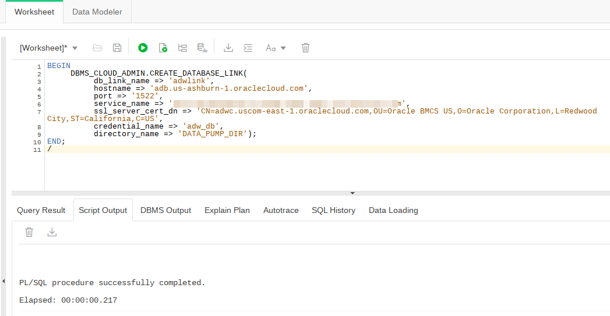

10. Test the database link by retrieving the date from the remote ADW instance.

    ````
    <copy>
    select sysdate from dual@adwlink;
    </copy>
    ````

    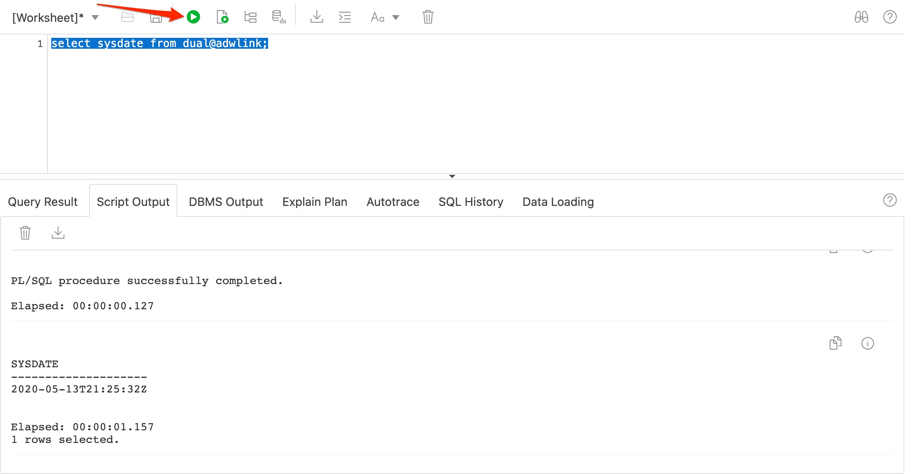

## Task 5: Copy tables from ADW to ATP

1.  First, copy the credit\_scoring\_100k table into ml\_user in ATP. Normally, this table would already exist in the production system. We could have loaded this table to ATP in lab 1 when we loaded the table into ADW. But, since we were going to create this database link, we can just copy it from ADW. Run the following statement to copy credit\_scoring\_100k table into ml\_user in ATP.

    ````
    <copy>
    create table ml_user.credit_scoring_100k as select * from credit_scoring_100k@adwlink;
    </copy>
    ````

    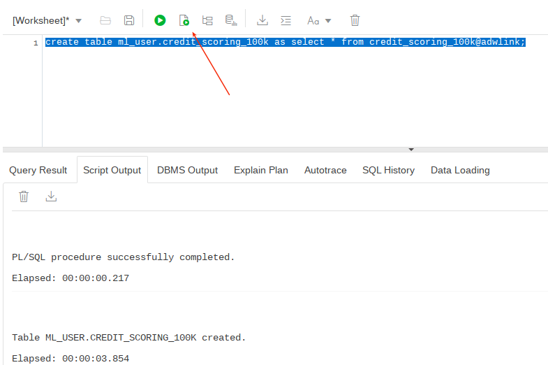

2.  We also need to copy the ml model, which is in the temp table (blob). To copy the temp table execute the following statement.

    ````
    <copy>
    create table ml_user.temp as select * from ml_user.temp@adwlink;
    </copy>
    ````

    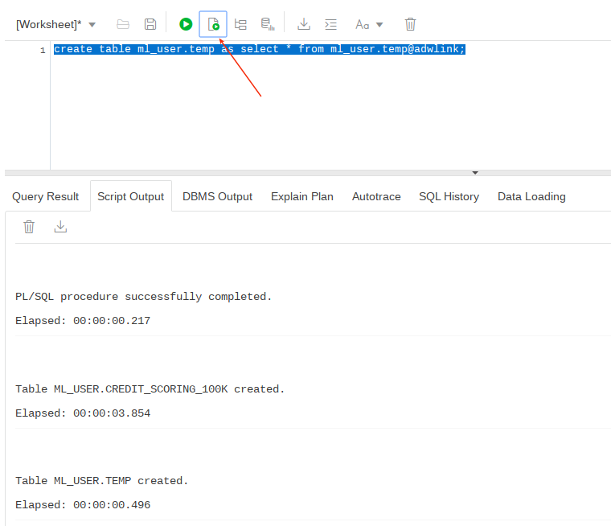

## Task 6: Import the ml model

1.  Copy the SQL Developer URL from the browser and paste it in another tab. Change the user in the SQL Developer URL from admin to **ml\_user** and hit enter to log in as ml\_user. Copy the URL to a notepad - you will need it later.

    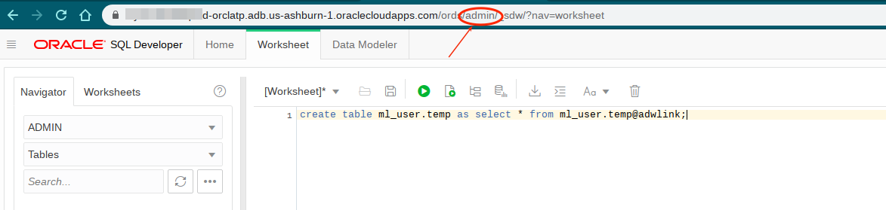

2.  Log in as ml_user, enter **Username - ml\_user** and **Password** you created for the ATP Instance.

    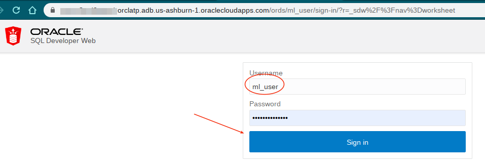

3.  Import your model and ignore the error message.

    ````
    <copy>
    DECLARE
    v_blob blob;
    BEGIN
    dbms_lob.createtemporary(v_blob, FALSE);
      select my_model into v_blob from temp;
    dbms_data_mining.import_sermodel(v_blob, 'N1_CLASS_MODEL');
    dbms_lob.freetemporary(v_blob);
    END;
    /
    </copy>
    ````

    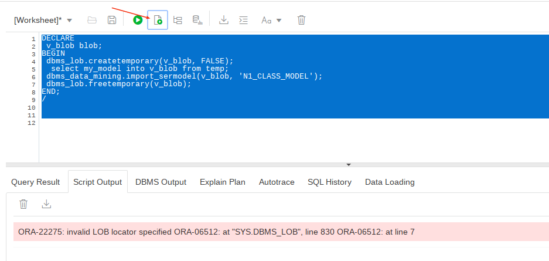

4.  Confirm the ml model was imported.

    ````
    <copy>
    select * from user_mining_models;
    </copy>
    ````

    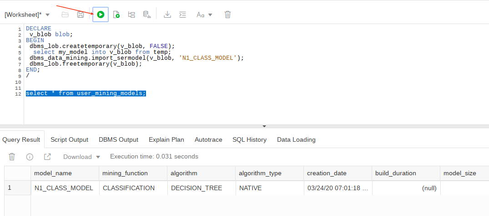

5.  Test the model.

    ````
    <copy>
    select prediction(N1_CLASS_MODEL USING 'Rich' as WEALTH, 2000 as income, 'Silver' as customer_value_segment) credit_prediction
    from dual;
    </copy>
    ````

    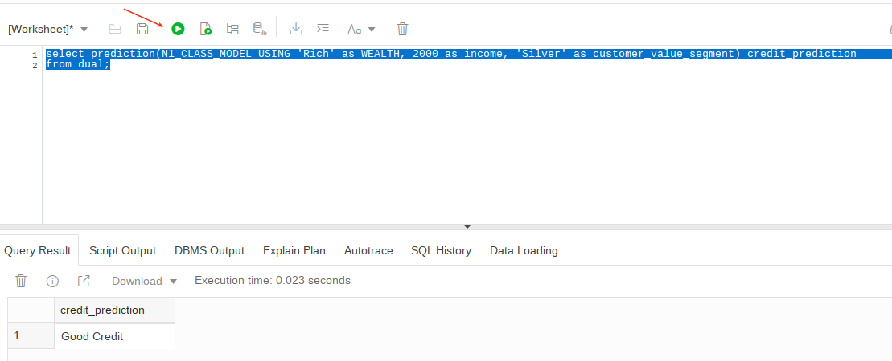

6.  To make the model prediction available to all applications we will use the Oracle Database's virtual column feature. We will add two new virtual columns - the prediction itself, and the probability that the prediction is correct. *TIP: You can also create a function index in the ml columns (not included here)*. If you wish to use a function index the table must be analyzed to be used in queries.

    ````
    <copy>
    alter table credit_scoring_100k add(
    likely_good_credit_pcnt AS (round((100*(prediction_probability(n1_class_model, 'Good Credit' USING
        wealth
      , customer_dmg_segment
      , income
      , highest_credit_card_limit
      , residental_status
      , max_cc_spent_amount_prev
      , max_cc_spent_amount
      , occupation
      , delinquency_status
      , customer_value_segment
      , residental_status))),1))
    , credit_prediction AS (prediction(n1_class_model USING   
      wealth
      , customer_dmg_segment
      , income
      , highest_credit_card_limit
      , residental_status
      , max_cc_spent_amount_prev
      , max_cc_spent_amount
      , occupation
      , delinquency_status
      , customer_value_segment
      , residental_status))
    );
    </copy>
    ````

    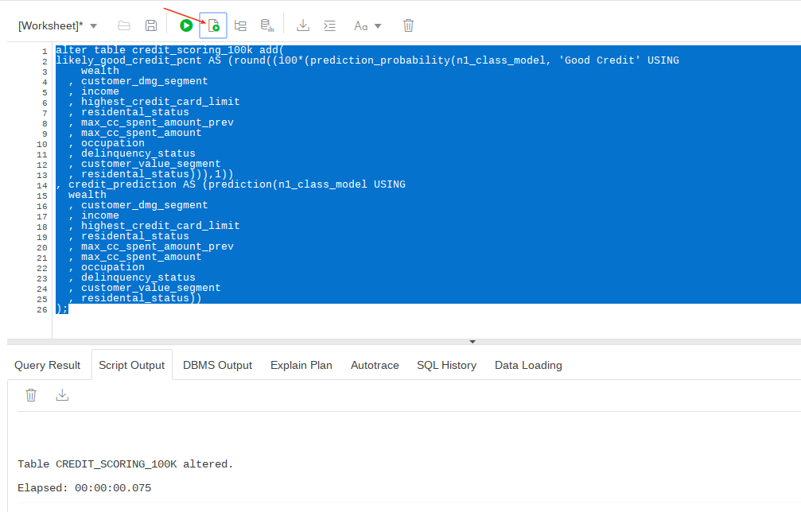

7.  Select some data to view predictions.

    ````
    <copy>
    select customer_id, wealth, income, credit_prediction, likely_good_credit_pcnt from credit_scoring_100k;
    </copy>
    ````

    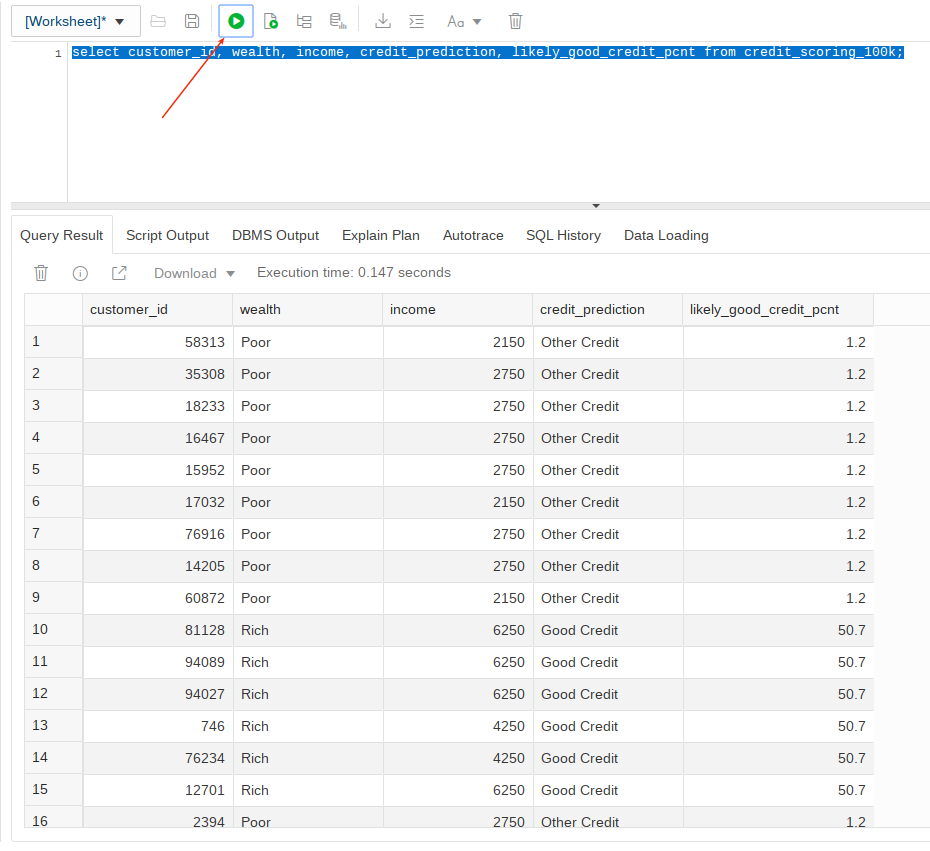

Please proceed to the next lab.

## Acknowledgements

- **Author** - Derrick Cameron
- **Last Updated By/Date** - Anoosha Pilli, Product Manager, DB Product Management, May 2020
- **Contributors** - Peter Jeffcock, Arabella Yao, Ayden Smith, Jeffrey Malcolm Jr, June 2020
