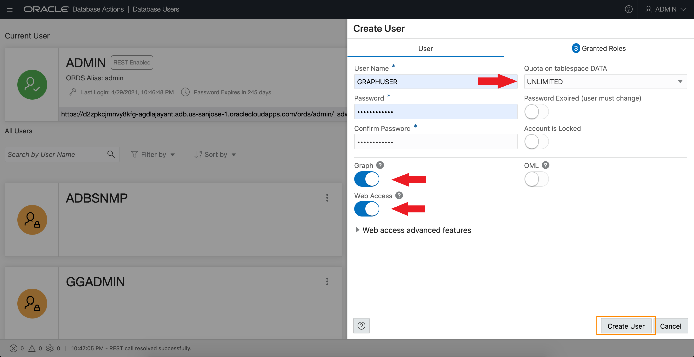
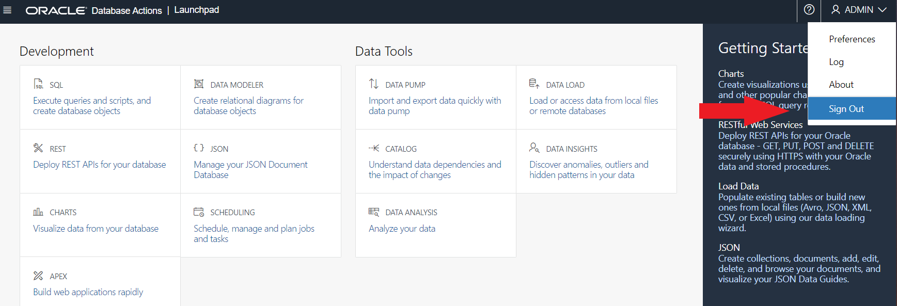
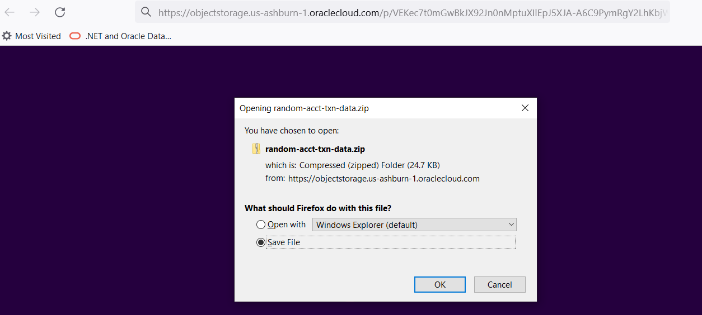
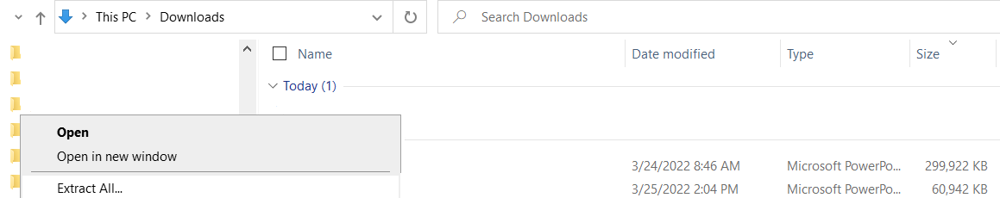
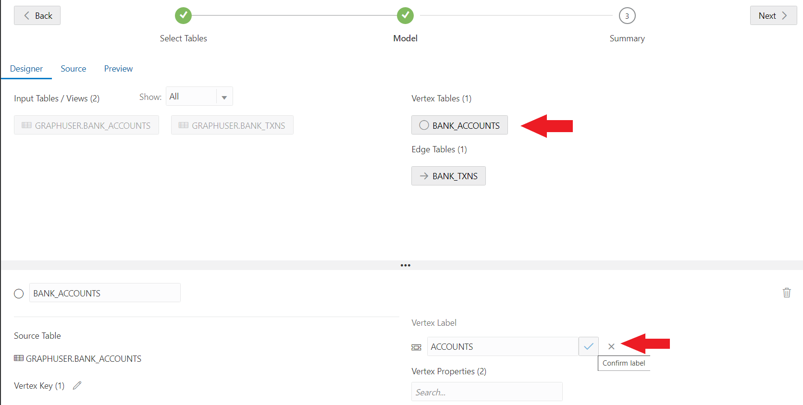
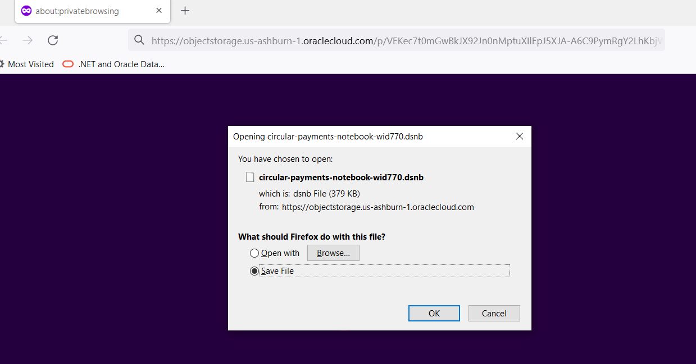
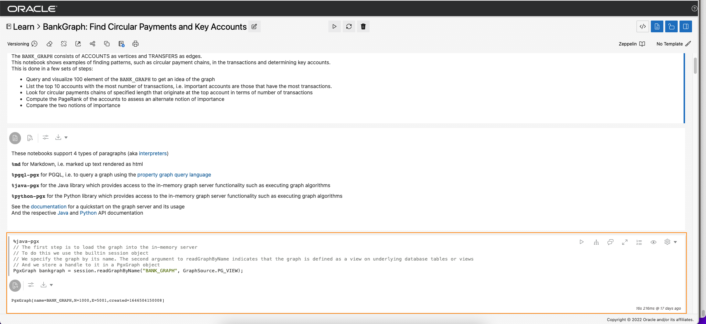
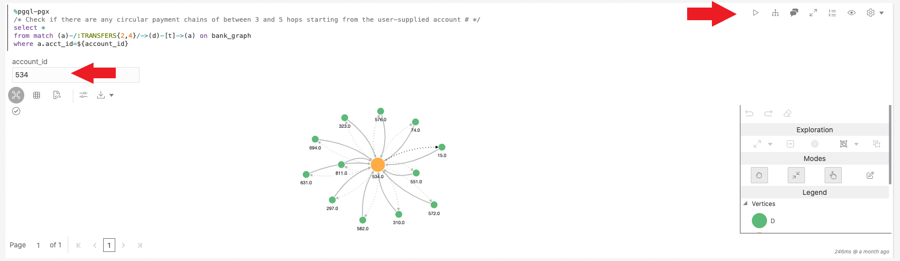

# Introduction

## About This Lab

This lab covers how to load data in CSV files into the database and introduces key graph data modeling and analysis concepts and the interactive Graph Studio for working with graphs in an Autonomous Database. It shows you how to use graph queries to find circular payments which may indicate fraudulent transactions. You will load data from CSV files containing (artificial) Account and Transaction information. Then create a graph and finally query it and visualize the results.


### About Graph Studio
Oracle Autonomous Database has features that enable it to function as a scalable property graph database. They automate the creation of graph models and in-memory graphs from database tables. They include notebooks and developer APIs for executing graph queries using PGQL, a SQL-like graph query language, and over 60 built-in graph algorithms, and many visualizations including native graph visualization.

Watch the following two videos for more information on Graph Studio. The first is an introduction to property graphs and their use cases. The second is a tour of the Graph Studio interface. 

[](youtube:eCd-969hrak)   Simplify Graph Analytics with Autonomous Database   

[](youtube:S6Q-IJcBkU0)   Autonomous Database: A tour of the Graph Studio interface

### Objectives

In this lab you will:
* Connect to your Autonomous Database using Database Actions and load two CSV files
* Connect to your Autonomous Database using **Graph Studio**
* Create a graph using PGQL's (a graph query language) CREATE PROPERTY GRAPH statement
* Load the graph into memory for analysis
* Create a notebook
* Query and visualize the graph using PGQL notebook paragraphs
 
### Prerequisites

* Oracle Cloud Account   
* Provisioned Autonomous Database-Shared instance  

## Task 1: Connecting to your Oracle Cloud Database

1. Log in to the Oracle Cloud at <a href="https://cloud.oracle.com">cloud.oracle.com</a>. Cloud Account Name is howarduniversity. Click "Next".
2. Click on "Direct Sign-In" and enter your Cloud Account email and password.

    

3. Once you are logged in, you are taken to the cloud services dashboard where you can see all the services available to you. Click the navigation menu in the upper left to show top level navigation choices.

    


4. Click **Autonomous Data Warehouse**.

    

5. From the Compartment drop down on the left side of the page, expand howarduniversity->spring2022->student1xx and select you student number.

    

6. Click on the database you created in lab 1
   
    

7. If your database icon is green and says running under it, proceed to Task 2 below. If your database is stopped, the ADW/ATP icon on the left is yellow says stopped under it then, under the More Actions drop down list, select “Start”, and confirm start.

    

8. Confirm start.

    

9.  Wait a few moments until the icon on the left turns from yellow to green.

    
  
## Task 2: Create the Graph User

### Introduction

In this task you will create a database user with the appropriate roles and privileges required for using the graph capabilities of the Autonomous Database.

Watch the video below for a quick walk through of the task.

[](youtube:CQh8Q24Rboc)

### Objectives

Learn how to
-  create a database user with the appropriate roles and privileges required for accessing **Graph Studio**


### Prerequisites

- The following task requires an Autonomous Data Warehouse - Shared Infrastructure or Autonomous Transaction Processing - Shared Infrastructure account

**Connect to the Database Actions for your Autonomous Database instance**


1. Open the service detail page for your Autonomous Database instance in the OCI console.  

   Then click the **Database Actions** link to open it. 
   
   

**Create the web access and graph-enabled user**

1. Login as the ADMIN user for your Autonomous Database instance. 

    

2. Click  the **DATABASE USERS** tile under **Administration**. 
   
   
   
3. Click the **+ Create User** icon.

    

4. Enter the required details, i.e. user name and password. Turn on the **Graph Enable** and **Web Access** radio buttons. And select a quota, e.g. **UMLIMITED**,  to allocate on the `DATA` tablespace.   

   Note: The password should meet the following requirements:

   - The password must be between 12 and 30 characters long and must include at least one uppercase letter, one lowercase letter, and one numeric character.
   - The password cannot contain the username.
   - The password cannot contain the double quote (“) character.
   - The password must be different from the last 4 passwords used for this user.
   - The password must not be the same password that is set less than 24 hours ago.
   
   

   **Note: Please do not Graph Enable the ADMIN user and do not login to Graph Studio as the ADMIN user. The ADMIN user has additional privileges by default. Create and use an account with only the necessary privileges for with with graph data and analytics.**

   Click the **Create User** button at the bottom of the panel to create the user with the specified credentials.

   The newly created user will now be listed.

    

**Login as the graph-enabled user**

1. Click on Database Actions
       

2. Log off ADMIN so you can log in as your new `GRAPHUSER`
       


3. Login as the graph user (for example, `GRAPHUSER`) for your Autonomous Database instance. 
   
      
 

## Task 3: Graph Studio: Load data from CSV files into tables

### Introduction

In this task you will load two CSV files into corresponding tables using the Database Actions interface of your 
Oracle Autonomous Data Warehouse  or Oracle Autonomous Transaction Processing instance.

Watch the video below for a quick walk through of the task.

[](youtube:wkKKO-RO0lA)

**Download the sample datasets from the ObjectStore**

1. Copy and paste the url below into your web browser (a new tab or browser) to download the sample file we will be using. This will download the file to you downloads directory or where you choose to save it. MAKE SURE you know where this file is being downloaded into your PC because you will need it in the next step.  

    ```
    <copy>
    https://objectstorage.us-ashburn-1.oraclecloud.com/p/VEKec7t0mGwBkJX92Jn0nMptuXIlEpJ5XJA-A6C9PymRgY2LhKbjWqHeB5rVBbaV/n/c4u04/b/livelabsfiles/o/data-management-library-files/random-acct-txn-data.zip
    </copy>
    ```
       

2. **Unzip** the archive into a local directory such as ~/downloads.
   
   

**Upload using Database Actions Data Load**
1. Click the **DATA LOAD** card. 
   
   
   
   Then specify the location of your data. That is, make sure the **LOAD DATA** and the **LOCAL FILE** cards have a check mark. Click **Next**.

   

2. Click **Select Files**.
   
       

    Navigate to the correct folder (for example, ~/downloads/random-acct-data) and select the `bank_accounts.csv` and the `bank_txns.csv` files.

    

3. Verify that the correct files were selected and then click **Run** icon.


4. Confirm that you wish to run the data load job.

   

5. Once the files are loaded 
   
     

   Click **Done** to exit.

   

6. Now open the **SQL** Worksheet by clicking **Database Actions** and selecting **SQL**. 
   
   
  
7. Copy and paste the following code into the worksheet  and run it by clicking on the “Run Script” arrow on top. 
   
      ```
      <copy>
      alter table bank_accounts add primary key (acct_id);
      
      alter table bank_txns add txn_id number;
      update bank_txns set txn_id = rownum;
      commit;
      
      alter table bank_txns add primary key (txn_id);
      alter table bank_txns modify from_acct_id references bank_accounts (acct_id);
      alter table bank_txns modify to_acct_id references bank_accounts (acct_id);

      desc bank_txns;
      
      select * from USER_CONS_COLUMNS where table_name in ('BANK_ACCOUNTS', 'BANK_TXNS');
      </copy>      
      ```

      It does the following:
      - Adds a primary key constraint to the `bank_accounts` table
      - Adds a column (`txn_id`) to the `bank_txns` table
      - Sets a value for the `txn_id` and commits the transaction
      - Adds a primary key constraint to the `bank_txns` table
      - Adds a foreign key constraint to the `bank_txns` table specifying that `from_acct_id` references `bank_accounts.acct_id`
      - Adds a second foreign key constraint to the `bank_txns` table specifying that `to_acct_id` references `bank_accounts.acct_id` 
      - Helps you verify that the addition of a `txn_id` column and the constraints

8.  Execute the `fixup.sql` script in the SQL worksheet.  
     
   
11. The script output should look as follows:
   
   
  
## Task 4: Graph Studio: Create a graph using PGQL CREATE PROPERTY GRAPH statement

### Introduction

In this task you will create a graph from the `bank_accounts` and `bank_txns` tables using Graph Studio and the CREATE PROPERTY GRAPH statement.

Watch the video below for a quick walk through of the task.

[](youtube:tNPY4xmVFMk)

### Objectives

Learn how to
- use Graph Studio and PGQL DDL (that is, CREATE PROPERTY GRAPH statement) to model and create a graph from existing tables or views.

**Connect to your Autonomous Database using Graph Studio**

1. On your browser tab where you have your Autonomous Database main page Click the **Tools** tab on the details page menu on the left. If you no longer have a browser page open to the main database page, you need to log back into your cloud account as done in Task 1. 

   


2. Click the **Open Graph Studio** card to open in a new page or tab in your browser.   
   
   If your tenancy administrator provided you the Graph Studio URL to connect directly then use that instead.


3. Log in as the GRAPHUSER you created in task 2 above, username graphuser and the password you created:
 
    

4. Then click the **Sign In** button. You should see the studio home page.   

     

    Graph Studio consists of a set of pages accessed from the menu on the left. 

    The Home icon  takes you to the Home page.  
    The Models icon  takes you to the Models page where you start modeling your existing tables and views as a graph and then create, or instantiate, a graph.  
    The Graph page  lists existing graphs for use in notebooks.  
    The Notebook page  lists existing notebooks and lets you create a new one.  
    The Jobs page  lists the status of background jobs and lets you view the associated log if any.  


**Create a graph of accounts and transactions from the corresponding tables**

1. Click the **Models** icon to navigate to the start of the modeling workflow.  
   Then click **Create**.  
     

   **Note: If you clicked on `Start Modeling` button instead then you'll see the screen shown in the next step.**

2. Under Available, expand **GRAPHUSER** so it shows the `BANK_ACCOUNTS` and `BANK_TXNS` tables which we loaded from the flat file in a previous step.   


3. Move them to the right, that is, click the first icon on the shuttle control.   

   

4.  Click **Next** to get a suggested model. We will edit and update this model to add an edge and a vertex label.  

    The suggested model has the `BANK_ACCOUNTS` as a vertex table since there are foreign key constraints specified on `BANK_TXNS` that reference it.   

    And `BANK_TXNS` is a suggested edge table.

      
  

5.  Now let's change the default Vertex and Edge labels.  

    Click the `BANK_ACCOUNTS` vertex table. Change the label to `ACCOUNTS`. Then click the checkmark next to the box to save the update.  

      

    Click the `BANK_TXNS` edge table and change the label from `BANK_TXNS` to `TRANSFERS`.  
    Then click the checkmark next to the box to save the update.  

      

    This is **important** because we will use these edge labels in the next lab of this workshop when querying the graph.  

6.  Since these are directed edges, a best practice is verifying that the direction is correct.  
    In this instance we want to **confirm** that the direction is from `from_acct_id` to `to_acct_id`.  

    Note the `Source Vertex` and `Destination Vertex` information on the left.  
       

    **Notice** that the direction is wrong. The Source Key is `to_acct_id` instead of what we want, which is `from_acct_id`.  

    Click the swap edge icon on the right to swap the source and destination vertices and hence reverse the edge direction.

    

   Note that the `Source Vertex` is now the correct one, i.e. the `FROM_ACCT_ID`.

    
  
7. Click the **Source** tab to verify that the edge direction, and hence the generated CREATE PROPERTY GRAPH statement, is correct.


     
  
8. Click **Next** and then click **Create Graph** to move on to the next step in the flow.   

   Enter `bank_graph` as the graph name.  
   That graph name is used throughout the next lab.  
   Do not enter a different name because then the queries and code snippets in the next lab will fail.  
   
   Enter a model name (for example, `bank_graph_model`), and other optional information.  
   

9. Graph Studio modeler will now save the metadata and start a job to create the graph.  
   The Jobs page shows the status of this job. 

     

   You can then interactively query and visualize the graph in a notebook after it's loaded into memory.

## Task 5: Graph Studio: Query, visualize, and analyze a graph using PGQL and Java

### Introduction

In this lab you will query the newly create graph (that is, `bank_graph`) in PGQL paragraphs of a notebook.

Watch the video below for a quick walk through of the lab.

[](youtube:XnE1yw2k5IU)

### Objectives

Learn how to
- use Graph Studio notebooks and PGQL and Java paragraphs to query, analyze, and visualize a graph.

### Prerequisites

- Earlier labs of this workshop. That is, the graph user exists and you have logged into Graph Studio. 

**Import the notebook**

The instructions below show you how to create each notebook paragraph, execute it, and change default visualization settings as needed.  
First **import** the sample notebook and then execute the relevant paragraph for each step in task 2.   

1. Download the exported notebook from the Object Store. 
   Use the following Pre-authenticated Request, or PAR, to download the exported notebook onto your machine.   
   Copy the URL below and paste it into your browser's address bar.  
   Note the location of the downloaded file. 

  	```
	<copy>
	https://objectstorage.us-ashburn-1.oraclecloud.com/p/VEKec7t0mGwBkJX92Jn0nMptuXIlEpJ5XJA-A6C9PymRgY2LhKbjWqHeB5rVBbaV/n/c4u04/b/livelabsfiles/o/data-management-library-files/circular-payments-notebook-wid770.dsnb
	</copy>
	```
     

2. Click the **Notebooks** menu icon and then on the **Import Notebook** icon on the top right.  

     

3. Drag the downloaded file or navigate to the correct folder and select it for upload.  
     

4. Click **Import**. 
     
5. Once imported it should open in Graph Studio.  
   
     

   You can execute the paragraphs in sequence and experiment with visualizations settings as described in the next section below.  

**Load and Query the `BANK_GRAPH` and visualize the results**

**Note:** *Execute the relevant paragraph after reading the description in each of the steps below*. To execute a paragraph in a notebook click on the “Run Paragraph” arrow. Please make sure you find the correct paragraph to run as per the steps below as the notebook contains extra paragraphs of explanation that do not need to be run. 


1. First load the graph into the in-memory graph server since we will be executing some graph algorithms.  
   
   Run the first `%java-pgx` paragraph which uses the built-in `session` object to read the graph into memory from the database and creates a `PgXGraph` object which is a handle to the loaded graph.  

   The code snippet in that paragraph is:    
   
	```
   <copy>
   %java-pgx
	// The first step is to load the graph into the in-memory server
	// To do this we use the builtin session object 
	// We specify the graph by its name. The second argument to readGraphByName indicates that the graph is defined as a view on underlying database tables or views
	// And we store a handle to it in a PgxGraph object
	PgxGraph bankgraph = session.readGraphByName("BANK_GRAPH", GraphSource.PG_VIEW);
   </copy>
	```
     

2. Next execute the paragraph which queries and displays 100 elements of the graph.    
   
	```
   <copy>
	%pgql-pgx
	/* Query and visualize 100 elements (nodes and edges) of BANK_GRAPH */
	select * 
	from match (s)-[t]->(d) on bank_graph 
	limit 100
   </copy>

	```

	The above PGQL query fetches the first 100 elements of the graph and displays them.  
	The MATCH clause specifies a graph pattern.  
	- `(s)` is the source node 
	- `[t]` is an edge 
	- `->` indicates the edge direction, that is, from the source `s` to a destination `d`
	- `(d)` is the destination node
	
	The LIMIT clause specifies the maximum of elements that the query should return.

	See the [PGQL site](https://pgql-lang.org) and specification for more details on the syntax and features of the language.  
	The Getting Started notebook folder also has a tutorial on PGQL.  

3. The result utilizes some features of the visualization component. The `acct_id` property is used for the node (or vertex) labels and the graph is rendered using a selected graph layout algorithm.

     
  

4. Next let's use PGQL to find the top 10 accounts in terms of number of transfers.  
	PGQL has built-in functions `IN_DEGREE` and `OUT_DEGREE` which return the number of incoming and outgoing edges of a node. So we can use them in this query.   
	Run the paragraph with the following query.  
	```
   <copy>
	%pgql-pgx
	/* List 10 accounts with the most number of transactions (that is, incoming + outgoing edges) */
	select a.acct_id, (in_degree(a) + out_degree(a)) as num_transactions 
	from match (a) on bank_graph 
	order by num_transactions desc 
	limit 10
   </copy>
	```

	  

	We see that accounts 934 and 387 are high on the list.  

5.  Now check if there are any circular transfers originating and terminating at account 934.   
	Execute the following query.  
	```
   <copy>
	%pgql-pgx
	/* Check if there are any circular payment chains of length 5 from acct 934 */
	select *
	from match (a)-/:TRANSFERS{5}/->(a) on bank_graph 
	where a.acct_id=934
   </copy>
	```

	

	Here `/:TRANSFERS{5}/` is a [reachability path expression](https://pgql-lang.org/spec/1.3/#reachability). It only tests for the existence of the path.  
	`:TRANSFERS` specifies that all edges in the path must have the label `TRANSFERS`.  
	While `{5}` specifies a path length of exactly 5 hops.  

	The result shows a dotted line which indicates a path, of length one or more, from the node for account 934 to itself.  
	
	
	
	It does not display all the paths or any intermediate nodes.


6. We can change the above query to include the node which made the deposit into account 934. This will display all the paths.   
	Execute the following query.  
	```
   <copy>
	%pgql-pgx
	/* Show the account that deposited into acct 934 in the 5-hop circular payment chain */
	select *
	from match (a)-/:TRANSFERS{4}/->(d)-[t]->(a) on bank_graph 
	where a.acct_id=934
   </copy>
	```

	  

	The reachability test has paths of length four because we explicity specify the last hop (`(d)-[t]->(a)`).  

	  

	Click the **Customization** settings and then select the **Concentric** layout and `ACCT_ID` for the vertex label.  

	

7. The next query finds and displays the 6-hop circular payment chains originating at account 934.  
	
	  
	```
   <copy>
	%pgql-pgx
	/* Show the account that deposited into acct 934 in the 5-hop circular payment chain */
	select *
	from match (a)-/:TRANSFERS{5}/->(d)-[t]->(a) on bank_graph 
	where a.acct_id=934
   </copy>
	```

	  

	The resulting visualizing will be similar to the following screenshot.  

	  

8.  We may want also to display all the intermediate nodes, that is, accounts through which the money was transferred. 

	Let's do that for the 5-hop case.   
	```
   <copy>
	%pgql-pgx
	/* Show all the transfers in 5-hop circular payment chains starting from acct 934 */
	select a, t1, i1, t2, i2, t3, i3, t4, i4, t5 
	from match (a)-[t1]->(i1)-[t2]->(i2)-[t3]->(i3)-[t4]->(i4)-[t5]->(a) on bank_graph
	where a.acct_id=934
   </copy>
	```
	  

9. This shows the use of bind parameters in a query. The account id value is entered at runtime.  

   **Enter 534 as the account id**, and then execute the paragraph.  

	```
   <copy>
	%pgql-pgx
	/* Check if there are any circular payment chains of between 3 and 5 hops starting from the user-supplied account # */
	select * 
	from match (a)-/:TRANSFERS{2,4}/->(d)-[t]->(a) on bank_graph
	where a.acct_id=${account_id}
   </copy>
	```

    

10. Now let's run the PageRank graph algorithm.  
 

    A %java-pgx paragraph lets you execute Java code snippets.  

	The code snippet below creates a PgxGraph object which contains a handle to the `BANK_GRAPH` which is loaded into the in-memory graph server.  
	Then it executes the `pagerank` algorithm using the built-in `analyst` Java object.  
	The `session` and `analyst` objects are created when the in-memory graph server is instantiated and when a notebook is opened.    

    Execute the paragrah containing the following code snippet.  
	```
   <copy>
	%java-pgx
	// PgxGraph bgraph = session.getGraph("BANK_GRAPH");
	analyst.pagerank(bankgraph);
   </copy>
	```

	

11. Now let's use the computed PageRank value in visualizing a PGQL query result.  
 	
 Execute the paragraph with the following query which finds the 6-hop transfers starting at account #934.  
    
	```
   <copy>
	%pgql-pgx
	/* Add highlights to symbolize account nodes by pagerank values. This shows that 934 is connected to other accounts with higher PageRank values. */
	SELECT *
	FROM MATCH(n)-/:Transfers{1,6}/->(m) on bank_graph
	WHERE n.acct_id = 934 limit 100
   </copy>
	```
   The result should be similar to the screenshot shown below.  

   


12.  Now let's compare the top ten accounts by PageRank and number of transactions. 
Execute the paragraph with the following query to show the top ten accounts by PageRank.  

    ```
    <copy>
    %pgql-pgx
    /* List top ten accounts by pagerank */
    select a.acct_id, a.pagerank
    from match (a) on bank_graph 
    order by a.pagerank desc limit 10
    </copy>
    ```
    Click the **Table** icon to visualize the results as a table, if necessary.  

        

13.  And the one which shows top ten accounts by number of transfers.  

    ```
    <copy>
	%pgql-pgx
	/* List 10 accounts with the most number of edges (that is, transfers) */
	select a.acct_id, in_degree(a) + out_degree(a) as num_transfers 
	from match (a) on bank_graph 
	order by num_transfers desc limit 10
   </copy>
	```

	    

14. Account #222 is in the top ten by PageRank but not by # of transfers. So let us look at that account and its immediate neighbors in the graph.  
 
   Execute the paragraph which queries and displays account 222 and its neighbors. 

    ```
    <copy>
	%pgql-pgx
	/* show the transactions for acct id 222 */
	select * from match (v1)-[e1]->(a)-[e2]->(v2) on bank_graph where a.acct_id=222
   </copy>
	```
       
    
15.  Similarly account #4 has a higher PageRank but is not in the top 10 by #transfers while account #380 is in the top 10 by #transfers but not by PageRank.  
 
   So let us look at those two and their neighbors.  

   Execute the paragraph which queries the neighbors of accounts #4 and #380.  

    ```
    <copy>
	%pgql-pgx
	/* Query and visualize elements (nodes and edges) of BANK_GRAPH for accts 4 and 380 */
	select * 
	from match (s)-[t]->(d) on bank_graph where s.acct_id = 4 or s.acct_id = 380 or d.acct_id = 4 or d.acct_id = 380
   </copy>
    ```

      	  

## Task 6: Homework 

The homework is to redo 3 paragraphs that use the Java API and PGQL to use the Python API and PGQL instead. You will then submit a screenshot to Blackboard.

Example:
- Get a graph as a Python object
- Run the community detection algorithm
- Query the graph and display it
- Then submit a screenshot of these 3 paragraphs


