# Developing with JSON in the Oracle Database

## Introduction

### About this Workshop

In this workshop, you will create a simple web shop for 80s, 90s and 2000s memorabilia (movies, posters, mugs, wearables, caps, toys electronics).

This lab is organized into different topics, each topic consists of multiple steps. Some steps are a bit more advanced, they're marked as 'advanced' and you can skip them. After completing this workshop a user has a very good understanding what JSON features are available in Oracle Database and when to use them. A user will also have learned why Oracle database is better suited for JSON Development than MongoDB, etc.

### Workshop Scenario

This workshop is loosely based on the video below where an "order processing system' is described. In this workshop, we implement an online shop selling used products: popular items like movies, posters, merchandise from the 80s, 90's and 2000s (maybe you find your favorite movie?). We show how the product catalog can be managed with JSON in a very schema-flexible way - allowing to add new product types on the fly. We also show how multiple JSON collections (products, shopping carts, orders, etc) play well together using SQL and JOIN, etc.

This workshop is not a 'cookbook' or 'design guideline' on how to build an online shop - the purpose is to illustrate various JSON features that the Oracle Database offers. That said, you likely find that many examples are applicable to your business needs!

Watch this quick video to know why JSON in Oracle Autonomous Database is awesome.

[](youtube:yiGFO139ftg)

<if type="odbw">If you would like to watch us do the workshop, click [here](https://youtu.be/uvlhnG-bjnY).</if>

### About JSON

Before we get started let's take a brief look at JSON (you may skip this step if you're already familiar with it)

#### What is JSON?

JSON is a human-readable, self-describing format to represent data in a hierarchical format. This is best illustrated by an example - a JSON object with information about a person:

```
{
	"id":100,
	"firstName":"John",
	"lastName":"Smith",
	"age":25,
	"address":{
		"street":"21 2nd Street“,"city":"New York",
		"state":"NY","postalCode":"10021",	 
		"isBusiness":false	
	},	
	"phoneNumbers":[		
		{"type":"home","number":"212 555-1234"},	
		{"type":"mobile","number":"646 555-4567"}
	],
	"bankruptcies":null,
	"lastUpdated":"2019-05-13T13:03:35+0000"
}
```

Objects consist of key-value pairs: the key "id" has the value 100. Keys are always strings (identified by double quotes). Scalar values can be numeric (like 100), strings ("John"), Boolean (true, false) or null. The ordering of key-values pairs in an object is not relevant but keys have to be unique per object. Keys can also point to a non-scalar value, namely another object (like address) or array (phoneNumbers). A JSON array is an ordered list of value. You can think of objects and arrays both being containers with values; in an object the key identifies the value whereas in an array it is the position that identifies the value.

No problem, if this does not make much sense yet, you'll get more comfortable with JSON very soon - it is really easy!

One thing to keep in mind is that JSON needs no upfront definition of keys or data types. You can easily modify the shape (schema) of your data.

#### Why is JSON so popular for application development?

Schema-flexibility is a big reason why JSON makes a lot of sense for application development. Especially in the initial phase an application is quite dynamic, new fields are needed, interfaces get changed, etc. Maintaining a relational schema is hard if application changes often need a change in the underlying tables and existing data needs to be modified to fit into the new schema. JSON makes this much easier as new documents may look different than old one (for example have additional fields).

JSON also avoids normalization of a business object into multiple tables. Look at the example above with a customer having multiple phone numbers. How would we store the phone numbers relationally? In separate columns (thus limiting the total amount of phone numbers per person) or in a separate table so that we need to join multiple tables if we want to retrieve on business object? In reality most business objects get normalized into many more than two tables to that an application developer has to deal with the complexity into inserting into many tables when adding a new object and joining the tables back on queries - the SQL to do that can get quite complex. JSON on the other hand allows to map an entire business object into one JSON document. Every insert or query now only affects one value in the database - no joins.

Now you know what JSON is and also why so many people love it. Enough theory for now - time to code!

### Objectives

In this workshop, you will explore: 
*	How to start an Oracle Autonomous (JSON) Database,
*	Fundamentals on the JSON data model and when to use it,
*	How to store, query and process JSON document in collections using the SODA Api,
*	How to use SQL to query, generate and process JSON data,
*	How to convert JSON data to the relational model (for example: for analytics or reporting),
*	How to generate JSON data from relational sources (for example: to serve a microservice),
*	How to update JSON data,
*	How to perform transactions over JSON data,
*	How to use stored procedures with JSON business logic.

## Task 1: Connecting to your Oracle Cloud Database

1. Log in to the Oracle Cloud at <a href="https://cloud.oracle.com">cloud.oracle.com</a>. Cloud Account Name is howarduniversity. Click "Next".
2. Click on "Direct Sign-In" and enter your Cloud Account email and password.

    

3. Once you are logged in, you are taken to the cloud services dashboard where you can see all the services available to you. Click the navigation menu in the upper left to show top level navigation choices.

    

4. Click **Autonomous Data Warehouse**.

    

5. From the Compartment drop down on the left side of the page, expand howarduniversity->spring2022->student1xx and select you student number.

    

6. Click on the database you created in lab 1
   
    
    
## Task 2: Get Started with JSON Database

1. In your database's details page, click the **Database Actions** button.

    

2. The Database Actions page opens. In the **Development** box, click **JSON**.

    

3. It opens on a worksheet. The first time you open JSON, a series of pop-up informational boxes introduce the main features. Click Next to know more or click on `X` to close the pop-up.

    
    
    
    
    
    
    
    
    
    
    

You are now connected to your Autonomous Database using JSON.

## Task 3: Working with JSON collections using the SODA (Simple Oracle Document Access) API

### Introduction

Oracle is a relational database, meaning it typically stores data in rows and column of tables and JSON can be stored as a column value. For this task though we first focus on the Document Store API SODA (Simple Oracle Document Access) which allows to store JSON data in a so-called collection. A JSON collection stores JSON documents alongside some metadata like the time of creation or update. Collections offer operations like inserts, deletes, index creation or queries.

In order to create a collection all you have to specify is the collection's name. Unlike a relational table you do not have to provide any schema information. So, lets create a collection for the products we want to sell in the store.

Watch the video below for a quick walk through of the task.

[](youtube:7H086A3JKbo)

### Objectives

In this lab, you will:

* Create Collection
* Insert First Document
* Finding JSON document in a collection
* JSON and Constraints

**Create Collection**

1. To create a collection, click **Create Collection**.

    

2. Provide a name for your collection in the field **Collection Name - products** and click **Create**. Note that the collection name is case-sensitive. You must enter products in all lower-case, do not use PRODUCTS or Products.

	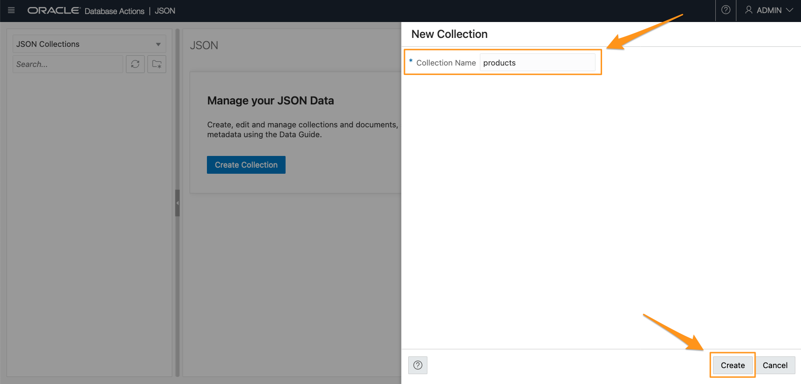

3. A notification pops up that displays `products` collections is created.

	

4. Click the refresh button to verify `products` collection is created.

	

**Insert Documents**

1. Double click **products** collection to show the **JSON-products** worksheet.

	

2. Click New JSON Document button.

	

3. A New JSON Document panel displays. Copy the following JSON object, paste it in the worksheet and click **Create**. Make sure you erase the empty brackets on the worksheet before pasting this code into it.

	```
	<copy>
	{
		"id": 100,
		"type":"movie",
		"title": "Coming to America",
		"format": "DVD",
		"condition": "acceptable",
		"price": 5,
		"comment": "DVD in excellent condition, cover is blurred",
		"starring": ["Eddie Murphy", "Arsenio Hall", "James Earl Jones", "John Amos"],
		"year": 1988,
		"decade": "80s"
	}
	</copy>
	```

	

4. A notification pops up that says A New Document is created and the new document is shown in the bottom section of the JSON workshop.

	

5. Let's repeat this with the following documents:

	Click New JSON Document button, copy the following JSON objects one by one, paste it in the worksheet and click **Create**.

    ```
	<copy>
	{
		"id": 101,
		"title": "The Thing",
		"type": "movie",
		"format": "DVD",
		"condition": "like new",
		"price": 9.50,
		"comment": "still sealed",
		"starring": [
			"Kurt Russel",
			"Wilford Brimley",
			"Keith David"
		],
		"year": 1982,
		"decade": "80s"
	}
	</copy>
	```

	```
	<copy>
	{
		"id": 102,
		"title": "Aliens",
		"type": "movie",
		" format ": "VHS",
		"condition": "unknown, cassette looks ok",
		"price": 2.50,
		"starring": [
			"Sigourney Weaver",
			"Michael Bien",
			"Carrie Henn"
		],
		"year": 1986,
		"decade": "80s"
	}
	</copy>
	```

	```
	<copy>
		{
		"id": 103,
		"title": "The Thing",
		"type": "book",
		"condition": "okay",
		"price": 2.50,
		"author":"Alan Dean Forster",
		"year": 1982,
		"decade": "80s"
	}
	</copy>
	```

**Find JSON documents in a collection**

Documents can be selected based on filter conditions - we call them 'Queries By Example' or 'QBE' for short. A QBE is a JSON document itself and it contains the fields and filter conditions that a JSON document in the collection must satisfy in order to be selected. QBEs are used with SODA (only); you can use SQL functions as an alternative.

The simplest form of a QBE just contains a key-value pair. Any selected document in the collection must have the same key with the same value. More complex QBEs can contain multiple filter conditions or operators like 'negation' or 'and', etc.

The following are examples for QBEs. You can copy them into the corresponding window (see screenshot) and execute them. Obviously, in a real application those QBE-expressions would be issued directly from the programming language - the SODA drivers have APIs for common application programming languages: Python, etc.

Now let's issue some simple queries on the *products* collection we just created.

1. Copy and paste the following queries in the worksheet and click Run Query button to run a query.

2.  Lookup by one value:

	Here, it displays the document whose id value is 101.

	```
	<copy>
	{"id":101}
	</copy>
	```
	
	

3.	Find all DVDs:

	Running the query will displays two documents with format DVD.

	```
	<copy>
	{"format":"DVD"}
	</copy>
	```
	

4.	Find all non-movies:

	This query displays the documents that are not of type - movies, which means just the document with id 103.

	```
	<copy>
	{"type":{"$ne":"movie"}}
	</copy>
	```
	

5.	Find documents whose condition value contains "new", which means just document (with id) 101.

	```
	<copy>
	{"condition":{"$like":"%new%"}}
	</copy>
	```
	

6. Find bargains of all products costing 5 or less:

	This query displays the documents with ids 100, 102 and 103 as those documents have price less than 5.

	```
	<copy>
	{"price":{"$lte":5}}
	</copy>
	```
	

7. Tighten previous query to choose only movie documents:

	This query displays the documents whose ids are 100, 102 as those documents have price less than 5 and not the type - book.

	```
	<copy>
	{"$and":[{"price":{"$lte":5}}, {"type":"movie"}]}
	</copy>
	```
	

**JSON and Constraints**

Some values need to be unique, so how do we enforce this?

1.	Insert a duplicate document for the id - 100:

	Click New JSON Document icon, copy and paste the following query in the worksheet and click **Create**.

	The document is successfully inserted as duplicate id's are not prevented and JSON database is schemaless.

	```
	<copy>
	{
		"id": 100,
		"fruit": "banana"
	}
	</copy>
	```
	

2. Use QBE:

	Copy and paste the following query in the worksheet and click **Run Query**.

	The result now shows two documents with id 100.

	```
	<copy>
	{"id":100}
	</copy>
	```

	

	Let's delete the {id:100, fruit:banana} last inserted document by clicking on the trash bin button.

	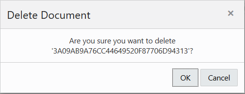

	It is likely we are looking up products by their id. Let's a create an index that gives fast access to 'id'. Make sure id is unique and numeric.

	Now we use a field 'id' in the JSON document to identify the product. The value could also be a SKU (barcode) or some catalog number. Obviously, every product needs an id and we want this to be a unique numeric value across all documents in the collection. Also, we want to be able to quickly find a product using the id value. So, let's create a unique index that solves all requirements (unique, numeric, present).

3.	Let's navigate to SQL Developer Web. Click the navigation menu on the top left and select **SQL** under Development.

	

4. Copy and paste the query below in the worksheet and click Run query button to creates a unique index that solves all requirements (unique, numeric, present).

	```
	<copy>
	create unique index product_id_idx on products (JSON_VALUE(json_document, '$.id.number()' ERROR ON ERROR));
	</copy>
	```
	

	JSON_Value is a SQL/JSON function that extracts one value from the JSON data that is specified by a JSON Path Expression - in this case we extract the 'id' and convert the selected value to a SQL number. Here, *$.id.number()* is a standard, SQL/JSON path expression. You'll learn more about SQJ/JSON functions later in this task.

5.	Once the product\_id\_idx is created, navigate back to JSON workshop. Click the navigation menu on the top left and select **JSON** under Development.

	

6.	Try to insert some documents that do not have an id or a non-numeric id:

	Click New JSON Document icon, copy and paste the following query in the worksheet and click **Create**.

	Although the "id" is unique the insert fails throws the error "Unable to add new JSON document" because the value is not a number. The same happens if the id is missing or already in use. Try it!

	```
	<copy>
	{"id":"xxx","title":"Top Gun"}
	</copy>
	```
	
	

7.  While we're at it lets add more 'checks' - we call them 'constraints'. Navigate back to the SQL Developer Web. Click the navigation menu on the top left and select **SQL** under Development.

	

8. Check constraint to make sure every product has a title of string data type and price >=0. Add a constraint to make sure that every item has at least a title and the price. We want the price to be a non-negative number and title to be a string.

	Copy and paste the query below in the worksheet and click Run query button to run the SQL query to alter products table and add constraints.

	```
	<copy>
	alter table products add constraint required_fields check (JSON_EXISTS(json_document, '$?(@.title.type() == "string" && @.price.number() > 0)'));
	</copy>
	```
	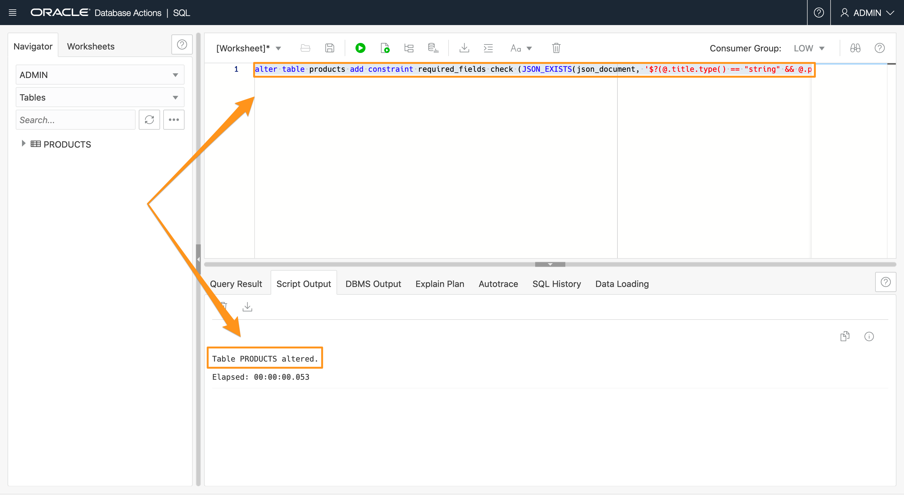

	JSON_Exists is a SQL/JSON function that checks that a SQL/JSON path expression selects at least one value in the JSON data. The selected value(s) are not extracted – only their existence is checked. Here, *$?(@.title.type() == "string" && @.price.number() > 0)* i a standard, SQL/JSON path expressions. You'll learn more about SQJ/JSON functions later in this lab.

9. Once the *products* table is altered, navigate back to JSON workshop. Click the navigation menu on the top left and select **JSON** under Development.

	

10. Validate that the following documents cannot get inserted as fields are missing or of wrong type.

	Click New JSON Document icon, copy and paste the following query in the worksheet and click **Create**.

	Throws the error "Unable to add new JSON document" since the following document has missing fields while trying to insert.

	```
	<copy>
	{"id":"200","title":"Top Gun"}
	</copy>
	```
	
	

11. The following document now satisfies all the constraints: the "id" is a unique number, the title is a string, and the price is a positive number.

    Click New JSON Document icon, copy and paste the following query in the worksheet and click **Create**.

	```
	<copy>
	{
		"id": 200,
		"title": "Top Gun",
		"category": "VHS",
		"condition": "like new",
		"price": 8,
		"starring": [
			"Tom Cruise",
			"Kelly McGillis",
			"Anthony Edwards",
			"Val Kilmer"
		],
		"year": 1986,
		"decade": "80s"
	}
	</copy>
	```

## Task 4: Using SODA for REST

### Introduction

So far, all collection operations have been issued from a UI in the browser. In a real application these operations would be called directly from a programming language (for example using the open-source SODA drivers for Java, Python or NodeJS). Another option is to use REST.

Navigate back to the SQL Developer Web. Click the navigation menu on the top left and select **SQL** under Development.


In order to move on to Task 5, you now load the extra documents from SQL, using the following SQL code:

```
<copy>
begin
dbms_cloud.copy_collection(
	collection_name => 'products',
	file_uri_list => 'https://objectstorage.us-ashburn-1.oraclecloud.com/p/VEKec7t0mGwBkJX92Jn0nMptuXIlEpJ5XJA-A6C9PymRgY2LhKbjWqHeB5rVBbaV/n/c4u04/b/livelabsfiles/o/data-management-library-files/testdata.json',
	format => '{ "recorddelimiter" : "0x''01''", "unpackarrays" : "TRUE", "maxdocsize" : "1000000" }'
);
end;
</copy>
```

## Task 5: Using SQL to work with JSON

### Introduction

So far, we've focused mostly on the document store API where we dealt with JSON data as a collection of documents. But there is another way to interact with your JSON data: SQL.

SQL is a very mature query language. Oracle added new operators to work with JSON data (we created an open standard called SQL/JSON which was adopted by the ISO SQL standard).

A key characteristic of a JSON collection (like 'products') is that it is backed by a table - a table then gets auto-created when you create a collection so that you do not have to specify columns and data types.

In the following we show you how you can use SQL to work with the JSON data in a collection.

Watch the video below for a quick walk through of the task.

[](youtube:MrSXStEfOF4)

### Objectives

In this task, you will:

* Use JSON_Serialize to convert binary JSON data to a human-readable string.
* Use dot notation to extract values from JSON data.

**SQL Developer Web**

1. Click on the navigation menu on the top left and select **SQL** under Development.

    

2. On the left side, click on PRODUCTS - this is the table for the 'products' collection. To get the view displayed, you need to right-click on **PRODUCTS** and choose **Open**.

    

    You see that the table 'PRODUCTS' has 5 columns: an 'ID' which is a unique identifier for the document, a 'JSON\_DOCUMENT' which holds the document, 2 metadata columns to keep track of creation and update timestamps and 'VERSION' which is typically a hash value for the document and allows to keep caches in sync (similar to an eTag). None of this is really important at this point as we will only use the JSON\_DOCUMENT column in the following examples.

3. When done looking at the table, click on **Close**.

    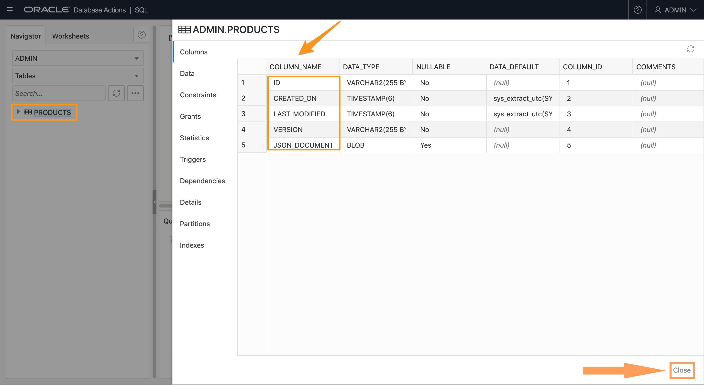

**JSON_Serialize**

1. Because the JSON data is stored in a binary representation (for query and update efficiency) we need to convert it to a human-readable string using JSON_Serialize.

    Copy and paste this query in SQL Developer Web worksheet and run it. It returns 9 (random) documents from the table/collection.

    ```
    <copy>
    select JSON_Serialize(json_document) from products where rownum < 10;
    </copy>
    ```

    

2. Simple dot notation - We can extract values from the JSON data using a simple notation (similar to JavaScript) directly from SQL.

    For example, running the below query shows all movies costing more than 5.

    ```
    <copy>
    select JSON_Serialize(json_document)
    from products p
    where p.json_document.type.string() = 'movie'
    and p.json_document.format.string() = 'DVD'
    and p.json_document.price.number() > 5;
    </copy>
    ```
    

    We use a trailing function like 'string()' or 'number()' to map a selected JSON scalar value to a SQL value.

3. You can also extract values this way in the `select` part. Copy and paste the query in SQL Developer Web worksheet and run it.

    ```
    <copy>
    select p.json_document.title.string(), p.json_document.year.number()
    from products p
    where p.json_document.type.string() = 'movie'
    order by 2 DESC;
    </copy>
    ```
    

4. It is also possible to use aggregation or grouping with values from the JSON data.

    The following calculates the average price of movies per decade.

    ```
    <copy>
    select p.json_document.decade.string(),
    avg(p.json_document.price.number())
    from products p
    where p.json_document.type.string() = 'movie'
    group by p.json_document.decade.string();
    </copy>
    ```
    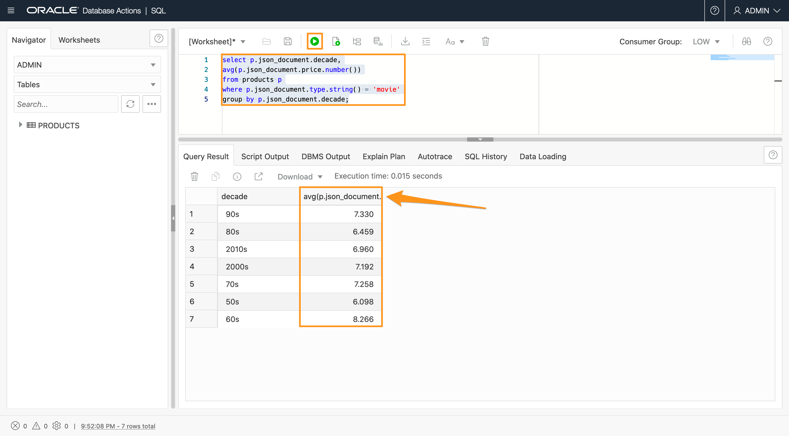

**Unnest JSON arrays**

All above examples extracted singleton values from the JSON data - values that only occurred once per document (like title or price). But JSON can have nested arrays - how can we access those?

1. Let's say we want to extract all actor names. They occur as JSON strings in the array called 'starring'. Since one movie has typically more than one actor the overall number of actor names is larger than the number of documents. We therefore need a mechanism that generates rows - a row source. This is why we use the 'nested' clause in the FROM part of the query - here we generate the rows and extract the value we're interested in as column values.

    The simplest example is the following, run it first then we will explain it.

    ```
    <copy>
    select jt.*
    from products p nested json_document columns (id, title, year NUMBER) jt;
    </copy>
    ```
    

    As you can see we're extracting the 'id', the 'title' and the 'year' from each document. Instead of a trailing function we can specify an optional SQL data type like NUMBER - the default (used for the title) is a VARCHAR2(4000).

2.  We could have written this query with the simple dot notation, as well, because we do not drill into any JSON array yet. Let's do that in  this query, by using the NESTED clause also in the COLUMNS clause.

    ```
    <copy>
    select jt.*
    from products p nested json_document columns (id, title, year NUMBER, nested starring[*] columns (actor path '$')) jt;
    </copy>
    ```
    

    The second 'nested' acts over the JSON array called 'starring'. The '[*]' means that we want to select every item of the array; [0] would only select the first one, for example. Then the second columns clause defines which value we want to extract from inside the array. The 'starring' array consists only of string values; we therefore need to select the entire value. This is done with the path expression '$'. We give selected values the column name 'actor'. You will learn more about path expressions in the next step.

3.  It is also possible to directly access the actors ('starring' array) as the following query shows: here we only select the actor names.

    ```
    <copy>
    select jt.*
    from products p nested json_document.starring[*] columns (actor path '$') jt;
    </copy>
    ```
    

4.  On this we can do here by slightly modifying the query is to count the number of movies by actor. All we do is group the results by actor name and count the group's size. The 'order by' clause orders the results based on the second column (the count).

    ```
    <copy>
    select jt.actor, count(1)
    from products p nested json_document.starring[*] columns (actor path '$') jt
    group by actor
    order by 2 DESC;
    </copy>
    ```
    

**Queries over JSON data**

The 'simple dot notation' as shown in the previous steps is a syntax simplification of the SQL/JSON operators. Compared to the 'simple dot notation' they're a bit more verbose but also allow for more customization. These operators are part of the SQL standard.

### SQL/JSON Path Expression

SQL/JSON relies on 'path expressions' which consist of steps: A step can navigate into an object or array.

An object step starts with a dot followed by a key name; for example, '.name' or '.id'. If the key name starts with a non-Ascii character you need to quote it; for example, '."0abc"'.

An array step uses square brackets; '[0]' selects the first value in an array. It is possible to select more than one element form the array, for example, '[*]' selects all values, '[0,1,2]' selects the first three elements, and '[10 to 20]' selects elements 11 through 21.

Steps can be chained together. A path expression typically starts with the '$' symbol which refers to the document itself.

Path expressions are evaluated in a 'lax' mode. This means that an object step like '.id' can also be evaluated on an array value: it then means to select the 'id' values of each object in the array. This will be explained a bit in JSON_Exists, where we also explain Path Predicates (filters).

Now let's look at the different SQL/JSON operators step by step:

### JSON_Value

JSON_VALUE takes one scalar value from the JSON data and returns it as a SQL scalar value.

1.  The first argument is the input, the column 'json_document' from the products collection/table. This is followed by a path expression, in this case we select the value for field 'format'. The optional 'returning' clause allows to specify the return type, in this case a varchar2 value of length 10. Because not every product has a 'format' value (only the movies do) there are cases where no value can be selected. By default NULL is returned in this case. The optional ON EMPTY clause allows to specify a default value (like 'none') or to raise an error - with ERROR ON EMPTY.

    ```
    <copy>
    select JSON_Value (json_document, '$.format' returning varchar2(10) default 'none' on empty) from products;
    </copy>
    ```
    

2.  JSON_Value can only select one scalar value. The following query will not return a result because it selects the array of actors.

    ```
    <copy>
    select JSON_Value (json_document, '$.starring[0,1]') from products;
    </copy>
    ```
    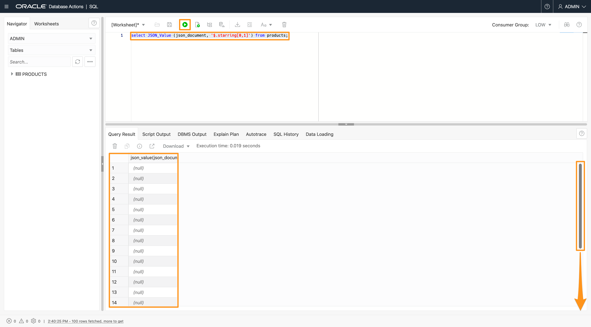

3.  But instead of seeing an error you'll see a lot of NULL values. This is because the NULL ON ERROR default applies. This fault-tolerant mode is to make working with schema-flexible data easier. To see the error you need to override this default with ERROR ON ERROR.

    This query will raise ORA-40456: JSON_VALUE evaluated to non-scalar value

    ```
    <copy>
    select JSON_Value (json_document, '$.starring' ERROR ON ERROR) from products;
    </copy>
    ```
    

4.  This query will raise ORA-40470: JSON_VALUE evaluated to multiple values.

    ```
    <copy>
    select JSON_Value (json_document, '$.starring[0,1]' ERROR ON ERROR) from products;
    </copy>
    ```
    

### JSON_Query

Unlike JSON\_Value (which returns one SQL scalar value) the function JSON\_Query can extract complex values (objects or arrays), and it can also return multiple values as a new JSON array. The result of JSON_Query is JSON data itself, for example an object or array.

1. This query extracts the embedded array of actors. Scroll down the `Query Result` to see the values.

    ```
    <copy>
    select JSON_Query(p.json_document, '$.starring')
    from products p;
    </copy>
    ```
    

2.  The following query selects two values: the first two actor names in the 'starring' array. You need to specify the 'with array wrapper' clause to return both values as one array. Scroll down the `Query Result` to see the values.

    ```
    <copy>
    select JSON_Query(p.json_document, '$.starring[0,1]' with array wrapper)
    from products p;
    </copy>
    ```
    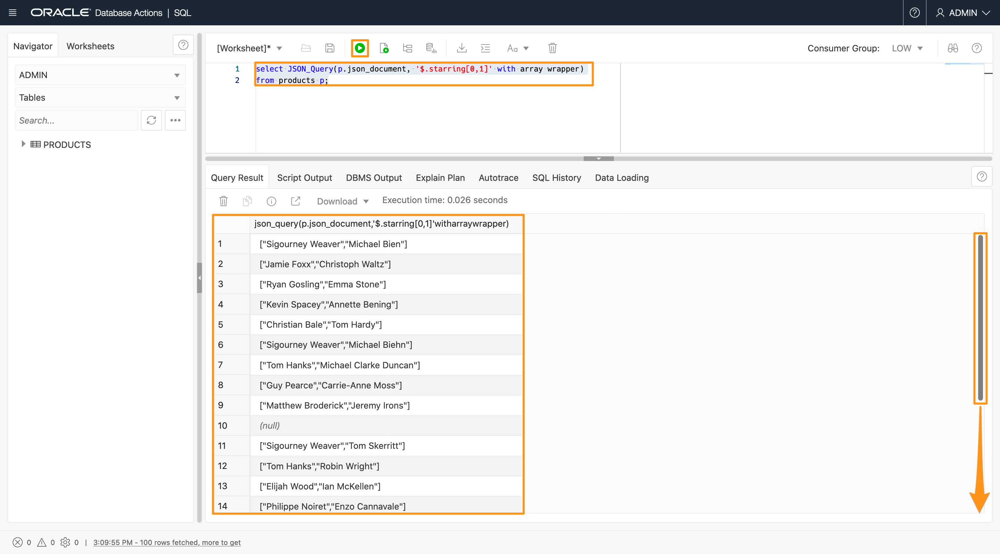

### JSON_Exists

JSON_Exists is used to filter rows, therefore you find it in the WHERE clause. Instead of using a path expression to select and return a value, this operator just tests if such value exits.

1.  For example, count all documents which have a field 'format' - regardless of the field value.

    ```
    <copy>
    select count(1)
    from products
    where JSON_Exists(json_document, '$.format');
    </copy>
    ```

    

2.  The following example returns all documents that have a field 'starring' that has the value 'Jim Carrey'.

    ```
    <copy>
    select JSON_SERIALIZE(p.json_document)
    from products p
    where JSON_Exists(p.json_document, '$.starring?(@ == "Jim Carrey")');
    </copy>
    ```
    


    This is expressed using a path predicate using the question mark (?) symbol and a comparison following in parentheses. The '@' symbol represents the current value being used in the comparison. For an array the context will be every item of the array - one can think of iterating through the array and performing the comparison for each item of the array. If any item satisfies the condition than JSON_Exists selects the row.

3.  The following selects all movies with two or more genres, one genre has to be 'Sci-Fi' and an actor's name has to begin with 'Sigourney'.

    ```
    <copy>
    select JSON_SERIALIZE(p.json_document)
    from products p
    where JSON_Exists(p.json_document, '$?(@.genres.size() >= 2 && @.genres == "Sci-Fi" && @.starring starts with "Sigourney")');
    </copy>
    ```
    

    SODA QBE filter expressions are rewritten to use JSON_Exists.

    *Note:* Indexes can be added to speed up finding the right documents.

### JSON_Table

JSON\_Table is used to 'flatten' hierarchical JSON data to a table consisting of rows and columns. It is commonly used for analytics or reporting over JSON data. Similarly to the 'nested' clause in the simple dot notation JSON\_Table allows to unnest an embedded JSON array. JSON\_Table consists of 'row' path expressions (which define the rows) and column path expressions (which extract a value and map it to a column with a given data type). Each row can have JSON\_Value, JSON\_Query and JSON\_Exists semantics (meaning that each row can act like JSON_Value, JSON_Query or JSON_Exists). This allows you to combine a set of these operations into one single JSON\_Table expression.

1.  In this example, let's combine a set of these operations into one single JSON_Table expression.

    ```
    <copy>
    select jt.*
    from products,
    JSON_TABLE (json_document, '$' columns (
      id NUMBER,
      ProductName varchar2(50) path '$.title',
      type,
      actors varchar(100) FORMAT JSON path '$.starring',
      year EXISTS,
      numGenres NUMBER path '$.genres.size()'
    )) jt;
    </copy>
    ```
    

2.  Like the other SQL/JSON operators the first input is the JSON data - the column 'json_document' from the products collection/table. The first path expressions, '$', is the row path expression - in this case we select the entire document. It would be possible to directly access an embedded object or array here, for example '$.starring[*]' would then generate a row for each actor.

    The columns clause then lists each column. Let's go over this line by line:
    *	The 'id' column is defined to be a number instead of the default VARCHAR2(4000).
    *	The next column is called 'ProductName' which is not a field name in the JSON data, we therefore need to tell which field name we want to use. This is done by providing title column path expression, '$.title', which targets field 'title'.. We also set the data type to be a VARCHAR2 of length 50.
    *	The column 'type' uses the same name as the field in the JSON, therefore we do not need to provide a path expression. Also we accept the default datatype.
    *	Field 'actors' does not exists, so we map the actors, which are elements of array 'starring', to column 'actors' using path expression '$.starring'. We use FORMAT JSON to specify JSON\_Table that this column has JSON\_Query  semantics and the returned value is JSON itself - in this case we extract the embedded array.
    *	Similarly, we use the keyword 'EXISTS' to specify that the next column ('year') or JSON_Exists semantics. We're not interested in the actual year value - only if a value exists or not. You will therefore see true|false values for this column (or 1|0 if you change the return type to NUMBER).
    *	The last column 'numGenres' is an example of using a path item method (or trailing function), in this case we call 'size()' on an array to count the number of values in the array. There are many other trailing functions that can be used.

    Multiple JSON arrays on the same level can also be projected out by using 'nested paths' on the same level, as the following example shows with the array of actors and genres. The values of the sibling arrays are returned in separate rows instead of merging them into the same row, for two reasons: The arrays could be of different sizes and there is no clear rule how to combine values from different arrays. In this example, 'genres' and 'actors' have nothing to do with each other. Why should the first actor name be place in the same row as the first genre? This is why you see the NULL values in the result. This is a UNION join.

    ```
    <copy>
    select jt.*
    from products,
    JSON_TABLE (json_document, '$' columns (
      title,
      nested path '$.starring[*]'
      columns (actor path '$'),
      nested path '$.genres[*]'
      columns (genre path '$')
    )) jt;
    </copy>
    ```
    

3.  A common practice is to define a database view using JSON\_TABLE. Then you can describe and query the view like a relational table. Fast refreshable materialized views are possible with JSON\_Table but not covered in this lab.

    For example, create view movie_view as:

    ```
    <copy>
    create view movie_view as
    select jt.*
    from products,
    JSON_TABLE (json_document, '$' columns (
      id NUMBER,
      ProductName varchar2(50) path '$.title',
      type,
      actors varchar(100) FORMAT JSON path '$.starring',
      year EXISTS,
      numGenres NUMBER path '$.genres.size()'
    )) jt;
    </copy>
    ```
    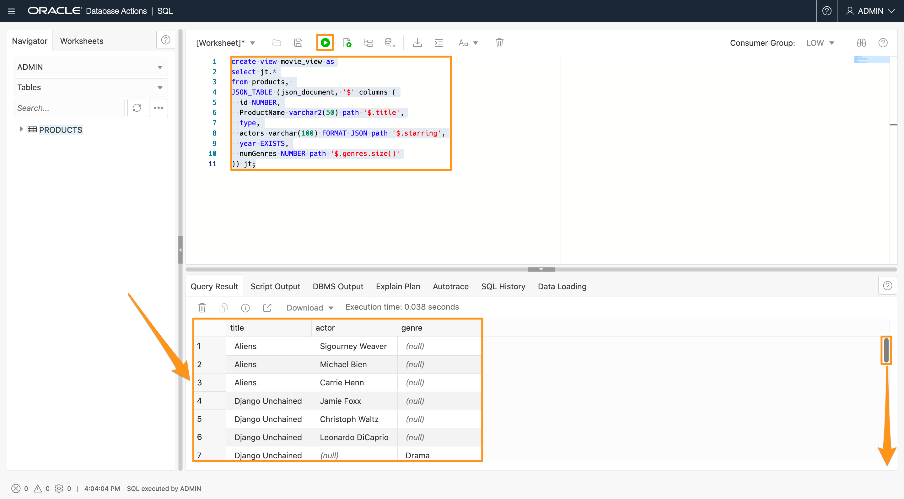

    Describe the movie_view:

    ```
    <copy>
    desc movie_view;
    </copy>
    ```
    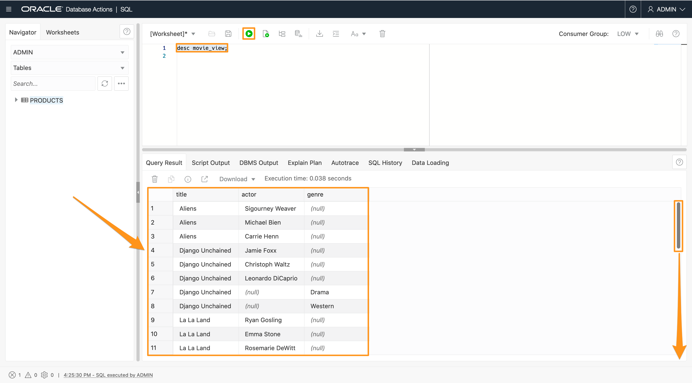

    select columns from the movie_view:

    ```
    <copy>
    select productName, numGenres
    from movie_view
    where year = 'true'
    order by numGenres;
    </copy>
    ```
    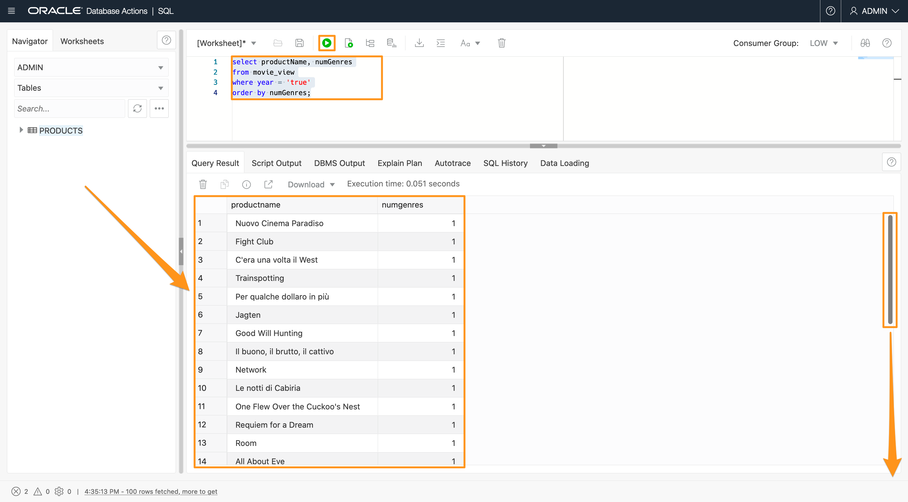

**JSON Generation functions**

SQL/JSON has 4 operators to generate JSON objects and arrays: 2 are per-row operators that generate one object/array per input row, and 2 are aggregate operators that generate one object/array for all input rows. These operators come in handy when you want to generate JSON data from existing tables or you want to bring JSON data into a different shape.

1.  Let's first look at a simple example first. We create the following simple table:

    ```
    <copy>
    create table emp (empno number, ename varchar2(30), salary number);
    </copy>
    ```
    

    **Note:** Click the refresh button on the left-hand side to view the new table.

    We want to insert three new documents. 
    
    **Important:** make sure you highlight all insert statement rows before pressing the "Run Statement" button. Otherwise it will only insert the row your cursor is on. Make sure it reports "1 row inserted" three times.

    ```
    <copy>
    insert into emp values (1, 'Arnold', 500000);
    insert into emp values (2, 'Sigourney', 800000);
    insert into emp values (3, 'Tom', 200000);
    </copy>
    ```
    

2.  With JSON_Object we can convert each row to a JSON object. The names are picked from the column names and are typically upper cased.

    ```
    <copy>
    select JSON_Object(*) from emp;
    </copy>
    ```
    

3.  If we want fewer columns or different field names we can specify this as follows:

    ```
    <copy>
    select JSON_Object('name' value ename, 'compensation' value (salary/1000)) from emp;
    </copy>
    ```
    
4.  As you can see, one JSON object is generated per row. Using JSON\_ObjectAgg we can summarize the information in one JSON\_Object - note that the field names now originate from column values:

    ```
    <copy>
    select JSON_ObjectAgg(ename value (salary/1000)) from emp;
    </copy>
    ```
    

5.  Similary, we use JSON\_Array and JSON\_ArrayAgg to build arrays:

    ```
    <copy>
    select JSON_Array(empno, ename, salary) from emp;
    </copy>
    ```
    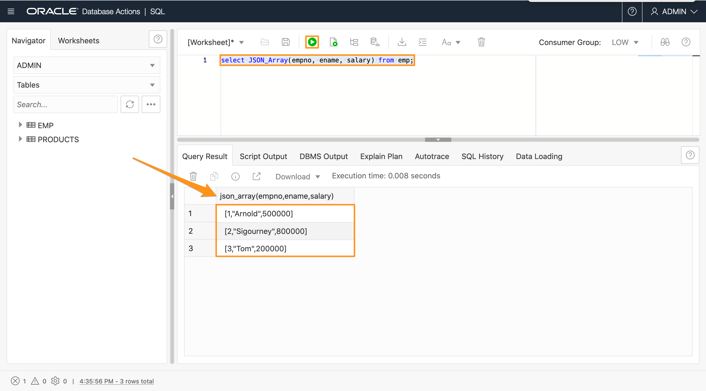
    ```
    <copy>
    select JSON_ArrayAgg(ename) from emp;
    </copy>
    ```
    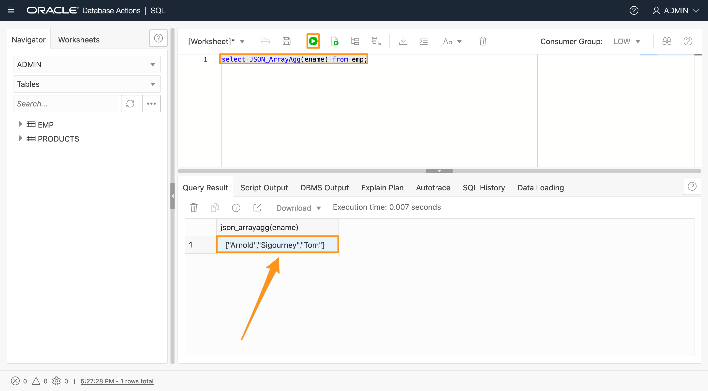

6.  We now use JSON generation together with JSON_Table to create a new JSON representation of information that is in the product collection: Every movie points to an array of actors. The same actor occurs in multiple arrays if she/he played in multiple movies.

    What if we wanted the opposite: a list of unique actors referring to the list of movies that they played in?

    First, we need to have a map of actors and the movies they played in

    ```
    <copy>
    select jt.id, jt.title, jt.actor
    from products NESTED json_document COLUMNS(
      id NUMBER,
      title,
      NESTED starring[*] COLUMNS(
       actor path '$'
      )) jt
    where jt.actor is not null;
    </copy>
    ```
    

7.  This list contains multiple entries for the same actor. How do we find the distinct actor names? By just issuing a 'DISTINCT' query on top of the previous query. We use the WITH clause to define the above query as an inlined subquery named ' actor\_title\_map'.

    ```
    <copy>
    with
    actor_title_map as (
    select jt.id, jt.title, jt.actor
    from products NESTED json_document COLUMNS(
      id NUMBER,
      title,
      NESTED starring[*] COLUMNS(
       actor path '$'
      )) jt
    where jt.actor is not null
    )
    select DISTINCT actor
    from actor_title_map;
    </copy>
    ```
    

8.  Now, we know each actor, and with the first query we're able to map each actor to all their movie titles. We can then use JSON generation functions to convert this information into a brand new JSON. The distinct actor names also become an inlined subquery in the following example:

    ```
    <copy>
    with
    actor_title_map as (
    select jt.id, jt.title, jt.actor
    from products NESTED json_document COLUMNS(
      id NUMBER,
      title,
      NESTED starring[*] COLUMNS(
       actor path '$'
      )) jt
    where jt.actor is not null
    ),
    distinct_actors as (
    select distinct actor
    from actor_title_map
    )
    select JSON_OBJECT(da.actor,
    'movies' VALUE (	select JSON_ArrayAgg(atm.title)
    from actor_title_map atm
    where atm.actor = da.actor))
    from distinct_actors da;
    </copy>
    ```
    

    The value for the field 'movies' is the result of a subquery on the actor\_title\_map with a join on the actor's name.

## Homework

Answer these questions by writing appropriate queries to extract the data from the database.  You can write these queries however you want, but we are providing your with hints, whether you should use a JSON query or a SQl query.  As indicated in using the JSON database action page or the SQL database action page. Submit a screenshot of each query and the result, and then submit to Blackboard. If you are unable to get your query to run, submit a portion of your work for project credit. For all of these queries, you have run similar queries throughout the labs, so use them as the basis for your queries and substitute as appropriate.

1. What is the title of the single drama movie from the 70s that is on a LaserDisk?
    
    Hint: use a QBE in the JSON Database Actions page

2. What is the title of the single movie that hat the word ‘university’ in the plot?
    
    Hint: use a QBE in the JSON Database Actions page
 
3. What is the title and the price of the most expensive movie of 1974?

    Hint: use SQL in the SQL Database Actions page

4. Which year has the most movies and how does the SQL statement look like?

    Hint: use SQL in the SQL Database Actions page

5. Modify the query you ran in Step 8 of the last task (the last query you ran in the lab) to return information for the actor “Morgan Freeman”.

    Hint: modify the where jt.actor... clause to get information about Morgan Freeman